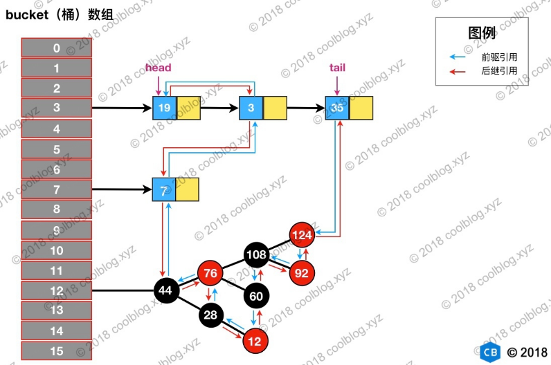

# Java中的容器(一) Java中的Collections #

  
 

基于Map接口实现的类主要有TreeMap，HashTable，LinkedHashMap,HashMap，上图中LinkedHashMap实际是HashMap的子类。

## 1.HashMap

首先来介绍一下HashMap，其基于哈希表来实现。在JDK1.8之前HashMap是由数组+链表组成的，数组是HashMap的主体，链表主要是为了解决哈希冲突而存在的(即所谓的拉链法)，JDK1.8以后对解决哈希冲突时有了较大的优化，当链表的长度大于阈值(默认为8)时，将链表转化为红黑树，红黑树的结构特性可以减少搜索时间，其主要原因是，红黑树是一颗平衡树，树的搜索时间复杂度与树的高度相关，一般是O(logn)，所以相比于链表和普通的搜索树都能减少搜索时间,后续延伸的B树，B+树的原理也类似。

### 1）HashMap底层数据结果分析

在JDK1.8之前HashMap底层是数组和链表结合在一起使用链表散列。HashMap通过hashCode经过扰动函数处理后得到hash值，然后通过(n-1)&hash判断当前元素存放的位置(其中n指的是数组长度)，当当前位置存在元素时，就判断该元素的hash值以及key是否相等，相等的话直接覆盖，否则通过拉链法解决冲突。

所谓扰动函数即hash方法，JDK1.8中的hash方法的源码如下：

    static final int hash(Object key) {
      int h;
      // key.hashCode()：返回散列值也就是hashcode
      // ^ ：按位异或
      // >>>:无符号右移，忽略符号位，空位都以0补齐
      return (key == null) ? 0 : (h = key.hashCode()) ^ (h >>> 16);
    }
相比于JDK1.7中的hash方法显得更加简洁，JDK1.7中hash值需要四次右移操作。

### 2）源码

**类的属性：**

	public class HashMap<K,V> extends AbstractMap<K,V> implements Map<K,V>, Cloneable, Serializable {
	    // 序列号
	    private static final long serialVersionUID = 362498820763181265L;    
	    // 默认的初始容量是16
	    static final int DEFAULT_INITIAL_CAPACITY = 1 << 4;   
	    // 最大容量
	    static final int MAXIMUM_CAPACITY = 1 << 30; 
	    // 默认的填充因子
	    static final float DEFAULT_LOAD_FACTOR = 0.75f;
	    // 当桶(bucket)即链表上的结点数大于这个值时会转成红黑树
	    static final int TREEIFY_THRESHOLD = 8; 
	    // 当桶(bucket)上的结点数小于这个值时树转链表
	    static final int UNTREEIFY_THRESHOLD = 6;
	    // 桶中结构转化为红黑树对应的table的最小大小
	    static final int MIN_TREEIFY_CAPACITY = 64;
	    // 存储元素的数组，总是2的幂次倍
	    transient Node<k,v>[] table; 
	    // 存放具体元素的集
	    transient Set<map.entry<k,v>> entrySet;
	    // 存放元素的个数，注意这个不等于数组的长度。
	    transient int size;
	    // 每次扩容和更改map结构的计数器
	    transient int modCount;   
	    // 临界值 当实际大小(容量*填充因子)超过临界值时，会进行扩容
	    int threshold;
	    // 填充因子
	    final float loadFact
	}
下面主要讲解一下HashMap的添加元素即put方法，而put方法主要是调用putVal方法。

putVal方法中，首先定位到数组中的位置，如果没有值，就直接插入，如果位置有值，就与要插入的key比较，如果key相同就覆盖，否则判断当前位置元素是否是一个树节点，如果是就调用putTreeVal方法将元素添加进入，如果不是，就遍历链表插入，当链表长度大于8时，链表转化为红黑树。

  
 

图中的阈值threshold为当前容量capacity*loadFactor，当size>=threshold时，就要对数据进行扩容。

    final V putVal(int hash, K key, V value, boolean onlyIfAbsent,
                   boolean evict) {
        Node<K,V>[] tab; Node<K,V> p; int n, i;
        if ((tab = table) == null || (n = tab.length) == 0)
            n = (tab = resize()).length;
        if ((p = tab[i = (n - 1) & hash]) == null)
            tab[i] = newNode(hash, key, value, null);
        else {
            Node<K,V> e; K k;
            if (p.hash == hash &&
                ((k = p.key) == key || (key != null && key.equals(k))))
                e = p;
            else if (p instanceof TreeNode)
                e = ((TreeNode<K,V>)p).putTreeVal(this, tab, hash, key, value);
            else {
                for (int binCount = 0; ; ++binCount) {
                    if ((e = p.next) == null) {
                        p.next = newNode(hash, key, value, null);
                        if (binCount >= TREEIFY_THRESHOLD - 1) // -1 for 1st
                            treeifyBin(tab, hash);
                        break;
                    }
                    if (e.hash == hash &&
                        ((k = e.key) == key || (key != null && key.equals(k))))
                        break;
                    p = e;
                }
            }
            if (e != null) { // existing mapping for key
                V oldValue = e.value;
                if (!onlyIfAbsent || oldValue == null)
                    e.value = value;
                afterNodeAccess(e);
                return oldValue;
            }
        }
        ++modCount;
        if (++size > threshold)
            resize();
        afterNodeInsertion(evict);
        return null;
    }

### 3）扩容机制

扩容是通过调用resize方法重新计算容量，JDK1.7的resize方法源码如下

     void resize(int newCapacity) {   //传入新的容量
     Entry[] oldTable = table;    //引用扩容前的Entry数组
     int oldCapacity = oldTable.length;         
      if (oldCapacity == MAXIMUM_CAPACITY) {  //扩容前的数组大小如果已经达到最大(2^30)了
          threshold = Integer.MAX_VALUE; //修改阈值为int的最大值(2^31-1)，这样以后就不会扩容了
          return;
      }
   
      Entry[] newTable = new Entry[newCapacity];  //初始化一个新的Entry数组
     transfer(newTable);                         //！！将数据转移到新的Entry数组里
     table = newTable;                           //HashMap的table属性引用新的Entry数组
     threshold = (int)(newCapacity * loadFactor);//修改阈值
    }

这里使用一个容量更大的数组来代替已有的容量小的数组，其中transfer()方法将原有的Entry数组的元素拷贝到新的Entry数组里。HashMap每次扩充都是以2的幂次方进行扩容。

**那么HashMap的长度为什么是2的幂次方？**

为了使HashMap中的数据尽量均匀，减少碰撞，Hash值的范围大概在-2147483648--2147483647范围，前后加起来是40亿长度的映射空间，但是这么的的空间内存很难放下，所以在使用时，往往进行取模运算，得到的余数才能用来存放对应数组的下标，其计算方法时"(n-1)&hash"。那么之所以采用这个方法计算数组下标是因为当除数是2的幂次方等价于与其除数与(&)操作(即hash%==hash&(n-1)的前提是n是2的幂次方)。

## 2.HashTable

HashTable基本功能与HashMap类似，主要是它是线程安全的，但并发性不如ConcurrentHashMap，ConcurrentHashMap引入分段锁，下面将详细讲到。HashTable一般很少用。另外它的键值不允许为空。

## 3.LinkedHashMap

继承至HashMap，底层实现与HashMap相同。所不同的是其维护了一条双向链表，保证访问顺序与插入顺序的一致。其结构图如下图所示。

  
 

使用LinkedHashMap是实现LRU算法

	class LRUCache {
	  
	    private final int capacity;
	    private Map<Integer,Integer> map;
	
	    public LRUCache(int capacity){
	        this.capacity = capacity;
	        map = new LinkedHashMap<>();
	    }
	    public int get(int key){
	        Integer val = map.get(key);
	        if(val == null){
	            return -1;
	        }
	        map.remove(key);
	        map.put(key,val);
	        return val;
	    }
	
	    public void put(int key,int value){
	        map.remove(key);
	        map.put(key,value);
	        if(map.size()> capacity){
	            Integer k = map.keySet().iterator().next();
	            map.remove(k);
	        }
	    }
	}

## 4.TreeMap

TreeMap实现了SortedMap接口，能够把它保存的记录根据键值排序，需要使用的排序的映射时，应该使用TreeMap，但是在使用时，需要实现Comparable接口或者在构造TreeMap传入自定义的Comaprator，否则会抛出异常。

## 5.ConcurentHashMap和Hashtable的区别

ConcurrentHashMap与Hashtable的主要区别主要体现在实现线程安全的方式上。
HashTable使用一把锁(synchronized)来保证线程安全。当一个线程访问同步方法时，其他线程也会访问同步方法，可能会进入阻塞或轮询状态，无法添加获取读取get方法。

  
 

而在JDK1.7中，ConcurrentHashMap使用的是分段锁，对整个桶数组进行分割分段(Segment),每一把锁只锁容器其中一部分数据。多线程访问容器里的不同数据段的数据，既不会存在锁竞争，提高并发访问率。

  
 

但是JDK1.8开始摈弃了Segment的概念，而是直接使用Node数据+链表+红黑树的数据结构来实现，其并发控制使用synchronized和CAS来操作。

  
 

synchronized只锁定当前链表或者红黑树的首节点。

