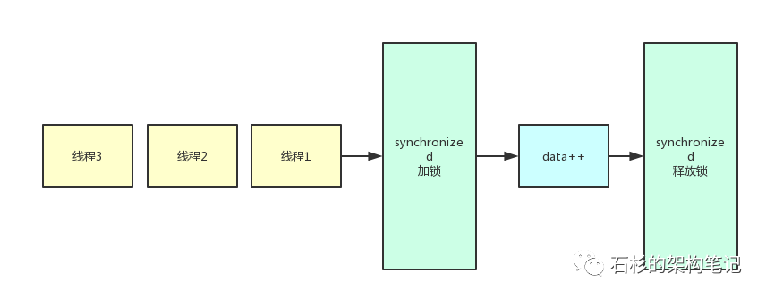
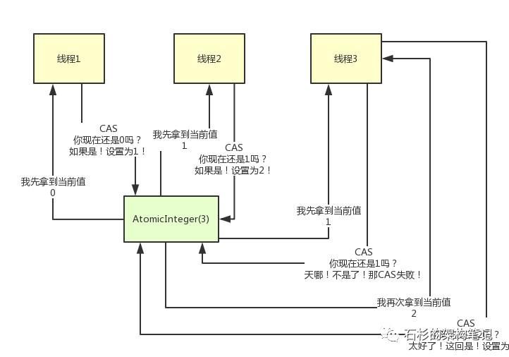

# Java中的原子类 #

当多个线程对一个共享变量进行累加操作时，往往会出现数据不准确，为了保证得到数据的准确性，有多种解决方案，最简单的方法就是在累加方法上加synchronize。因为添加synchronize后，同一时间只有一个线程可以获取锁，这样就相当于多个线程一个一个的排队在更新那个数值。

  
 

但是使用synchronize相当于将各个线程串行化，而且太重。这种场景中采用Atomic原子类更加高效，Atomic原子类底层不是传统的锁机制，而是无锁化的CAS机制，通过CAS机制多线程修改一个数值的安全性。

## 那么什么是CAS？ ##

  
 

如上图所示，每个线程先获取当前的值，接着走一个原子的CAS操作，原子操作是指必须一次执行完，不能被其他线程中断。所谓CAS就是Compare and Set,即每次执行CAS时，之前获取的值与当前值进行比较，如果不一样就会失败，从而进入循环。

其基本流程如下：

1。线程获取当前值为0，并将当前值与共享数据进行比较，如果共享数据是0，则累加设置共享变量为1，否则CAS失败。
2.由于atomic底层是无锁化机制，所以线程2和线程3可能会通过get方法同时获得共享变量的值为1，。
3.接下来，线程2首先进行原子的CAS操作，将自己读到的值与当前共享变量进行比较，如果共享变量还没有被其他线程修改，则将共享变量设置为2.。
4.当线程3发起CAS操作时，发现共享变量已经被修改为2，与自己之前获取的值不同，于是CAS失败，重新获取当前值，然后再次发起CAS操作，将共享变量修改为3。

CAS操作最大的问题，就是当大量线程同时发起修改一个AtomicInteger时，很多线程会不停自旋。Java8中新推出一个新类LongAdder，它进行分段CAS以及自动分段迁移来提升多线程并发CAS操作的性能。

Atomic包中总共有13个类，分为四种类型的原子更新方式，分别是原子更新基本数据类型、原子更新基本数组、原子更新基本引用和原子更新属性。

## 1.原子的方式更新基本数据类型 ##

主要包含三个类：AtomiBoolean，AtomicInteger,AtomicLong。JDK8中新增LongAddr

LongAddr：Cell数组，在LongAddr的父类Strip64中提供了一个volitale Cell[] cells,其长度是2的幂次方，每个Cell都提供了一个Long字段

常用方法：

- int addAndGet(int delta):以原子的方式将输入的数值与实例中的值相加，并返回结果。
- boolean compareAndSet(int expect,int update):如果输入的数值等于预期值，则以原子的方式将该值设置为输入的值。
- int getAndIncrement():以原子的方式将当前值加1，这里返回的是自增前的值。
- void lazySet(int newValue):最终会设置成newValue，使用lazySet设置值后，可能会导致其他线程在之后的一小段时间内还是可以读到旧的值。
- int getAndSet(int newValue):以原子方式设置为newValue的值，并返回旧值。

package demo7;

import java.util.concurrent.atomic.AtomicInteger;

/**
 * @author zlCalma
 * @date 2018/11/28 21:37.
 */

    public class AtomicIntegerTest {
    static AtomicInteger ai = new AtomicInteger(1);

    public static void main(String[] args) {
        System.out.println(ai.getAndIncrement());//1
        System.out.println(ai.get());//2
        System.out.println(ai.addAndGet(3));//5
        System.out.println(ai.compareAndSet(5,6));//true
        //System.out.println(ai.lazySet(7));
        ai.lazySet(7);
        System.out.println(ai.get());//7
        System.out.println(ai.getAndSet(8));//
        System.out.println(ai.get());//8
    }

    }

**getAndIncrement()是如何保证原子性的？**

通过分析源码可以发现在getAndIncrement()中调用compareAndSet()方法，只有当前值未被其他线程修改，也就是说等于期望的值时，才可以更新。

**Atomic中只提供三种基本类型的原子更新，其他数据类型如何进行原子更新呢？**

Atomic包中基本都是使用Unsafe实现的，而Unsaft中只提供三种CAS方法：compareAndSwapObject,compareAndSwapInt,compareAndSwapLong。分析AtomicBoolean的源码可以发现，它是先将Boolean转化为整形，再使用compareAndSwapInt进行原子CAS，所以其他数据类型也可以用类似的思路来实现。

## 原子更新数组 ##

通过原子的方式更新数组中的某个元素，Atomic包提供了4个类。

- AtomicIntegerArray:原子更新的整形数组中的元素。
- AtomicLongArray：原子更新长整型数组中的元素。
- AtomicReferenceArray:原子更新引用数据类型里的元素。

常用方法：

int addAndGet(int i,int delta)以原子的方式将输入值与数组中索引为i的元素相加。
boolean compareAndSet(int i,int expect,int update):如果当前值等于预期值，则以原子方式将数组位置i的元素设置成update值。

package demo7;

import java.util.concurrent.atomic.AtomicInteger;
import java.util.concurrent.atomic.AtomicIntegerArray;

/**
 * @author zlCalma
 * @date 2018/11/28 22:44.
 */
    public class AtomicIntegerArrayTest {

    static int[] value = new int[]{1,2};

    static AtomicIntegerArray ai = new AtomicIntegerArray(value);

    public static void main(String[] args) {
        ai.getAndSet(0,3);
        System.out.println(ai.get(0));//3
        System.out.println(value[0]);//1
    }
    }

数组value通过构造函数传递进去，然后AtomicIntegerArray会将当前数组复制一份，然后当AtomicIntegerArray对内部数组元素进行修改时，不会影响传入的数组。

## 原子更新引用类型 ##

主要包含三个类：
AtomicReference:原子引用更新
AtomicReferenceFieldUpdater:原子更新引用类型的字段
AtomicMarkableReference:原子更新带有标记位的引用类型，可以原子更新一个布尔类型的标记位和引用类型。构造方法是AtomicMarkableReference(V initialRef,boolean initialMark)。

    package demo7;
    
    import java.util.concurrent.atomic.AtomicReference;

/**
 * @author zlCalma
 * @date 2018/11/28 22:55.
 */

    public class AtomicReferenceTest {

    public static AtomicReference<User> atomicReference = new AtomicReference<User>();

    public static void main(String[] args) {
        User user  = new User("conan",15);
        atomicReference.set(user);
        User updateUser = new User("shinichi",17);
        atomicReference.compareAndSet(user,updateUser);
        System.out.println(atomicReference.get().getName());
        System.out.println(atomicReference.get().getOld());
    }

    static class User{
        private String name;
        private int old;

        public User(String name, int old) {
            this.name = name;
            this.old = old;
        }

        public String getName() {
            return name;
        }

        public void setName(String name) {
            this.name = name;
        }

        public int getOld() {
            return old;
        }

        public void setOld(int old) {
            this.old = old;
        }
    }
    }
## 原子更新字段类 ##

当需要更新某个类中的某个字段时，就需要使用原子更新字段类，Atomic包提供已下三个类进行原子字段更新

AtomicIntegerFieldUpdate：原子更新整形的字段的更新器
AtomicLongFieldUpdate：原子更新长整型字段的更新器
AtomicStampedUpdate：“原子更新带有版本号的引用类型。该类将整数值与引用关联起来。可用于原子的更新数据和数据的版本号，可以解决使用CAS进行原子操作更新可能处出现的ABA问题。

package demo7;

import java.util.concurrent.atomic.AtomicIntegerFieldUpdater;

/**
 * @author zlCalma
 * @date 2018/11/28 23:08.
 */
    public class AtomicIntegerFieldUpdaterTest {

    //创建原子更新器，并设置要更新的对象类和类的属性
    private static AtomicIntegerFieldUpdater<User> atomicIntegerFieldUpdater =
            AtomicIntegerFieldUpdater.newUpdater(User.class,"old");

    public static void main(String[] args) {
        User conan = new User("conan",10);
        System.out.println(atomicIntegerFieldUpdater.getAndIncrement(conan));//10
        System.out.println(atomicIntegerFieldUpdater.get(conan));//11
    }
    public static class User{
        private String name;
        public volatile int old;

        public User(String name, int old) {
            this.name = name;
            this.old = old;
        }

        public String getName() {
            return name;
        }

        public void setName(String name) {
            this.name = name;
        }

        public int getOld() {
            return old;
        }

        public void setOld(int old) {
            this.old = old;
        }
    }
    }

根据上述代码可知，原子的更新字段类需要两步，首先，原子更新字段类都是抽象类，每次更新时必须使用静态方法newUpdater创建一个更新器，并且需要设置想要更新的类和类的字段，然后更新字段必须使用public volatile修饰。