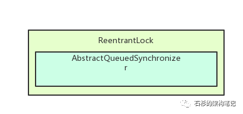
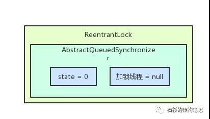
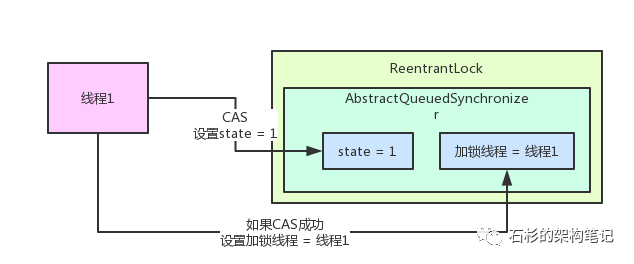
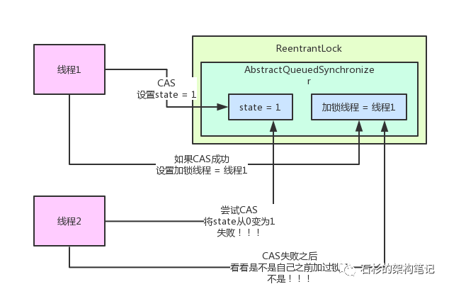
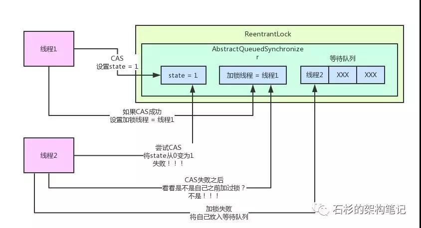
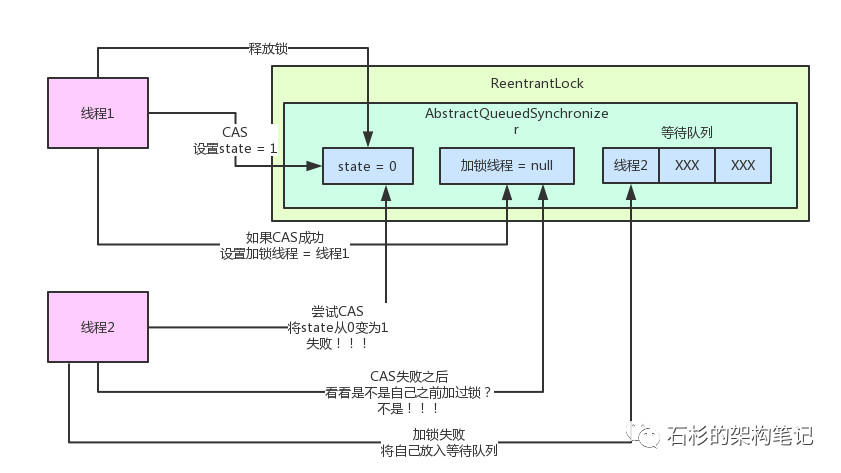
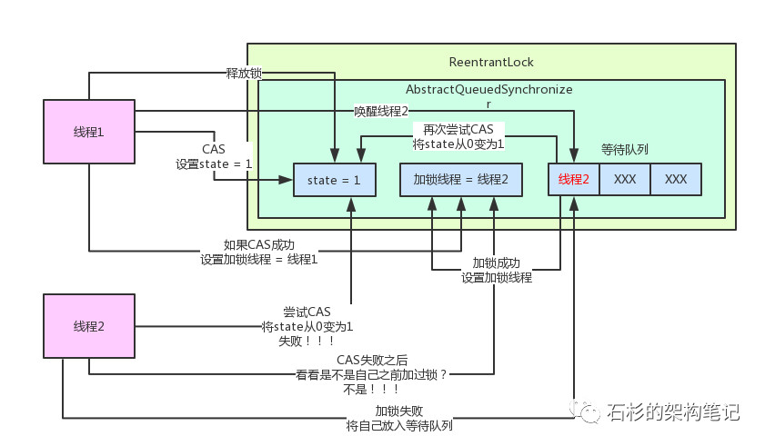
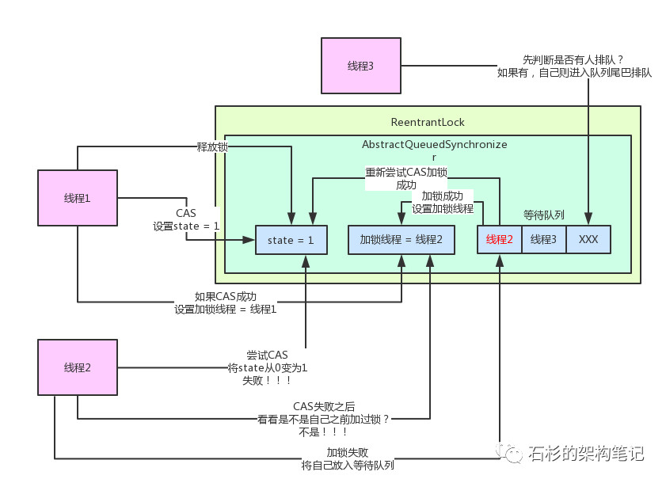

# Java中的锁 #

## 一、可重入锁: ReentrantLock(加强版synchronized)

ReentrantLock,是一种递归无阻塞的同步机制。它可以等同于synchronized的使用，但是ReentrantLock提供比synchronized更强大更灵活的锁机制，可以减少死锁发生的概率。

### 1.获取锁

	//非公平锁
	ReentrantLock lock = new ReentrantLock();
	lock.lock();

lock方法：

	 public void lock() {
	        sync.lock();
	    }
Sync为ReentrantLock里面的一个内部类，它**继承AQS**，有两个子类：公平锁**FairSync**和非公平锁**NonfairSync**。

ReentrantLock里面大部分功能都是委托给Sync来实现的，同时Sync内部定义了lock()抽象方法由其子类去实现，默认实现了nonfairTryAcquire(int acquires)方法，可以看出他它是非公平锁的默认实现。下面我们看非公平锁的lock()方法：

	 final void lock() {
	        //尝试获取锁
	        if (compareAndSetState(0, 1))
	            setExclusiveOwnerThread(Thread.currentThread());
	        else
	            //获取失败，调用AQS的acquire(int arg)方法
	            acquire(1);
	    }

首先会第一次尝试快速获取锁，如果获取失败，则调用**acquire(int arg)**方法，该方法定义在AQS中，如下：

	public final void acquire(int arg) {
	        if (!tryAcquire(arg) &&
	                acquireQueued(addWaiter(Node.EXCLUSIVE), arg))
	            selfInterrupt();
	    }
这个方法首先调用**tryAcquire(int arg)方法**，在AQS中讲述过，tryAcquire(int arg)需要自定义同步组件提供实现，非公平锁如下：

	protected final boolean tryAcquire(int acquires) {
	        return nonfairTryAcquire(acquires);
	    }
	
	    final boolean nonfairTryAcquire(int acquires) {
	        //当前线程
	        final Thread current = Thread.currentThread();
	        //获取同步状态
	        int c = getState();
	        //state == 0,表示没有该锁处于空闲状态
	        if (c == 0) {
	            //获取锁成功，设置为当前线程所有
	            if (compareAndSetState(0, acquires)) {
	                setExclusiveOwnerThread(current);
	                return true;
	            }
	        }
	        //线程重入
	        //判断锁持有的线程是否为当前线程
	        else if (current == getExclusiveOwnerThread()) {
	            int nextc = c + acquires;
	            if (nextc < 0) // overflow
	                throw new Error("Maximum lock count exceeded");
	            setState(nextc);
	            return true;
	        }
	        return false;
	    }
该方法主要逻辑：首先判断**同步状态state **== 0?,如果是表示该锁还没有被线程持有，直接通过**CAS获取同步状态**，如果成功返回true。如果state!=0,则判断当前线程是否为获取锁的线程，如果是则获取锁，成功返回true。成功获取锁的线程再次获取锁，这是增加了同步状态的state。

### 2.释放锁

获取同步锁后，使用完毕则需要释放锁，ReentrantLock提供了unlock释放锁：

	public void unlock() {
	        sync.release(1);
	    }

unlock内部使用Sync的release(int arg)释放锁，release(int arg)是在AQS定义的

	public final boolean release(int arg) {
	        if (tryRelease(arg)) {
	            Node h = head;
	            if (h != null && h.waitStatus != 0)
	                unparkSuccessor(h);
	            return true;
	        }
	        return false;
	    }

与获取同步状态的acquire(int arg)方法相似，释放同步状态的tryRelease(int arg)同样是需要自定义同步组件自己实现：

	protected final boolean tryRelease(int releases) {
	        //减掉releases
	        int c = getState() - releases;
	        //如果释放的不是持有锁的线程，抛出异常
	        if (Thread.currentThread() != getExclusiveOwnerThread())
	            throw new IllegalMonitorStateException();
	        boolean free = false;
	        //state == 0 表示已经释放完全了，其他线程可以获取同步状态了
	        if (c == 0) {
	            free = true;
	            setExclusiveOwnerThread(null);
	        }
	        setState(c);
	        return free;
	    }
只有当同步状态彻底释放后该方法才会返回true。当**state==0时**，则将锁持有线程设置为null，free=true，表示释放成功。

### 3.ReentranLock和AQS的关系 ##
AQS是Java并发包的基础类，ReentrantLock、ReetranReadWriteLock底层都是基于**AQS**来实现的。所谓AQS就是AbstractQueuedSynchronizer,即抽象队列同步器。

  
 

ReentrantLock内部包含一个AQS对象，也就是AbstractQueuedSynchronizer类型的对象，这个对象就是ReentrantLock可以实现**加锁和释放锁**的核心组件。

**那么ReentrantLock加锁和释放锁的底层原理？**

当一个线程尝试使用ReentrantLock的lock()方法进行加锁时，AQS对象内部有一个**核心变量state，代表加锁的状态**。初始条件下，这个state值为0。另外AQS内部还有一个**关键变量，用来记录当前加锁的是哪个线程**，初始情况下这个变量为null。

  
 

当线程调用ReentrantLock的lock()方法尝试进行加锁，这个加锁的过程就是使用**CAS操作**将state值从0变为1，如果之前没有被加锁那么state的值肯定为0，所以此时线程1加锁成功，一旦线程1加锁成功就可以设置当前加锁线程是自己。整个加锁过程如下图：

  
 

**可重入性**：可以对一个ReentrantLock锁定的对象进行**多次lock()和unlcok()操作**，即一个锁可以加多次。当线程进行加锁时，会判断一下当前加锁线程是不是自己，是**自己就可重入多次加锁**，每次加锁就**将state的值进行累加**。

当另外一个线程2想对当前对象进行ReentrantLock加锁时，线程2首先会判断一下当前加锁线程是不是自己，如果不是即查看当前state值是不是0，如果不是，那么CAS失败，加锁失败。

  
 

加锁失败后，线程2会将自己放入AQS的等待队列，等待线程释放锁之后，自己可以尝试重新加锁。其过程如下图所示：

  
 

当线程1执行完自己的业务代码之后，就会释放锁，其释放锁的过程就是将AQS内的state值减1，**如果state等于0，那么才彻底释放锁**，将加锁线程变量置为null，如下图所示：

  
 

接下来从等待队列的对头唤醒线程2重新尝试加锁。接下来加锁过程就与上面线程1类似，当加锁成功之后需要将线程2从等待队列中移除。

  
 

### 3.ReentrantLock可指定公平锁和非公平锁。 ##

**什么是非公平锁？**

在上述ReentrantLock进行加锁场景下，当线程1刚刚释放锁的时候，线程2还没来得及重新加锁，突然来了一个线程3，进行加锁，直接抢占加锁，那么线程2加锁失败，只有继续等待，这就是非公平锁。

当如果线程3想要加锁之前进行判断等待队列中是否有人排队，如果发现有人排队，则自觉在进入队列排队，那么此时线程就可以加锁成功，并移除队列。基本过程如下图

  
 

公平锁：**公平是针对锁的获取而言的**，如果一个锁是公平的，那么锁的获取顺序就应该符合请求的绝对时间顺序，也就是FIFO

### 4.ReentrantLock与synchronized的区别

1. 与synchronized相比，ReentrantLock提供了更多，更加全面的功能。具备更强的扩展性。例如：**时间锁等候**，**可中断锁等候**，锁投票。
2. ReentrantLock还提供了**条件Condition**，对线程的等待、唤醒操作更加详细和灵活，所以在多个条件变量和高度竞争锁的地方，ReentrantLock更加适合
3. ReentrantLock提供了**可轮询的锁**请求。它会尝试着去获取锁，如果成功则继续，否则可以等到下次运行时处理，而synchronized则一旦进入锁请求要么成功要么阻塞，所以相比synchronized而言，ReentrantLock会不容易产生死锁些。
4. ReentrantLock**支持更加灵活的同步代码块**，但是使用synchronized时，只能在同一个synchronized块结构中获取和释放。

 **注：ReentrantLock的锁释放一定要在finally中处理，否则可能会产生严重的后果。**

5. ReentrantLock**支持中断处理**，且性能较synchronized会好些。

## 二、读写锁：ReentrantReadWriteLock ##

重入锁ReentrantLock是排他锁，排它锁在同一时刻仅有一个线程可以进行访问，但是在多数场景下，大部分时间都是提供**读服务**，而写服务占用时间较少。然而读服务不存在数据竞争问题，如果一个线程在读时禁止其他线程读势必会导致性能降低。所以读写锁很有必要。

读写锁维护着一对锁，一个读锁和一个写锁。通过分离读锁和写锁，使得并发性比一般的排他锁有了较大提高：在同一时间可以允许多个线程同时访问，但是在写线程访问时，所有读线程和泄线程都会被阻塞。

读写锁：ReadWriteLock定义获取读锁和写锁的两个方法，即r**eadlock()方法**和**writelock()方法**。

读锁是共享锁，写锁是排他锁。

对于共享数据，如果加了写锁，其他线程既不能加读锁也不能加写锁。如果一个线程加了读锁，其他线程可以继续加读锁，但是不能加写锁。

### 1.读写锁的主要特性：

1. **公平性**：支持公平性和非公平性
2. **重入性**：支持重入。读写锁最多支持**65535**个递归写入锁和65535个递归读取锁。
3. **锁降级**：遵循获取写锁、获取读锁在释放写锁的次序，写锁能够降级成为读锁。

读写锁ReentrantReadWriteLock实现接口ReadWriteLock，该接口维护了一对相关的锁，一个用于只读操作，另一个用于写入操作。只要没有writer，读写锁可以由多个reader线程同时保持。写入锁是独占的。

	public interface ReadWriteLock {
	    Lock readLock();
	    Lock writeLock();
	}

ReadWriteLock定义了两个方法。readLock()返回用户读操作的锁，writeLock()返回用于写操作的锁。ReentrantReadWriteLock定义如下：

    /** 内部类  读锁 */
    private final ReentrantReadWriteLock.ReadLock readerLock;
    /** 内部类  写锁 */
    private final ReentrantReadWriteLock.WriteLock writerLock;

    final Sync sync;

    /** 使用默认（非公平）的排序属性创建一个新的 ReentrantReadWriteLock */
    public ReentrantReadWriteLock() {
        this(false);
    }

    /** 使用给定的公平策略创建一个新的 ReentrantReadWriteLock */
    public ReentrantReadWriteLock(boolean fair) {
        sync = fair ? new FairSync() : new NonfairSync();
        readerLock = new ReadLock(this);
        writerLock = new WriteLock(this);
    }

    /** 返回用于写入操作的锁 */
    public ReentrantReadWriteLock.WriteLock writeLock() { return writerLock; }
    /** 返回用于读取操作的锁 */
    public ReentrantReadWriteLock.ReadLock  readLock()  { return readerLock; }

    abstract static class Sync extends AbstractQueuedSynchronizer {
        /**
         * 省略其余源代码
         */
    }
    public static class WriteLock implements Lock, java.io.Serializable{
        /**
         * 省略其余源代码
         */
    }

    public static class ReadLock implements Lock, java.io.Serializable {
        /**
         * 省略其余源代码
         */
    }

ReentrantReadWriteLock与Reentrant一样，其**锁主体依然是Sync**，它的读写锁都是依靠Sync来实现。所以ReentrantWriteLock实际上只有一个锁，只是在获取读取锁和写入锁的方式上不一样而已，它的读写锁其实就是两个类：ReadLock、writeLock，这两个类都是lock实现的。

在ReentrantLock中使用int类型的state来表示同步状态，该值表示锁被一个线程重复获取的次数。但是读写锁ReentrantReadWriteLock内部维护着两个锁，需要一个变量维护多种状态。所以读写锁采用“**按位切割使用**”的方法来维护这个变量，将其切分为两部分，**高16位表示读，低16位表示写**。分割之后，读写锁如何迅速确定读锁和写锁的状态呢？通过位运算。假如当前同步状态为S，那么写状态等于S&0x0000FFFF(将高16位全部抹去)，读状态等于S>>>16(无符号补0右移16位)。代码如下：

	 static final int SHARED_SHIFT   = 16;
	        static final int SHARED_UNIT    = (1 << SHARED_SHIFT);
	        static final int MAX_COUNT      = (1 << SHARED_SHIFT) - 1;
	        static final int EXCLUSIVE_MASK = (1 << SHARED_SHIFT) - 1;
	
	        static int sharedCount(int c)    { return c >>> SHARED_SHIFT; }
	        static int exclusiveCount(int c) { return c & EXCLUSIVE_MASK; 
      }

### 2.写锁

写锁是一个支持可重入的**排他锁**。

#### 1.写锁的读取

写锁的获取最终会调用tryAcquire(int arg),该方法在内部类Sync中实现：

	 protected final boolean tryAcquire(int acquires) {
	        Thread current = Thread.currentThread();
	        //当前锁个数
	        int c = getState();
	        //写锁
	        int w = exclusiveCount(c);
	        if (c != 0) {
	            //c != 0 && w == 0 表示存在读锁
	            //当前线程不是已经获取写锁的线程
	            if (w == 0 || current != getExclusiveOwnerThread())
	                return false;
	            //超出最大范围
	            if (w + exclusiveCount(acquires) > MAX_COUNT)
	                throw new Error("Maximum lock count exceeded");
	            setState(c + acquires);
	            return true;
	        }
	        //是否需要阻塞
	        if (writerShouldBlock() ||
	                !compareAndSetState(c, c + acquires))
	            return false;
	        //设置获取锁的线程为当前线程
	        setExclusiveOwnerThread(current);
	        return true;
	    }
该方法和ReentrantLock的tryAcquire(int arg)大致一样，在判断重入时增加一项条件：读锁是否存在。因为要确保写锁的操作对读锁是可见的，如果在存在读锁的情况下允许获取写锁，那么那些已经获取读锁的其他线程可能就无法感知当前写线程的操作。因此只有等读锁完全释放后，写锁才能被当前线程锁获取，一旦写锁获取了，所有其他读、写线程均会被阻塞。

#### 2.写锁的释放

获取了写锁用完了则需要释放，WriteLock提供了unlock()方法释放写锁：

	public void unlock() {
	        sync.release(1);
	    }
	
	    public final boolean release(int arg) {
	        if (tryRelease(arg)) {
	            Node h = head;
	            if (h != null && h.waitStatus != 0)
	                unparkSuccessor(h);
	            return true;
	        }
	        return false;
	    }

写锁的释放最终还是会调用AQS的模板方法**release(int arg)方法**，方法首先调用tryRelease(int arg)方法释放锁，tryRelease(int arg)方法为读写锁内部类Snyc中定义了，如下：

	protected final boolean tryRelease(int releases) {
	        //释放的线程不为锁的持有者
	        if (!isHeldExclusively())
	            throw new IllegalMonitorStateException();
	        int nextc = getState() - releases;
	        //若写锁的新线程数为0，则将锁的持有者设置为null
	        boolean free = exclusiveCount(nextc) == 0;
	        if (free)
	            setExclusiveOwnerThread(null);
	        setState(nextc);
	        return free;
	    }

写锁释放锁的整个过程和独占锁ReentrantLock相似，每次释放均是减少写状态，当写状态为0时表示写锁已经完全释放了，从而等待的其他线程可以继续访问读写锁，获取同步状态，同时写线程的修改对后续线程可见。

### 2.读锁

读锁为一个可重入的共享锁，它能够被多个线程同时持有，在没有其他线程访问时，读锁总是会获取成功。

#### 1.读锁的获取

读锁的获取可以通过ReadLock的lock()方法：

	   public void lock() {
	            sync.acquireShared(1);
	        }

Sync的acquireShared(int arg)定义在AQS中：

	public final void acquireShared(int arg) {
	        if (tryAcquireShared(arg) < 0)
	            doAcquireShared(arg);
	    }

tryAcquireShared(int arg)尝试获取同步状态，获取成功返回>=0的返回结果，否则返回<0的返回结果。

	protected final int tryAcquireShared(int unused) {
	        //当前线程
	        Thread current = Thread.currentThread();
	        int c = getState();
	        //exclusiveCount(c)计算写锁
	        //如果存在写锁，且锁的持有者不是当前线程，直接返回-1
	        //存在锁降级问题，后续阐述
	        if (exclusiveCount(c) != 0 &&
	                getExclusiveOwnerThread() != current)
	            return -1;
	        //读锁
	        int r = sharedCount(c);
	
	        /*
	         * readerShouldBlock():读锁是否需要等待（公平锁原则）
	         * r < MAX_COUNT：持有线程小于最大数（65535）
	         * compareAndSetState(c, c + SHARED_UNIT)：设置读取锁状态
	         */
	        if (!readerShouldBlock() &&
	                r < MAX_COUNT &&
	                compareAndSetState(c, c + SHARED_UNIT)) {
	            /*
	             * holdCount部分后面讲解
	             */
	            if (r == 0) {
	                firstReader = current;
	                firstReaderHoldCount = 1;
	            } else if (firstReader == current) {
	                firstReaderHoldCount++;
	            } else {
	                HoldCounter rh = cachedHoldCounter;
	                if (rh == null || rh.tid != getThreadId(current))
	                    cachedHoldCounter = rh = readHolds.get();
	                else if (rh.count == 0)
	                    readHolds.set(rh);
	                rh.count++;
	            }
	            return 1;
	        }
	        return fullTryAcquireShared(current);
	    }

读锁获取的过程相对于独占锁而言会稍微复杂下，整个过程如下：

1. 因为存在锁降级情况，如果存在写锁且锁的持有者不是当前线程则直接返回失败，否则继续。
2. 依据公平性原则，判断读锁是否需要阻塞，读锁持有线程数小于最大值（65535），且设置锁状态成功，执行以下代码（对于HoldCounter下面再阐述），并返回1。如果不满足改条件，执行fullTryAcquireShared()。

fullTryAcquireShared(Thread current)会根据“是否需要阻塞等待”，“读取锁的共享计数是否超过限制”等等进行处理。如果不需要阻塞等待，并且锁的共享计数没有超过限制，则通过CAS尝试获取锁，并返回1。

#### 2.读锁的释放

与写锁相同，读锁也提供了unlock()释放读锁：

	  public void unlock() {
	            sync.releaseShared(1);
	        }

unlock()方法内部使用Sync的releaseShared(int arg)方法，该方法定义在AQS中：

	public final boolean releaseShared(int arg) {
	        if (tryReleaseShared(arg)) {
	            doReleaseShared();
	            return true;
	        }
	        return false;
	    }

调用tryReleaseShared(int arg)尝试释放读锁，该方法定义在读写锁的Sync内部类中：

#### 3.HoldCounter

在读锁获取锁和释放锁的过程中，我们一直可以看到一个变量rh(**HoldCounter**),该变量在读锁中扮演非常重要的作用，读锁的内在机制其实就是一个共享锁，为了更好的理解HoldCounter，首先认为它不是一个锁，而是相当于一个计数器。一次共享锁的操作就相当于在该计数器的操作。**获取共享锁，则该计数器+1，释放共享锁，该计数器-1**。只有当线程获取共享锁后才能对共享锁进行释放、重入操作。所以HoldCounter的作用就是当前线程持有共享锁的数量，这个数量必须要与线程绑定在一起，否则操作其他线程就会抛出异常。我们先看HoldCounter的定义：

	static final class HoldCounter {
	            int count = 0;
	            final long tid = getThreadId(Thread.currentThread());
	        }
HoldCounter定义非常简单，就是**一个计数器count和线程tid**两个变量，根据上面HoldCounter是需要和某个线程进行绑定了，但是一个对象和线程绑定仅仅有tid是不够的，所以需要引入ThreadLocal，定义如下：

	 static final class ThreadLocalHoldCounter
	            extends ThreadLocal<HoldCounter> {
	            public HoldCounter initialValue() {
	                return new HoldCounter();
	            }
	        }

通过上面代码HoldCounter就可以与线程进行绑定了。故而，HoldCounter应该就是绑定线程上的一个计数器，而ThreadLocalHoldCounter则是线程绑定**ThreadLocal**。从上面我们可以看到ThreadLocal将HoldCounter绑定到当前线程上，同时HoldCounter也持有线程Id，这样在释放锁的时候才能知道ReadWriteLock里面缓存的上一个读取线程（cachedHoldCounter）是否是当前线程。这样做的好处是可以减少ThreadLocal.get()的次数，因为这也是一个耗时操作。需要说明的是这样HoldCounter绑定线程id而不绑定线程对象的原因是避免HoldCounter和ThreadLocal互相绑定而GC难以释放它们（尽管GC能够智能的发现这种引用而回收它们，但是这需要一定的代价），所以其实这样做只是为了帮助GC快速回收对象而已。

### 锁降级
锁降级就意味着写锁是可以降级为读锁的，但是需要遵循**先获取写锁、获取读锁在释放写锁的次序**。注意如果当前线程先获取写锁，然后释放写锁，再获取读锁这个过程不能称之为锁降级，锁降级一定要遵循那个次序。

在获取读锁的方法tryAcquireShared(int unused)中，有一段代码就是来判读锁降级的：

	int c = getState();
	        //exclusiveCount(c)计算写锁
	        //如果存在写锁，且锁的持有者不是当前线程，直接返回-1
	        //存在锁降级问题，后续阐述
	        if (exclusiveCount(c) != 0 &&
	                getExclusiveOwnerThread() != current)
	            return -1;
	        //读锁
	        int r = sharedCount(c);

**问题：锁降级中读锁的获取释放为必要？**

肯定是必要的。试想，假如当前线程A不获取读锁而是直接释放了写锁，这个时候另外一个线程B获取了写锁，那么这个线程B对数据的修改是不会对当前线程A可见的。如果获取了读锁，则线程B在获取写锁过程中判断如果有读锁还没有释放则会被阻塞，只有当前线程A释放读锁后，线程B才会获取写锁成功。

## Condition

ReentrantLock提供一个Condition类，可以分组唤醒需要唤醒的线程，相比Object中的wait(),notify()系列方法更加详细和灵活。

Condition提供了一系列的方法来对阻塞和唤醒线程：

1. await()：造成当前线程在接到信号或被中断之前一直处于**等待状态**。
2. await(long time, TimeUnit unit)：造成当前线程在接到信号、被中断或到达**指定等待时间**之前一直处于等待状态。
3.awaitNanos(long nanosTimeout)：造成当前线程在接到信号、被中断或到达指定等待时间之前一直处于等待状态。**返回值表示剩余时间**，如果在nanosTimesout之前唤醒，那么返回值 = nanosTimeout – 消耗时间，如果返回值 <= 0 ,则可以认定它已经超时了。
4.awaitUninterruptibly()：造成当前线程在接到信号之前一直处于等待状态。(对中断不敏感)
5.awaitUntil(Date deadline)：造成当前线程在接到信号、被中断或到达指定最后期限之前一直处于等待状态。如果没有到指定时间就被通知，则返回true，否则表示到了指定时间，返回返回false。
6. signal()：唤醒一个等待线程。该线程从等待方法返回前必须获得与Condition相关的锁。
7. signal()All：唤醒所有等待线程。能够从等待方法返回的线程必须获得与Condition相关的锁。

Condition是一种广义上的条件队列。他为线程提供了更为灵活的等待/通知模式，线程在调用**await方法后执行挂起操作**，直到线程等待的某个条件为真时才会被唤醒。Conodition必须配合锁一起使用，因为对共享状态变量的访问发生在多线程环境下。一个Condition的实例必须与一个Lock绑定，因此Condition一般都是作为Lock的内部实现。

### 1.Condition的实现
获取一个Condition必须要通过**Lock的newCondition()方法**。该方法定义在接口Lock下面，返回的结果是绑定到此 Lock 实例的新 Condition 实例。Condition为一个接口，其下仅有一个**实现类ConditionObject**，由于Condition的操作需要获取相关的锁，而AQS则是同步锁的实现基础，所以ConditionObject则定义为AQS的内部类。

#### 1.等待队列
每个Condition对象都包含着一个FIFO队列，该队列是Condition对象通知/等待功能的关键。在队列中每一个节点都包含着一个线程引用，该线程就是在该Condition对象上的等待线程。

Condition拥有首节点(firstWaiter),尾节点(lastWaiter)。当前线程调用await()方法，将会以当前线程构造成一个节点(Node),并将节点加入到该队列的尾部。结构如下：

  
 

Node里面包含了当前线程的引用。Node定义与AQS的CLH同步节点的使用是同一个类。但Condition的队列结构比CLH同步队列的结构简单，新增过程只需要将原尾节点的nextWaiter指向新增节点，然后更新lastWaiter即可。

#### 2.等待

调用Condition的await()方法会使当前线程进入等待状态，同时加入到Condition等候队列同时释放锁。当从await()方法返回时，当前线程一定是获取了Condition先关联的锁。

#### 3.通知

调用Condition的signal()方法，将会唤醒在等待队列中等待时间最长时间的节点(条件队列里的首节点)，在唤醒节点前，会将节点移到CLH同步对列中。

总得说来，当一个线程获取锁后，通过调用Condition的**await()方法**，会将当前线程**加入到条件队列**中，然后释放锁，最后通过isOnSyncQueue(Node node)方法不断**自检该节点是否已经在CLH同步对列**中，如果是则尝试获取锁，否则一直挂起。当线程调用**signal()方法**后，程序首先检查当前线程是否获取了锁，然后通过**doSignal(Node first)方法唤醒CLH同步队列的首节点**。被唤醒的线程，将从await()方法中的while循环中退出来，然后调用acquireQueued()方法竞争同步状态。