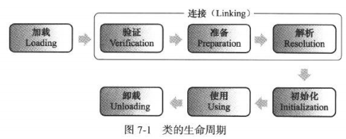
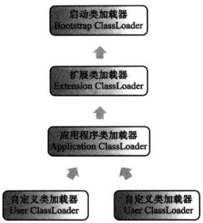

# JVM类加载机制 #

## 一、什么是类加载

类的加载指的是将类的.class文件中的**二进制数据读到内存**中，将其放在运行时数据区的**方法区**内，然后在**堆区**创建一个java.lang.class对象，用来封装类在方法区内的数据结构。类的加载的最终产品是位于**堆区的Class对象**，class对象封装了类在方法区内的数据结构，并且向Java程序员提供了访问方法区内的数据结构的接口。

类加载器并不需要等到某个类被“首次主动使用”时再加载它，JVM规范允许类加载器在预料某个类将要被使用时就**预先加载它**，如果在预先加载的过程中遇到了.class文件缺失或存在错误；类加载器必须在使用该类时才报告错误(LinkageError错误)如果这个类一直没有被程序主动使用，那么类加载器就不会报告错误。(懒加载非即时加载)。

简单说来，类在运行期间**第一次使用时动态加载**，而不是编译时一次性加载。因为如果在编译时一次性加载，会占用很多内存。

## 二、类的生命周期

类的生命周期包括：加载-->**验证**-->**准备**-->**解析**-->初始化-->使用-->卸载，其中验证-->准备-->解析3部分统称为**连接**。

  
 

类加载的过程包括加载-->验证-->准备-->解析-->初始化这5个阶段,其中加载、验证、准备、初始化的顺序是确定的，类加载的过程必须按照这种顺序开始，但是**解析过程**则不一定：它在某些情况下可以在初始化阶段之后再**开始**，这是为了支持Java语言的运行时绑定(也称为动态绑定)，**注意：**只是按顺序开始，而不一定按顺序完成，主要是因为这些阶段通常是相互交叉地混合式进行的，通常会在一个阶段执行的过程中调用、激活另一个阶段。

**下面分别介绍一下各个阶段的主要内容**：

### 1.加载

**加载阶段，虚拟机需要完成以下三件事**：

- 通过一个类的**全限定名**来**获取定义此二进制字节流**。
- 将这个字节流所代表的静态存储结构转化为**方法区**的**运行时数据结构**
- 在内存中生成一个代表这个类的**java.lang.Class对象**，作为**方法区这个类的各种数据结构的访问入口。**

**加载.class文件的方式**（加载源）

- 从**本地系统**中直接加载。
- 通过**网络下载.**class文件。
- 从**zip，jar等归档文件**中加载.class文件。
- 从**专有数据库**中提取.class文件。
- 将**java源文件动态编译**为.class文件。

相对于类加载的其他阶段而言，加载阶段(加载阶段中**获取类的二进制字节流的动作**)是开发人员可控性最强的，因为加载阶段既可以使用系统提供的引导类加载器来完成，也可以由用户自定义的类加载器去完成，开发人员可以通过定义自己的类加载器去控制字节流的获取方式(即重写一个类加载器的**loadClass()方法**)。

加载阶段完成之后，虚拟机外部的二进制字节流就按照虚拟机所需的格式存储在**方法区**之中，而且在Java堆中也**创建一个java.lang.Class类的对象**，这样便可以通过该对象访问方法区中的这些数据。

### 2.连接 

#### 1）.验证

确保被加载的类的正确性，确保Class文件的字节流中包含的信息符合当前虚拟机的要求，从而防止恶意代码的攻击。**

验证阶段分为4个阶段:

- 1).文件格式验证：验证字节流是否符合Class文件的规范；例如：是否以**魔数0xCAFEBABE****开头、主次版号**是否在当前虚拟机的处理范围之内，**常量池中的常量**是否有不被支持的类型。

- 2).元数据验证**:对字节码描述的信息进行**语义分析**(注意：对比javac编译阶段的语义分析)，以保证其描述的信息符合Java语言规范的要求；例如这个类是否有父类(除了java.lang.Object之外，**所有的类都应当有父类**)，这个类是否继承类不被允许继承的类(被final修饰的类)，如果不是抽象类，是否继承了其父类或者接口中所要求的实现的所有方法。
 
- 3).字节码验证**：最复杂阶段，通过数据流和控制流分析，确保语义是合法的、符合逻辑的。元数据验证阶段对元数据信息中的数据类型做完校验后，字节码验证需要对类的**方法体进行校验**，如果类的方法体没有通过字节码验证，那肯定是有问题的。

- 4).符号引用验证：**该阶段在解析中发生，确保**解析动作正常执行**。

验证阶段并不一定是必须的，所有运行代码都已经被反复使用和验证过，在实施阶段可以考虑使用**-Xverify:none**参数来关闭大部分的类验证措施，以缩短虚拟机类加载的时间。

#### 2）.准备

准备阶段是正式为**类变量分配内存**并设置**类变量初始值（默认值）**的阶段，这些变量所使用的内存都将在**方法区**中分配。注意：

1. 该阶段内存分配的仅包括**类变量(static)**,而不包括实例变量，实例变量在对象实例化时随着对象一块分配在Java堆中。
2. 该阶段的初始值是数据类型默认值，而不是代码显示的赋值。
 
假设定义:`public static int value=20;`那么在准备阶段后初始值为0
，value赋值为20的putstatic指令在程序编译后，存放在类构造器<clinit>()方法之中，所以value的赋值操作需要在**初始化阶段才会执行**。

    **注意：**
    
    - 对基本数据类型来说，对于类变量和全局变量，如果程序未显示的为其赋值，系统会为其赋予默认值，而对于局部变量，在使用之前必须显示的为其赋值，否则编译无法通过。
    - 对于同时被static和final修饰的常量，必须在声明的时候就为其显示地赋值，否则编译时不通过，而只被final修饰的常量则既可以在声明时显示地为其赋值，也可以在类初始化时显示的为其赋值，总之，在使用之前必须为其显示地赋值，系统不会为其显示的赋值。
    - 对于引用数据类型，如数组引用和对象引用，系统会为其赋默认值。
    
 
 3.如果类字段的属性表中存在ConstantValue属性，即同时被**final和static**修饰，那么在准备阶段变量value就会被初始化为ConstantValue属性所指定的值。例如：`public static final int value = 123；`在**准备阶段**就会根据ConstantValue的设置将value赋值为123。即static final常量在编译期就将其结果放入调用它的类的常量池中了。

#### 3），解析*

解析阶段是虚拟机将**常量池**内的**符号引用替换为直接引用（直接只用地址指定）**的过程，解析动作主要针对类或接口、字段、类方法、接口方法、方法类型、方法句柄和调用点限定符7类符号引用进行。

**符号引用**就是一组符号来描述目标，可以是任何字面量。

**直接引用**就是直接指向目标的指针、相对偏移量或一个间接定位到目标的句柄。

### 3.初始化 ##

初始化是类加载的最后一步，执行类构造器<clinit>()方法的过程，为类的静态变量赋予正确的初始值，JVM负责对类进行初始化，主要对类变量进行初始化。在Java中对类变量进行初始值设定有两种方式：

- 声明类变量是指定初始值。
- 使用静态代码块为类变量指定初始值。

  <clinit>()方法是有编译器自动收集所有类变量的赋值动作和静态语句块中合并产生，编译器收集的顺序是由源文件出现的顺序决定的。

    public class Demo {
    static {
        i = 0;
        //System.out.println(i);只能赋值，不能访问
    }
    static int i=1;
    }

 子类的<clinit>()方法执行之前，父类的<clinit>()方法已经执行完毕，因此虚拟机中第一个被执行的<clinit>()方法的类肯定是java.lang.Object。由于父类的<clinit>()方法先执行，也就意味着父类中定义的静态语句块要优先子类变量的赋值操作。

 <clinit>()方法对于类或接口来说并不是必须的，如果一个类中没有静态代码块，也没有对变量的赋值操作，那么编译器可以不为这个类生成<clinit>()方法。

 接口中不能有静态语句块，但仍然有变量赋值操作，因此接口与类一样会生成<clinit>()方法，但接口与类不同是，执行接口的<clinit>()方法不需要执行父接口的<clint>()方法。只有父接口中定义变量使用时，父接口才会初始化。接口的实现类在初始化时不会执行父接口的<clinit>()方法。

 虚拟机会保证一个类的<clinit>()方法在多线程环境下正确地加锁、同步，如果多个线程同时初始化一个类，那么只会有一个线程去执行这个类的<clinit>()方法，其他线程需要处于阻塞等待，直到活动线程执行<clinit>()完毕。

JVM初始化步骤

-  如果该类还没有被加载和连接，则程序先加载并连接该类。
-  假如该类的直接父类还没初始化，则先初始化其父类。
-  假如类中有初始化语句，则系统一次执行这些初始化语句。

类初始化的时机：只有当对类主动使用时才会导致类的初始化，类的主动使用包括以下六种：

1. 创建类的实例，new。
2. 访问某个类或接口的静态变量，或者对该静态变量赋值。
3. 调用类的静态方法
4. 反射(如 Class.forName("com.zl.demo.Test"))。
5. 初始化某个类的子类，则其父类也会被初始化
6. Java虚拟机启动时被标明为启动类(Java Test),直接使用java.exe命令来运行某个主类。
### 4.结束生命周期 ##

- 执行了System.exit()方法。
- 程序正常执行结束。
- 程序在执行过程中遇到异常或错误而异常终止。
- 由于操作系统出现错误而导致Java虚拟机进程终止。

## 三、类加载器 ##

通过一个类的全限定名来获取描述此类的二进制字节流。

站在虚拟机的角度只存在两种加载器：1.启动加载器(c++实现)，主要是Hotspot，是jvm的一部分；加载lib目录下的类2.所有其他类加载器，Java实现，独立于虚拟机之外，并且全部继承抽象类java.lang.ClassLoader,这些类加载器需要由启动类加载器加载到内存之后才能加载其他类。

站在Java开发人员的角度，类加载器大致可分为三类：

- **1.启动类加载器**：Bootstrap ClassLoader，负责加载存放在JDK\jre\lib下，或被-Xbootclasspath参数指定的路径之中的，并且能被虚拟机识别的类库(如rt.jar,所有java.开头的类均被Bootstrap ClassLoader加载)。启动类加载器是无法被Java程序直接引用的。
 
- **2.扩展类加载器**：Extension ClassLoader,该加载器由sun.misc.Launcher$ExtClassLoader实现，它负责加载JDK\jre\ext目录中的，或者由java.ext.dirs系统变量指定的路径中所有的类库(如javax.开头的类)开发者可以直接扩展类加载器。

- **3.应用程序类加载器**：Application ClassLoader,该类加载器由 sun.misc.Launcher$AppClassLoader来实现，它负责加载用户类路径(ClassPath)所指定的类，开发者可以直接使用该类加载器，如果应用程序中没有自定义过自己的类加载器，一般情况下这个就是程序中默认的类加载器。

应用程序都是由着三种类加载器相互配合进行加载的，如果有必要，我们还可以加入**自定义的类加载器**。因为JVM自带的类加载器只知道从本地文件系统加载标准的java class文件，因此如果自己编写类ClassLoader，便可以做到以下几点：

- 执行非置信代码前，自动验证数字签名。
- 动态地创建符合用户特定需要的定制化构建类。
- 从特定的场所取得java class，例如**数据库中和网络**中。

### 1.JVM类加载机制**

- **全盘负责**，当一个类加载器负责加载某个Class时，该Class所依赖的和引用其他Class也将由该类加载器负责载入，除非显示使用另外一个类加载器载入。
- **父类委托**，先让父类加载器试图加载该类，只有父类加载器无法加载该类时才尝试从自己的路径加载该类。
- **缓存机制**，缓存机制将会保证所有加载过的Class都会被缓存，当程序中需要使用某个Class时，类加载器先从缓存区寻找该Class，如果缓存区不存在，系统才会读取该类对应的二进制数据，并将其转化为Class对象，存入缓存区。所以修改Class后，必须重启JVM，程序修改才会生效。

### 2.类的加载方式**

1. 命令行启动应用时由JVM初始化加载。
2. 通过Class.forName()方法动态加载。
3. 通过ClassLoader.loadClass方法动态加载。

Class.forName()和ClassLoader.loadClass()的区别：

- Class.forName():将类的.class文件加载到jvm中，还会对类进行解释，执行类中static块；
- ClassLoader.loadClass():只会干一件事，就是讲class文件加载到jvm中，不会执行static中内容，只会在newInstance才会执行static块。
- Class.forName(name,initialize,loader)带参函数也可控制是否加载static块，并且只有调用了newInstance()方法才能调用构造函数，创建类的对象。

### 3.双亲委派模型 ##

双亲委派模型的工作流程：如果一个类加载器收到了类加载请求，它首先不会自己尝试加载这个类，而是把请求委托给父加载器去完成，依次向上，因此所有的类加载请求最终都应该被传递到顶层的启动加载器中，只有当父加载器在它的搜索范围中没有找到所需的类时，即无法完成该加载，子加载器才会尝试自己去加载该类。

**双亲委派机制**：

- 当AppClassLoader加载一个class时，它首先不会自己去尝试加载这个类，而是把类加载请求委派给父类加载器ExtClassLoader去完成。
- 当ExtClassLoader加载一个Class时，它首先不会自己去尝试加载这个类，而是把类加载器请求委派给父类加载器BootstrapClassLoader去完成。
- 如果BootstarpClassLoader加载失败(例如在$JAVA_HOME/jre/lib里未找到该class)，会使用ExtClassLoader来尝试加载。
- 如果ExtClassLoader也加载失败，则会使用AppClassLoader来加载，如果AppClassLoader也加载失败则会报出异常ClassNotFoundException。

  
 

双亲委派模型意义：

- 1.系统防止内存出现多份同样的字节码。
- 2.保证Java程序安全稳定运行。
