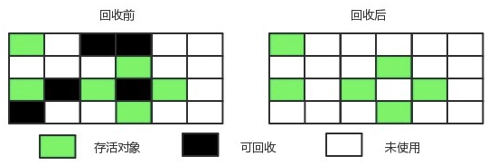
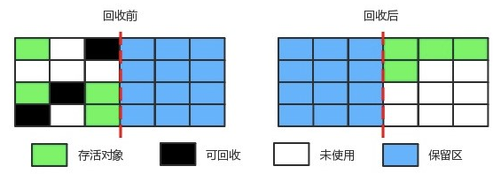
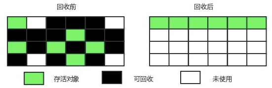
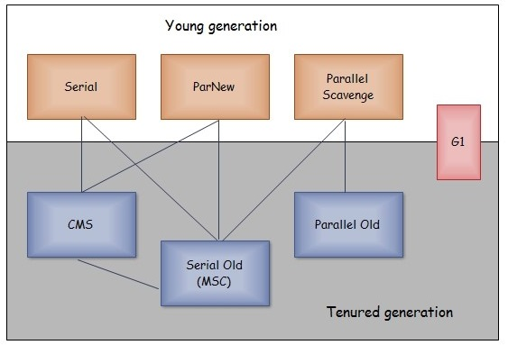
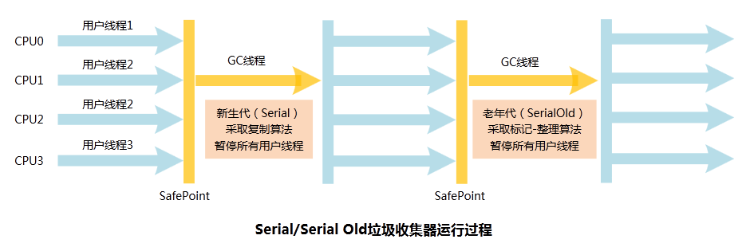
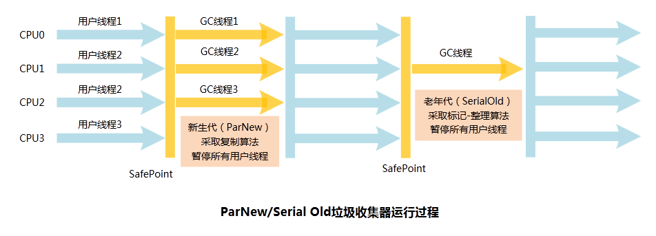
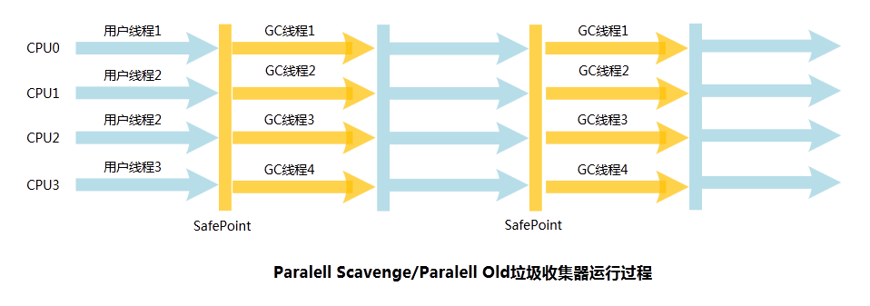

# JVM垃圾回收算法与垃圾回收器 #

本博客主要内容来源于《深入理解Java虚拟机》，也参考了许多博客和公众号，例如纯洁的微笑、程序员江湖等，如有侵权请联系2530997324@qq.com

## 一.介绍 ##

前面介绍了JVM主要分为程序计数器、虚拟机栈，本地方栈，堆和方法区。其中程序计数器、虚拟机栈以及本地方法栈都是随着线程而生随线程而灭，实现了自动内存的清理。因此内存垃圾回收主要集中在**Java堆和方法区**中，在程序运行期间，这部分内存的分配和使用是动态的。

## 二.如何判断对象是否已死

主要有两种方法：

### 1.引用计数法

每个对象有一个引用计数器，增加一个对象引用时，计数器加1，引用释放时，计数器减1，计数器为零时，认为对象已死，可以回收。但是种这方法主要问题是无法解决对象间相互引用的问题。

### 2.可达性分析法

从GCRoots向下搜索，搜索所走过的路径称之为引用链，当一个对象到GCRoots没有任何引用链时，认为对象不可达。因此这种方法的主要问题是找到GCRoots。

**可作为GCRoots的对象包括：**

1. 虚拟栈中引用的对象。
2. 方法区中类的**静态属性**引用的对象。
3. 方法区中**常量引用**的对象。
4. 本地方法栈中引用的对象。

## 三.Java中的引用

### 1.强引用

通过new创建的对象引用，Object object = new Object(),永远不会被回收。

### 2.软引用

对于一些有用但是非必需的对象，系统发生内存溢出之前，会对这些对象进行第二次垃圾回收，如果还是内存不足，才会抛出内存溢出异常，可以使用SoftReference类实现软引用。

### 3.弱引用

弱引用是用来描述非必需对象的，被弱引用关联的对象只能生存到下一次垃圾回收前，无论内存是否足够，都会回收，可使用WeakReference类实现弱引用。

### 4.虚引用

其目的只是为被虚引用关联的对象在回收时收到一个系统通知，可使用PhantomReference类来实现虚引用。

## 四.垃圾回收算法

### 1.标记-清除算法

主要分为**标记**和**清除**两个阶段，标记处所有需要回收的对象，在标记完成后统一回收被标记的对象。

两个不足：标记和清除**效率不高**；标记清除之后会产生大量不连续的**空间碎片**，当分配大对象时，无法找到连续内存，会触发另一次垃圾回收动作。

  
 

### 2.复制算法

为了解决标记-清除的**效率问题**，引入复制算法，将内存分为大小相等的两块，每次只使用一块，当这一块用完，将存活的对象复制到另一块，然后再把已经使用过的内存空间一次清理掉，但是这种方法会浪费一半的空间。

  
 

常用的复制算法是将内存按照8：1：1的比例将内存分为一块**较大的Eden区**和两个较小的Survivor区。当survivor存放不下时，需要依赖其他内存（老年代）进行分配担保。

堆可以分为新生代和老年代区域。

新生代：Eden区(只要新创建一个对象放入Eden区)；survivor：如果Eden区的对象没有被杀死，就存在survivor区；Tenured Gen：垃圾回收器很少关注。

### 3.标记-整理算法

对于所有对象都100%存活的情况，例如老年代就不太适合复制算法，所以提出了标记-整理算法，它与标记-清除算法的区别是后续步骤不是直接对可回收对象进行清理，而是将存活的对象向一端移动，然后直接清除掉端边界以外的内存。

  
 

效率还不如复制算法。

### 4.分代收集算法

堆可以分为新生代和老年代，新生代中由于每次垃圾回收时会有大量对象死去，所以采用复制算法，而老年代的对象存活率较高，没有空间进行担保，所有采用标记-清除或者标记-整理算法。

## 五、垃圾收集器

  
 

上图反映了现在Java虚拟机中的7中垃圾收集器之间的关系。

### 1. Serial收集器
**单线程**垃圾收集器，在进行垃圾回收时，必须暂停所有工作进程(Stop The World),会产生停顿，Serial--->Parallel--->CMS--->G1,一直在致力于减小停顿。Serial收集器在桌面客户端或者单CPU场景中也有优于其他收集器的地方（简单高效）Client模式下默认的新生代收集器。

  
 

Serial Old是Serial收集器的老年代版本。可与CMS和Parallel Scavenage收集器搭配使用。

**参数控制**： -XX:+UseSerialGC 串行收集器

### 2.ParNew收集器

Serial收集器的多线程版本，与CMS配合对老年代进行垃圾回收。在单核cpu情况下性能不如Serial，只有当CPU数量增加时，GC时系统资源利用率才高。

  
 

**参数控制**：

-XX:+UseParNewGC ParNew收集器
-XX:ParallelGCThreads 限制线程数量

### 3.Parallel Scavenge收集器

与ParNew收集器相同的是，都是新生代收集器，都采用复制算法，且又是多线程。不同在于ParNew在于**缩短停顿**时间，Parallel 关注点在达到一个可控的吞吐量（执行代码时间/(执行代码时间+垃圾回收时间)）。使用两个参数精确控制吞吐量，分别是最大垃圾停顿时间-XX：MaxGCPauseMillis参数和直接设置吞吐量大小-XX：GCTimeRatio参数。

  
 

**参数控制**： -XX:+UseParallelGC 使用Parallel收集器+ 老年代串行

Parallel Old是Parallel-scavenge的老年代版本。，使用多线程和标记-整理算法。

**参数控制**： -XX:+UseParallelOldGC 使用Parallel收集器+ 老年代并行

### 4.CMS收集器

  
 

**并发低停顿收集器**，concurrent Mark Sweep收集器，为获取最短回收停顿时间为目标的收集器。分为4个步骤：

- 初始标记：标记GCRoots直接关联的对象，速度快。
- 并发标记：进行GC Roots Tracing的过程。
- 重新标记：修正并发标记期间因用户线程继续运作而导致标记产生变动的那一部分对象的标记记录。时间较长，但远小于并发标记停顿时间。
- 并发清理：回收对象。

缺点：

- 占用大量CPU资源。
- 无法处理浮动垃圾。
- 内存空间碎片

初始标记、重新标记任然需要“Stop The World”

**控制参数：**

-XX:+UseConcMarkSweepGC 使用CMS收集器
-XX:+ UseCMSCompactAtFullCollection Full GC后，进行一次碎片整理；整理过程是独占的，会引起停顿时间变长
-XX:+CMSFullGCsBeforeCompaction 设置进行几次Full GC后，进行一次碎片整理
-XX:ParallelCMSThreads 设定CMS的线程数量（一般情况约等于可用CPU数量）

### 5.G1收集器

G1把堆划分为多个大小相等的**独立区域(Region**),新生代和老年代不在物理隔离。

  
 

通过引入Region的概念，从而将原来的一整块内存空间划分为多个小空间

  
 

特点：

1. 并发与并行：充分利用CPU资源，缩短Stop-The-World停顿时间。
2. 分代收集：
3. 空间整合：G1从整体上看是基于标记-整理算法，在局部上基于复制算法，不会产生内存碎片。
4. 可预测的停顿：建立可预测的停顿时间模型，能够明确指定停顿时间。

步骤：
1. 初始标记：标记一下GC Roots能直接关联到的对象，并修改TAMS（Next Top at Mark Start）的值，让下阶段用户并发执行时，能在正确可用的Region中创建新对象，这阶段需要停顿线程，但耗时很短,会触发一次Mintor GC。
2. 并发标记：从Root GC 开始对堆中对象进行可达性分析，找出存活对象，这阶段耗时较长，但可以与用户并发执行。
3. 最终标记：修正在并发标记期间因用户线程继续运作而导致标记产生变动的那一部分标记记录，虚拟机将这段时间对象变化记录在线程Remembered Set Logs里面，最终标记阶段需要把Remembered Set Logs的数据合并到**Remebered Set**中，这阶段需要停顿线程，但可以并发执行。
4. 筛选回收：对各个Region的回收价值和成本进行排序，根据用户所期望的GC停顿时间制定回收计划。

## 六.内存分配和回收 

### 1.内存分配策略：

-1.优先分配到Eden；
-2.大对象直接分配到老年代；
-3.长时间存活的对象分配到老年代；
-4.空间分配担保；
-5.动态对象年龄判断。

### 2.对象优先在Eden上分配 ##

-Xms20：最大堆为20M。
-Xmx20：初始化堆为20M。
-Xmn10：新生代堆为10M。
-XX：SurvivorRatio=8决定新生代中Eden与一个survivor比为8：1。

Minor GC：发生在新生代的垃圾回收。

Full GC：发生在老年代的垃圾回收。

### 3.大对象直接进入老年代 ##

避免在Eden去和Survivor区之间的之间发生的大量复制。

-XX：PretenureSizeThreshold参数，大于这个值的对象直接放入到老年代，但这个参数只读Serial和ParNew有效，Parallel Scanvenge不认识该参数。

### 4.长期存活的对象将进入老年代 ##

-XX：MaxTenuringThreshold设置对象晋升为老年代的年龄阈值，对象每熬过一次Minor，年龄计数器加1。

### 5.动态对象年龄判定 ##

当Survovir空间中相同年龄对象的总和大于Survivor空间的一半，年龄大于或等于该年龄的对象就可以直接进入老年代。

### 6.空间分配担保 ##

-XX：HandlePromotionFaliure用来设置是否允许担保失败。但JDK6以后不用。现在新版本中只要老年代的连续空间大于**新生代对象总大小或者历次晋升的平均大小**就会进行minor GC，否则进行Full GC。 

### 7.逃逸分析和栈上分配 ##

逃逸分析主要目标：分析对象的作用域

-方法返回实例对象发生逃逸；
-为成员属性赋值，发生逃逸；
-对象的作用域只在方法中，没有发生逃逸；
-引用成员变量的值，发生逃逸。
