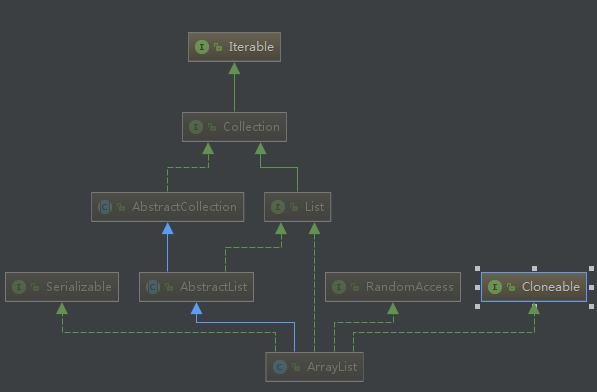

# Java中的容器(一) Java中的Collections #

Java中的容器主要分为Collection和Map两种。

其中Collection相关类或接口的加成关系如图如示

  
 

从上图中可以看出Collection主要包含Set、List、Queue三个接口。

## 一.List ##

List常使用的实现类主要有ArrayList，Vector，Stack以及LinkedList。下面详细介绍几个常用的类的主要特点和源码。

### 1.ArrayList

  
 

Arraylist的底层是基于**动态数组**(相比于Java中的数组)实现数组，支持**随机访问**。其实现了List接口，是顺序容器，即元素存放的数据与放进去的顺序相同，允许放入null元素。ArrayList不支持基础数据类型，需要将基础数据类型转化为包装类，在ArrayList源码中有一个提供给外部调用的ensureCapacity方法，在添加大量元素前，应用程序可以调用该方法增加ArrayList实例的容量，可以减少后期递增式再分配的数量。

ArrayList继承了AbstractList，实现了List。所以它是一个数组队列，提供了相关的添加、删除、修改、遍历等功能。

ArrayList实现了RandomAccess接口，提供了随机访问功能。

ArrayList实现了Cloneable接口，即覆盖了函数clone(),能被克隆。

ArrayList实现了Java.io.Serializable接口，这意味着ArrayList支持序列化。

ArrayList与Vector的最大区别是ArrayList中的操作不是线程安全的，建议在单线程使用，而在多线程中可以选择Vector或者**CopyOnWriteArrayList**以及使用**Collections.synchronizedList()**得到一个线程安全的ArrayList。

    List<String> list = new ArrayList<>();
    List<String> synlist = new Collections.synchronizedList(list);

或者

    List<String> list = new CopyOnWriteArrayList<>();

#### 1)CopyOnWriteArrayList

CopyOnWriteArrayList是读写分离的,写操作在一个复制的数组上进行，读操作还是在原数组中进行。写操作需要加锁，防止并发写入时导致写入数据丢失。写操作结束之后需要把原始数组指向新的复制数组。

	public boolean add(E e) {
	    final ReentrantLock lock = this.lock;
	    lock.lock();
	    try {
	        Object[] elements = getArray();
	        int len = elements.length;
	        Object[] newElements = Arrays.copyOf(elements, len + 1);
	        newElements[len] = e;
	        setArray(newElements);
	        return true;
	    } finally {
	        lock.unlock();
	    }
	}
	
	final void setArray(Object[] a) {
	    array = a;
	}
	@SuppressWarnings("unchecked")
	private E get(Object[] a, int index) {
	    return (E) a[index];
    }
CopyOnWriteArrayList在写操作同时支持读操作，大大提高了读操作的性能，因此适合读多写少的场景。但其也有缺陷：

- 内存占用：在写操作时需要复制一个新的数组，使得占用内存为原来的两倍。
- 数据不一致：读操作不能读取实时性数据，因为部分写操作的数据还未同步到读数组。所以不适合用到内存敏感以及实时性要求很高的场景。

在进行数组复制是反复用到System.arraycopy()和Array.copyOf()方法。下面简单介绍一下两者的区别：copyOf()内部调用了System.arraycopy()方法，System.arraycopy()需要目标数组，将原数组拷贝到自己定义的数组中，可以选择拷贝的起点和长度以及放入到新数组中的位置；copyOf()是系统自动在内部新建一个数组，并返回该数组。

#### 2)ArrayList扩容机制(主要以无参构造为例)

ArrayList的无参构造函数中，实际初始化的是一个空数组，当进行添加操作时，才真正分配容量，当添加第一个元素时，数组容量扩为10.。

     *默认构造函数，使用初始容量10构造一个空列表(无参数构造)
     */
    public ArrayList() {
        this.elementData = DEFAULTCAPACITY_EMPTY_ELEMENTDATA;
    }

ArrayList默认容量是10

	private static final int DEFAULT_CAPACITY = 10;

首先看一下add方法

    public boolean add(E e) {
        //添加元素前，先调用ensureCapacityInternal方法
        ensureCapacityInternal(size + 1);  // Increments modCount!!
        elementData[size++] = e;
        return true;
    }
运行至ensureCapacityInternal方法，

     private static int calculateCapacity(Object[] elementData, int minCapacity) {
        if (elementData == DEFAULTCAPACITY_EMPTY_ELEMENTDATA) {
            return Math.max(DEFAULT_CAPACITY, minCapacity);
        }
        return minCapacity;
    }

    private void ensureCapacityInternal(int minCapacity) {
        ensureExplicitCapacity(calculateCapacity(elementData, minCapacity));
    }

当 要 add 进第1个元素时，minCapacity为1，在Math.max()方法比较后，minCapacity 为10。

调用ensureCapacityInternal() 判断是否需要扩容

    private void ensureExplicitCapacity(int minCapacity) {
        modCount++;

        // overflow-conscious code
        if (minCapacity - elementData.length > 0)
            grow(minCapacity);
    }

在elementData.length小于minCapacity之前不需要扩容，否则调用grow方法

    private void grow(int minCapacity) {
        // overflow-conscious code
        int oldCapacity = elementData.length;
        int newCapacity = oldCapacity + (oldCapacity >> 1);
        if (newCapacity - minCapacity < 0)
            newCapacity = minCapacity;
        if (newCapacity - MAX_ARRAY_SIZE > 0)
            newCapacity = hugeCapacity(minCapacity);
        // minCapacity is usually close to size, so this is a win:
        elementData = Arrays.copyOf(elementData, newCapacity);
    }

通过代码int newCapacity = oldCapacity + (oldCapacity >> 1);可知每次扩容之后容量变为原来的**1.5倍**

当grow中扩容之后的容量大于MAX_ARRAY_SIZE时，会调用hugeCapacity()方法

    private static final int MAX_ARRAY_SIZE = Integer.MAX_VALUE - 8;

在hugeCapacity()方法中，如果minCapacity大于MAX_ARRAY_SIZE则新容量为Integer.MAX_VALUE，否则新容量的大小为MAX_ARRAY_SIZE。

#### Vector

Vecotr的实现与ArrayList类似，但是使用synchronized进行同步。

     public synchronized boolean add(E e) {
        modCount++;
        ensureCapacityHelper(elementCount + 1);
        elementData[elementCount++] = e;
        return true;
    }

	public synchronized E get(int index) {
	    if (index >= elementCount)
	        throw new ArrayIndexOutOfBoundsException(index);
	
	    return elementData(index);
	}

Vector是同步的，因此开销比ArrayList大，访问速度更慢。Vector每次扩容请求其大小的**2倍空间**。

#### Stack

在Java中Stack类表示后进先出(LIFO)的对象堆栈。Stack通过五个操作对Vector进行扩展：

1. empty()：测试堆栈是否为空。
2. peek():查看堆栈顶部的对象，但不从堆栈中移除它。
3. pop():移除堆栈顶部的对象，并作为此函数的值返回该对象。
4. push(E item):把对象压入堆栈顶部。
5. search(Object o):返回对象在堆栈中的位置。

### 2.LinkedList

LinkedList基于双向链表实现，实现了List接口和Deque。LinkedList底层的链表结构使它支持高效的插入和删除操作。LinkedList不是线程安全的，如果想使LinkedList变成线程安全的，可以调用静态类Collections类中的synchronizedList方法：

     List list=Collections.synchronizedList(new LinkedList(...));

### 3.Fail-Fast机制

modCount用来记录ArrayList结构发生变化的次数。结构发生变化是指添加或者删除元素的所有操作，或者调整数组的大小。在进行序列化或者迭代等操作时，需要比较前后modCount是否发生变化，如果改变了需要抛出ConcurrentModificationException。遍历非线程安全的数据结构时，尽量使用迭代器。

## 二、Set

基于Set接口实现的类主要有TreeSet，HashSet，LinkedHashSet。

### 1.TreeSet

TreeSet是SortedSet接口唯一的实现类，基于红黑树实现，支持有序性操作，例如根据一个范围查找元素的操作，但查找效率不如HashSet，Hashset查找时间复杂度为O(1),TreeSet则为O(logN).

### 2.HashSet

基于哈希表实现，支持快速查找，但不支持有序性操作，不保证元素的排列顺序。当向HashSet集合中存入一个元素时，HashSet会调用该对象的HashCode()方法来得到该对象的HashCode值，然后根据HashCode的值来决定该对象在HashSet中存储的位置。由于判断HashSet元素相等的标准是两个对象通过equals方法比较相等，并且两个对象的HashCode()方法返回值相等。所以一个对象放入HashSet中，重写该对象对应类的equals方法，也应该重写HashCode()方法。

### 3.LinkedHashSet

LinkedHashSet集合也是根据HashCode()方法决定元素的存储位置，但是它使用链表维护元素的次序。这样使得元素是以插入顺序来保存的，当遍历该集合时，LinkedHashSet将会以元素添加的顺序访问集合的元素。
