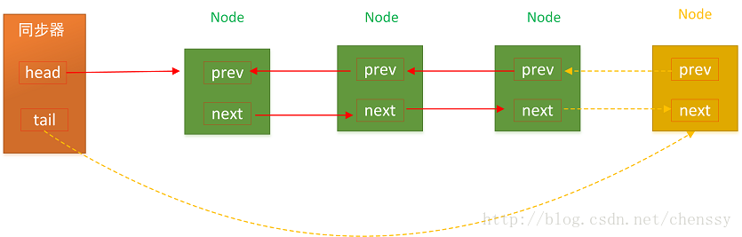
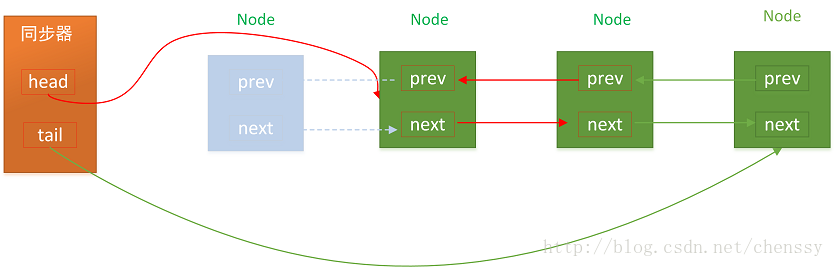
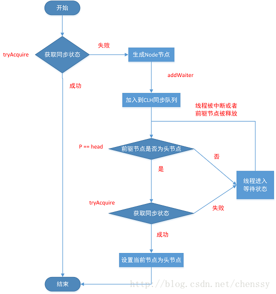

# Java中的AQS #

转自[http://cmsblogs.com](http://cmsblogs.com "死磕并发")

## 一、AQS

介绍Lock之前，首先介绍一下AQS，即同步队列器，它是构建锁以及其他同步组件的基础框架(ReentrantLock、ReentrantReadWriteLock、Semaphore)。

AQS的主要使用方式是继承，子类通过继承同步器并实现它的抽象方法来管理同步状态。

AQS是用一个int类型的成员变量state来表示同步状态，当state>0时表示已经获取了锁，当state=0时表示释放了锁。它提供了三个方法(getState(),setState(int newState),compareAndSetState(int expect,int update))来对同步状态state进行操作，当然AQS可以确保state是线程安全的。

AQS通过内置的FIFO同步队列来完成资源获取线程的排队工作，如果当前线程获取同步状态失败(锁)时，AQS则会将**当前线程以及等待状态信息**构成一个节点(Node)并加入同步队列，同时会阻塞当前线程，当同步状态释放时，则会把节点中的线程唤醒，使其再次尝试获取同步状态。

## 二、CLU同步队列器

在CLH同步队列中，一个节点表示一个线程，它保存着线程的引用(thread)、状态(waitStatus)、前驱节点(prev)、后继节点(next)。

其结构图如下图所示

  
 

### 入列

CLH队列的入列是tail指向新的节点、新节点的prev指向当前最后的节点，当前最后一个节点的next指向当前节点。addWaiter(Node node)方法如下：

	private Node addWaiter(Node mode) {
	        //新建Node
	        Node node = new Node(Thread.currentThread(), mode);
	        //快速尝试添加尾节点
	        Node pred = tail;
	        if (pred != null) {
	            node.prev = pred;
	            //CAS设置尾节点
	            if (compareAndSetTail(pred, node)) {
	                pred.next = node;
	                return node;
	            }
	        }
	        //多次尝试
	        enq(node);
	        return node;
	    }
addWaiter(Node node)先通过快速尝试设置节点，如果失败，则调用enq(Node node)方法设置尾节点。

	 private Node enq(final Node node) {
	        //多次尝试，直到成功为止
	        for (;;) {
	            Node t = tail;
	            //tail不存在，设置为首节点
	            if (t == null) {
	                if (compareAndSetHead(new Node()))
	                    tail = head;
	            } else {
	                //设置为尾节点
	                node.prev = t;
	                if (compareAndSetTail(t, node)) {
	                    t.next = node;
	                    return t;
	                }
	            }
	        }
	    }

上面两个方法都是通过一个**CAS方法**compareAndSetTail(Node expect,Node update)来设置尾节点，通过该方法可以确保节点是**线程安全添加**的。在enq(Node node)方法中，AQS通过**死循环**的方式保证节点可以正常添加，只有成功添加后，当前线程才会从该方法返回，否则会一直执行下去。

  
 

### 2.出列

CLH同步队列遵循FIFO规则，首节点的线程释放同步状态后，将会唤醒它的后继节点(next),而后继节点将会在获取同步状态成功时将自己设置为首节点，这个过程非常简单，head执行该节点并断开原首节点的next和当前节点的prev即可，在这个过程中不需要使用CAS来保证，因为只有一个线程能够成功获取到同步状态。

  
 

## 三、同步状态的获取与释放

AQS的设计模式采用的是模板方法模式，子类通过继承的方式，实现它的抽象方法来管理同步状态，对于子类来说不需要太多的实现，AQS提供大量方法来实现同步，主要分为三类：独占式获取和释放同步状态、共享式获取和释放同步状态、查询同步队列中等待线程的情况。自定义子类使用AQS提供的模板方法就可以实现自己的同步语义。

### 独占式

独占式，同一时刻只有一个线程持有同步状态。

#### 独占式同步状态的获取
**acquire(int arg)**方法为AQS提供的模板方法，该方法为独占式获取同步状态，但是该方法对**中断不敏感**，也就是说由于线程获取同步状态失败加入到CLH同步队列，后续对线程进行中断操作时，线程不会从同步队列中移除。

	 public final void acquire(int arg) {
	        if (!tryAcquire(arg) &&
	            acquireQueued(addWaiter(Node.EXCLUSIVE), arg))
	            selfInterrupt();
	    }
上述方法定义如下：
	
1. tryAcquire：去尝试获取锁，获取成功则设置锁状态并返回true，否则返回false。该方法自定义同步组件需要自己实现，该方法必须保障线程安全的获取同步状态。
2. **addWaiter**:如果tryAcquire返回false(获取同步状态失败)，则调用该方法将当前线程加入到CLH同步队列尾部。
3. acquireQueued:当前线程会根据公平性原则来进行阻塞等待(自旋)，直到获取锁为止；并且返回当前线程在等待过程中是否中断。
4. selfInterrupt:产生一个中断。

acquireQueued方法为一个自旋的过程，也就是说当前线程(Node)进入同步队列后，就会进入一个自旋的过程，每个节点都会自行观察，当条件满足，获取同步状态后，就可以从这个自旋过程中退出，否则会一直执行下去

	final boolean acquireQueued(final Node node, int arg) {
	        boolean failed = true;
	        try {
	            //中断标志
	            boolean interrupted = false;
	            /*
	             * 自旋过程，其实就是一个死循环而已
	             */
	            for (;;) {
	                //当前线程的前驱节点
	                final Node p = node.predecessor();
	                //当前线程的前驱节点是头结点，且同步状态成功
	                if (p == head && tryAcquire(arg)) {
	                    setHead(node);
	                    p.next = null; // help GC
	                    failed = false;
	                    return interrupted;
	                }
	                //获取失败，线程等待--具体后面介绍
	                if (shouldParkAfterFailedAcquire(p, node) &&
	                        parkAndCheckInterrupt())
	                    interrupted = true;
	            }
	        } finally {
	            if (failed)
	                cancelAcquire(node);
	        }
	    }

从上面代码中可以发现，当前线程会一直尝试获取同步状态，当然前提是只有其前驱节点为头结点才能够获取同步状态，理由：

1. 保持FIFO同步队列的原则。
2. 头节点释放同步状态后，将会唤醒其后继节点，后继节点唤醒后需要检查自己是否为头结点。

  
 

#### 独占式获取中断响应

上述介绍了AQS提供了acquire(int arg)方法以供独占式获取同步状态，但是该方法对中断不响应，对线程进行中断操作后，该线程会依然位于CLH同步队列中等待着获取同步状态，为了响应中断，AQS提供了**acquireInterruptibly(int arg)**方法，该方法在等待获取同步状态时，如果当前线程被中断了，会立刻响应中断抛出异常InterruptedException。

	 public final void acquireInterruptibly(int arg)
	            throws InterruptedException {
            //线程中断直接抛出异常
	        if (Thread.interrupted())
	            throw new InterruptedException();
            //否则执行tryAcquire(int arg)方法获取同步状态，如果成功则直接返回，否则执行doAcquireInterruptibly(int arg)。
	        if (!tryAcquire(arg))
	            doAcquireInterruptibly(arg);
	    }
doAcquireInterruptibly(int arg)方法与acquire(int arg)方法仅有两个差别。1.方法声明抛出InterruptedException异常，2.在中断方法处不再使用interrupted，而是直接抛出InterruptedException异常。

#### 独占式超时获取

**tryAcquireNanos(int arg,long nanos)**。该方法为acquireInterrupttibly方法进一步加强，除了响应中断，还有超时控制。即如果当前线程没有在指定时间内获取同步状态，则会返回false，否则返回true。该方法的超时获取是在doAcquireNanos(int arg,long nanosTimeout）中实现的。

针对超时控制，程序首先记录唤醒时间deadline，deadline=System.nanosTimeout(时间间隔)。如果获取同步状态失败，则需要计算出需要休眠的时间间隔nanosTimeout=deadline - System.nanoTime(),如果nanosTimeout<=0表示已经超时，返回false，如果大于spinForTimeoutThreshold(1000L)nanosTimeout，如果nanosTimeout <= spinForTimeoutThreshold,就不需要休眠，直接进入快速自旋的过程。原因在于spinForTimeoutThreshold已经非常小，非常短的时间等待取法做到十分精确，如果这时再次进行超时等待，相反会让nanosTimeout的超时从整体上表现的不是那么精确，所以在超时非常短的场景中，AQS进行无条件的快速自旋。

  
 

#### 独占式释放锁

线程获取同步状态后，执行完相应逻辑后就需要释放同步状态。AQS提供了release(int arg)方法释放同步状态。

	public final boolean release(int arg) {
	        if (tryRelease(arg)) {
	            Node h = head;
	            if (h != null && h.waitStatus != 0)
	                unparkSuccessor(h);
	            return true;
	        }
	        return false;
	    }

该方法同样是调用自定义的同步器自定义的**tryRelease(int arg)**方法来释放同步状态，释放成功后，会调用unparkSuccessor(Node node)方法**唤醒后继节点**。

总得说来，在AQS中维护着一个FIFO的同步队列，当线程获取同步状态失败后，则会加入到这个CLH同步队列的队尾并一直保持着自旋。在CLH同步队列中的线程在自旋时会判断其前驱节点是否为首节点，如果为首节点则不断尝试获取同步状态，获取成功则退出CLH同步队列。当线程执行完逻辑后，会释放同步状态，释放后会唤醒其后继节点。

 ### 共享式

共享式与独占式的最主要区别在于同一时刻独占锁只能有一个线程获取同步状态，而共享式在同一时刻可以有多个线程获取同步状态。例如读操作可以有多个线程同时进行，而写操作同一时刻只能有一个线程进行写操作，其他操作被阻塞。

#### 共享式同步状态获取

AQS提供acquireShared(int arg)方法共享式获取同步状态：

	public final void acquireShared(int arg) {
	        if (tryAcquireShared(arg) < 0)
	            //获取失败，自旋获取同步状态
	            doAcquireShared(arg);
	    }
从上面程序可以看出，方法首先是调用tryAcquireShared(int arg)方式尝试获取同步状态，如果获取失败则调用doAcquireShared(int arg)自旋方式获取同步状态，共享式获取同步状态的标志是返回>=0的值表示获取成功，tryAcquireShare(int arg)方法尝试获取同步状态，返回值为int，当其>=0时，表是能够获取到同步状态，这个时候可以从自旋过程中退出。

#### 共享式同步释放

获取同步状态后，需要调用release(int arg)方法释放同步状态。

	public final boolean releaseShared(int arg) {
	        if (tryReleaseShared(arg)) {
	            doReleaseShared();
	            return true;
	        }
	        return false;
	    }

因为可能会存在多个线程同时进行释放同步状态资源，所以需要确保同步状态安全成功释放，一般是通过CAS和循环来完成的。

## AQS的阻塞和唤醒线程

在线程获取同步状态失败时，会加入CLH同步队列，通过自旋的方式不断获取同步状态，但是在自旋的过程中需要判断当前线程是否需要阻塞，其主要方法在acquireQueued():

	if (shouldParkAfterFailedAcquire(p, node) &&
	                    parkAndCheckInterrupt())
	                    interrupted = true;
通过这段代码可以看出，在获取同步状态失败后，线程并不是立马进行阻塞，需要检查该线程的状态，检查状态的方法为shouldParkAfterFailedAcquire(Node pred,Node node)方法，该方法主要依靠前驱节点判断当前线程是否应该阻塞。

	 private static boolean shouldParkAfterFailedAcquire(Node pred, Node node) {
	        //前驱节点
	        int ws = pred.waitStatus;
	        //状态为signal，表示当前线程处于等待状态，直接放回true
	        if (ws == Node.SIGNAL)
	            return true;
	        //前驱节点状态 > 0 ，则为Cancelled,表明该节点已经超时或者被中断了，需要从同步队列中取消
	        if (ws > 0) {
	            do {
	                node.prev = pred = pred.prev;
	            } while (pred.waitStatus > 0);
	            pred.next = node;
	        }
	        //前驱节点状态为Condition、propagate
	        else {
	            compareAndSetWaitStatus(pred, ws, Node.SIGNAL);
	        }
	        return false;
	    }
上面代码检测当前线程是否阻塞的具体规则如下：

1. 如果当前线程的前驱节点状态为SINNAL，则表明当前线程需要被阻塞，调用unpark()方法唤醒，直接返回true，当前线程阻塞。
2. 如果当前线程的前驱节点状态为CANCELLED(ws>0)，则表明该线程的前驱节点已经等待超时或者被中断，则需要从CLH队列中将前驱节点删除掉，知道回溯到前驱界定啊状态<=0,返回false。
3. 如果前驱节点非SINNAL，非CANCELLED，则通过CAS的方式将其前驱节点设置为SINNAL，返回false。

如果shouldParkAfterFailedAcquired(Node pred,Node node)方法返回true，则调用parkAndCheckInterrupt()方法阻塞当前线程。

	 private final boolean parkAndCheckInterrupt() {
	        LockSupport.park(this);
	        return Thread.interrupted();
	    }
parkAndCheckInterrupt()方法主要是把当前线程挂起，从而阻塞住线程的调用栈，同时返回当前线程的中断状态。其内部则是调用LockSupport工具类的park()方法来阻塞该方法。

当线程释放同步状态后，则需要唤醒该线程的后继节点

	public final boolean release(int arg) {
	        if (tryRelease(arg)) {
	            Node h = head;
	            if (h != null && h.waitStatus != 0)
	                //唤醒后继节点
	                unparkSuccessor(h);
	            return true;
	        }
	        return false;
	    }
调用unparkSuccessor(Node node)唤醒后继节点。可能会存在当前节点的后继节点为null，超时，被中断的情况，如果遇到上述情况，则需要跳过该节点

### LockSupport

LockSupport是用来创建锁和其他同步类的基本线程原语

每个使用LockSupport的线程都与一个许可关联，如果该许可可用，并且可在进程中使用，则调用park()将会立即返回，否则可能阻塞。如果许可尚不可用，则可以调用unpark使其可用。但是许可不可重入，只能调用一次park()方法。否则一直阻塞。

LockSupport定义了一系列以park开头的方法来阻塞当前线程，unpark(Thread thread)方法来唤醒一个被阻塞的线程，park和unpark方法其内部实现都是通过Unsafe包来实现，是antive本地方法。

