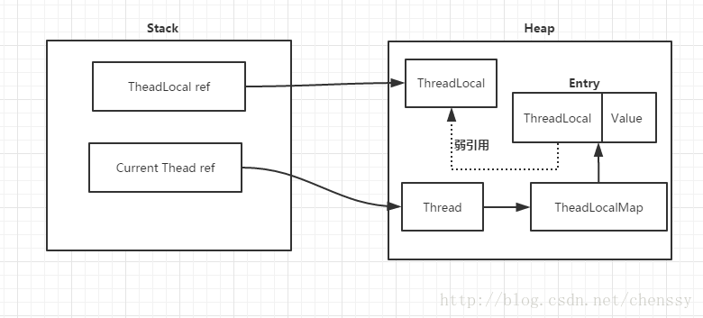

# ThreadLocal #

转自[http://cmsblogs.com/?p=2442](http://cmsblogs.com/?p=2442 "ThreadLocal")

## 1.ThreadLocal是什么？
ThreadLocal，即线程变量，是一个以ThreadLocal对象为键、任意对象为值的存储结构，一个线程可以通过ThreadLocal变量查询到绑定在这个线程上的值。ThreadLocal与线程同步机制不同，线程同步机制是多个线程共享同一个变量，而ThreadLocal是为每一个线程创建一个单独的变量副本，因此每一个线程都可以独立的改变自己所拥有的变量副本，而不会影响其他线程对应的副本。可以说ThreadLocal为多线程变量问题提供了一种解决思路。

ThreadLocal定义了四个方法：

- get():返回此线程局部变量的当前线程副本的值。
- initialValue():返回此线程局部变量的当前线程的“初始值”。
- remove():移除此线程局部变量当前线程的值。
- set(T value):将此线程局部变量的当前线程副本中的值设置为指定值。

除了上述四个方法，ThreadLocal内部还有一个静态内部类ThreadLocalMap，该内部类才是实现线程隔离机制的关键，get(),set(),remove()都是基于内部类操作。ThreadLocalMap提供了一种用键值对方式存储每一个线程的变量副本的方法，key为当前对象，value是对应线程的变量副本。

ThreadLocal需要注意两点：

1. ThreadLocal本身是不存储值，它只是提供了一个在当前线程中找到副本的key。
2. 是ThreadLocal包含在Thread中，而不是Thread包含在ThreadLocal中。

Thread、ThreadLocal、ThreadLcoalMap之间的关系如下图：

  
 

## 2.ThreadLocal源码解析

### 1）ThreadMap

      static class ThreadLocalMap {

        static class Entry extends WeakReference<ThreadLocal<?>> {
            /** The value associated with this ThreadLocal. */
            Object value;

            Entry(ThreadLocal<?> k, Object v) {
                super(k);
                value = v;
            }
        }

ThreadLocal其内部利用Entry来实现key-value的存储，其中Entry中的key就是ThreadLocal，而value就是值，同时Entry还继承一个弱引用。

ThreadLocalMap最核心的两个方法是getEntry(),set(ThreadLocal key,Object value)方法。

     private void set(ThreadLocal<?> key, Object value) {

            Entry[] tab = table;
            int len = tab.length;
           //根据ThreadLocal散列值，查找对应元素在数组中的位置
            int i = key.threadLocalHashCode & (len-1);

           //利用线性探测法，寻找合适的位置
            for (Entry e = tab[i];
                 e != null;
                 e = tab[i = nextIndex(i, len)]) {
                ThreadLocal<?> k = e.get();
             //key存在，直接覆盖
                if (k == key) {
                    e.value = value;
                    return;
                }
              //key==null,但是存在值，说明之前的ThreadLocal对象已经被回收
                if (k == null) {
                    //用新元素替换陈旧的元素
                    replaceStaleEntry(key, value, i);
                    return;
                }
            }
            //ThreadLocal对应的key实例不存在也没有陈旧元素，new一个
            tab[i] = new Entry(key, value);
            int sz = ++size;

           //如果没有清理陈旧的Entry并且数组中的元素大于了阈值，则进行rehash
            if (!cleanSomeSlots(i, sz) && sz >= threshold)
                rehash();
        }
该set方法与集合中的put方法的主要区别是，几个Map中解决散列冲突的方法是拉链法，而ThreadLocal中的set方法中采用的是开放地址法。

## ThreadLocal为什么会发生内存泄漏

每一个线程Thread都有一个ThreadLocal.ThreadLocalMap的map，该map的key为ThreadLcoal实例，它是一个弱引用，用利于GC 回收。当ThreadLocla的key==null时，GC就会回收这部分空间，但是value却不一定能够被回收，因为他还与当前线程存在一个强引用关系。

  
 

由于存在这个强引用关系，回导致value无法回收。如果线程对象不会销毁，这个强引用关系会一直存在，就会出现内存泄漏。

**如何解决？**

所以在使用ThreadLocalMap中的setEntry()、getEntry(),如果遇到key==null的情况，会对value设置为null，同时也可以调用ThreadLocal的remove方法。

