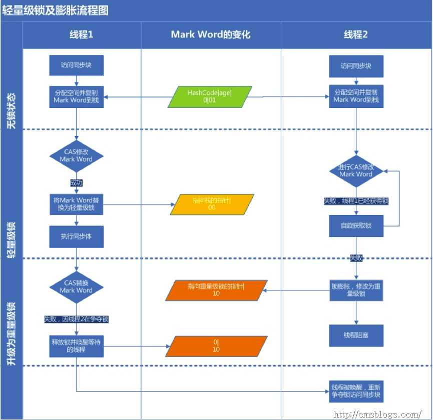

# Synchronized实现原理与使用 #

synchronized最初是以重量级锁的形式出现，随着JDK1.6对其进行优化后,synchronized并不会显得那么重。

## 1.实现原理

Java中每一个对象都可以作为锁，这是synchronized实现同步的基础。其的作用域主要有：

1. 放在**普通方法**上，作用于调用这个方法的对象，内置锁作用域该实例对象，所谓的互斥锁即为独占锁。
2. 修饰**静态方法**时，内置锁作用域是当前Class字节码对象，作用于类的所有对象。
3. 修饰**类**：括号括起来的部分，作用于类所有对象。
4. 修饰**代码块**时，内置锁作用Synchronized作用域括号里配置的对象。

## 2.synchronized是如何实现所得获取与释放的？

同步代码块使用**monitorenter**和m**onitorexit**指令实现，同步方法依靠方法修饰符上的**ACC_SYNCHRONIZED**实现。

- 同步代码块：monitorenter指令插入到同步代码块的开始位置，monitorexit指令插入到同步代码块的结束位置。JVM需要保证每一个monitorenter都有一个monitorexit与之对应。任何对象都有一个monitor与之关联，并且一个monitor被持有之后，它将处于锁定状态。线程执行到monitorenter指令时，将会尝试获取对象所对应的monitor所有权，及尝试获取对象锁。
- 同步方法：synchronized方法会被翻译成普通方法和返回指令：invokevirtual、areturn指令，在VM字节码层面并没有任何特别的指令来实现被synchronized修饰的方法，而是在Class文件方法表中将该方法的access_flags字段中synchronized标志位置1，表示该方法是同步方法并使用调用该方法的对象或该方法所属的Class在JVM的内部对象表示为锁对象。

## 3.Java对象头、monitor

### 1）对象头

synchronized使用的锁是在Java对象头里的，Hotspot虚拟机对象头主要包括两部分数据：**Mark Word(标记字段**),**类型指针**。其中类型指针是对象指向它类元数据的指针，虚拟机通过这个指针来确定这个对象是哪个实例，Mark Word用于存储对象自身的运行时数据，它是实现轻量级锁和偏向锁的关键。

**Mark Word**

Mark Word用于存储对象自身的运行数据，如哈希码(HashCode)、GC分代年龄、锁状态标志、线程持有锁、偏向锁ID、偏向时间戳。对象头一般占用两个机器码(在32位虚拟机中，一个机器码等于4字节)，但是如果是数组类型，则需要三个机器码，因为JVM可以通过Java对象的元数据信息确定Java对象的大小，但是无法从数组的元数据来确认数组的大小。

对象头中Mark Word信息

  
 

### 2）Monitor

Monitor是用来实现Java对象的同步工具，任何一个Java对象。都会包含一个内部锁或者Monitors锁。

## 4.锁的优化和升级

### 1.自旋锁

所谓自旋锁，实际是让该线程等待一段时间，不会被挂起，看持有锁的线程是否会很快释放锁，所谓等待就是执行一段无意义的循环语句。自旋可以避免线程切换带来的开销，但是占用了处理器的时间，如果持有锁很快释放了线程，那么自旋效率就非常好，但是自旋时间过程就会浪费系统资源，因此自旋等待时间需要有一个限度，当超过定义的时间，还没有获得锁，那么应该被挂起。JDK1.6以后引入了自定义的自旋锁，让虚拟机变得更加聪明。

所谓自适应自旋锁，是线程如果自旋成功，那么下次自旋的次数会更加多，如果对于某个锁很少自旋成功，那么这个锁自旋的次数会减小。

### 2.轻量级锁
轻量级锁是在没有多线程的竞争下，减少重量级锁使用操作系统互斥量产生的性能消耗。当关闭偏向锁功能或者多个线程竞争偏向锁导致偏向锁升级为轻量级锁，则会尝试获取轻量级锁。

**获取锁**：

1. 判断当前对象是否处于无锁状态(hashcode、0、01)，若是，则JVM首先将在当前线程的栈帧中建立一个名为锁记录(Lock Record)的空间，用于存储锁对象目前的Mark Word的拷贝。如果当前对象有锁，则执行步骤3。
2. JVM利用CAS操作尝试将对象的Mark Word更新为指向Lock Record的指正，如果成功表示竞争到锁，则将锁标志为变为00(表示此对象处于轻量级锁状态)，执行同步操作；如果失败则执行步骤3.
3. 判断当前对象的Mark Word是否指向当前线程的栈帧，如果是则表示当前线程已经持有当前对象的锁，则直接执行同步代码块；否则只能说明该锁对象已经被其他线程抢占了，这时轻量级锁需要膨胀为重量级锁，锁标志为变为10，后面等待的线程将会进入阻塞状态。

**释放锁**

轻量级锁的释放是通过CAS操作来进行的，主要步骤如下：

1. 取出轻量级锁保存在Displaced Mark Word中的数据。
2. 用CAS操作将取出的数据替换当前对象的Mark Word中，如果成功，则说明释放锁成功，否则执行(3)。
3. 如果CAS操作替换失败，说明其他线程尝试获取该锁，则需要在释放锁的同时唤起被挂起的线程。

对于轻量级锁，其性能提升的主要依据是“绝大部分的锁，在整个生命周期内都是不会存在竞争的”，但是如果满足这个依据时，不仅存在互斥的开销，还会有额外的CAS操作。所以在多线程竞争的情况下，轻量级锁比重量级锁更慢。

  
 

### 3.偏向锁

引入偏向锁的目的是，为了在没有多线程竞争的情况下尽量减少不必要的轻量级锁执行路径。上面提到在轻量级锁加锁解锁的操作需要依赖多次原子指令。那么偏向锁是如何来减少不必要的CAS操作呢？

**获取锁：**

1. 检查Mark Word是否为可偏向锁，即是否为偏向锁1，锁标识位为01。
2. 若为可偏向状态，则测试线程ID是否为当前线程ID，如果是，则执行步骤5，否则执行步骤3。
3. 如果线程ID不为当前线程ID，则通过CAS操作竞争锁，竞争成功，则将Mark Word的线程ID替换为当前线程。否则执行步骤4。
4. 通过CAS竞争锁失败，证明当前存在多线程竞争情况，当到达全局安全点，获得偏向锁的线程被挂起，偏向锁升级为轻量级锁，然后被阻塞在安全点的线程继续执行同步代码块。
5. 执行同步代码块。

**释放锁：**

偏向锁的释放采用一种只有竞争才会释放锁的机制，线程不会主动去释放偏向锁，需要等待其他线程来竞争。偏向锁的撤销需要等待全局安全点(这个时间点上没有正在执行的代码)。其步骤如下：

1. 暂停拥有偏向锁的线程，判断锁对象是否还处于被锁定状态；
2. 撤销偏向锁，恢复到无锁状态(01)或者轻量级锁状态。

  
 

### 4.重量级锁

重量级锁通过对象内部的监视器(monitor)实现，其中monitor的本质的依赖于底层草操作系统实现线程之间的切换需要从用户态到内核态的切换，切换成本较高

