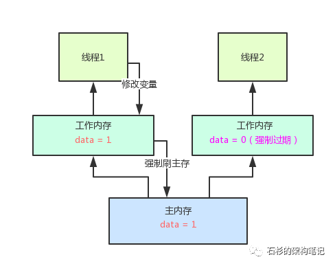

# Volatile的实现原理 #

volatile的主要作用是保证共享变量的可见性以及禁止指令重排序，不保证原子性。

## 1.操作系统语义

首先介绍一下操作系统的语义，计算机在运行程序时，每条指令都是在CPU中执行的，执行中会涉及数据的读写。起初，程序运行的数据都是放在主存中的，但是读写主存没有CPU中指令的速度快，如果任何交互都需要与主存打交道则会大大影响效率，所以引入了CPU 高速缓存，CPU高速缓存为CPU独有，只与该线CPU运行的线程有关，CPU高速缓存虽然解决了效率问题，但是会出现数据一致性问题。例如操作系统在执行i++操作时，两个线程从主存中读取i的值(1)到各自的高速缓存，然后线程A执行+1操作并将结果写入高速缓存中，最后写入主内存中，此时主存i=2，线程B做同样的操作，主存中的i任然是2，这种现象就是缓存一致性问题。

解决缓存一致性方案有两种：

1. 通过在总线加LOCK#锁的方式。
2. 通过缓存一致性协议。

方案一采用一种独占的方式来实现，即总线加Lock#锁的话，只能有一个CPU能够运行，其他CPU都要阻塞，效率较为低下。

方案二，缓存一致性协议，它确保每个缓存中使用的共享变量的副本是一致的。其核心思想：当某个CPU在写数据时，如果发现操作的变量是共享变量，则会通知其他CPU告知该变量的缓存行是无效的，因此其他CPU在读取数据该变量时，发现其无效会重新从主内存中加载数据。

## 2.Volatile如何保证内存可见性
div align="center">  
 

根据Java内存模型，每个线程都有自己的工作内存，并共享一个主内存，如上图所示，当两个线程并发读写一个共享变量data，初始值为0，当线程1将工作内存中的data更新为1时，主内存中和线程2中的工作内存读到data数据都为0，因此，在这种场景下就出现了并发编程中的可见性，即线程1更新自己data变量后，线程2无法看到，其一直看到自己工作内存中的一个旧的副本。

### 那么如何解决并发编程中的可见性问题？ 

当上述data变量定义的时候前面加上volatile来修饰后就会产生三个效果：

1.当线程1更新本地内存中data值后，**强制**将data变量最新值刷回主内存，使得主内存中的值立马变为线程1更新的值。

其用图示表示如下：

  
 

2.其他线程(线程2)中如果存在这个data变量，那么就会**强制**让其他线程工作内存中的data**变量缓存直接过期**，不允许再次读取和使用。

其用图时表示如下：

  
 

3.如果线程2需要读取data值，当其尝试读取本地内存中的data值时，就会发现data已经过期，它必须**重新从主内存中读取最新的data值**。

其用图表示如下：

  
 

## 3.禁止指令重排序

指令重排序对单线程程序没有影响，但是会影响多线程执行的正确性。那么JVM如何禁止重排序？首先看一下另一个原则happens-before，happens-before原则保证了程序的有序性，它规定如果两个操作的执行顺序无法从happens-before原则中推导出来，那么他们就不能保证有序性，可以随意进行重排序。其定义如下：

1. 同一个线程中的，前面的操作happens-before后续的操作。
2. 监视器上的解锁操作happens-before其后续的读操作。(Synchronized规则)
3. 对volatile变量的写操作happens-before后续的读操作。(volatile规则)
4. 线程的start()方法happen-before该线程所有后续操作。(线程启动规则)
5. 线程所有的操作happens-before其他线程在该县城上调用join返回成功后的操作。
6. 如果a happen-before b,b happen-before c,则a happen-before c(传递性)。

观察加入volatile关键字和没有加入volatile关键字时，所生成的汇编代码发现，加入volatile关键时，会多出一个**lock前缀指令**。lock前缀指令其实相当于一个内存屏障。内存屏障是一组处理指令，用来实现对内存操作的顺序限制。volatile底层就是通过**内存屏障**来实现的。

volatile底层实现是通过插入内存屏障，JMM采用了保守策略：

- 在每一个volatile写操作前面插入一个StoreStore屏障。
- 在每一个volatile写操作后面插入一个StoreLoad屏障。
- 在每一个volatile读操作后面插入一个LoadLoad屏障。
- 在每一个volatile读操作后面插入一个LoadStore屏障。

StoreStore屏障可以保证在volatile写之前，其前面所有普通写操作都已经刷新到主内存。

StoreLoad屏障的作用是避免volatile写与后面可能有的volatile读/写操作重排序。

LoadLoad屏障用来禁止处理器把上面的volatile读与下面的普通读重排序。

LoadStore屏障用来禁止处理器把上面的volatile读与下面的普通写重排序。

## 4.volatile的使用

volatile常见场景主要是作为状态标记量和单例模式的双重检测模型。

