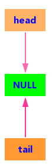
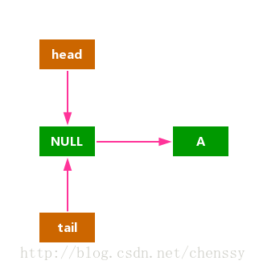
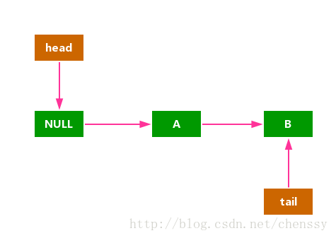
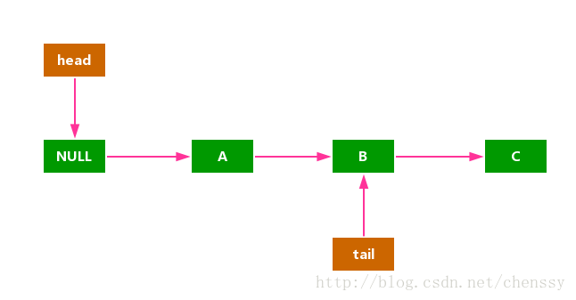

# Java并发容器 #

## 一、ConcurrentHashMap

ConcurrentHashMap存在主要是为了解决HashMap的线程安全问题的，HashMap在多线程环境下，put操作有可能产生死循环。除了ConcurrentHashMap，HashTable与Collections.synchronizedMap(hashMap)两种解决方案，但是这两种方案都是对读写加锁，且都是独占式的，而ConcurrentHashMap有着更高的性能。

在1.8版本以前，ConcurrentHashMap采用**分段锁(Segment + HashEntry)**的概念，使锁更加细化，但是1.8已经改变了这种思路，而是利用CAS+Synchronized来保证并发更新的安全，当然底层采用数组+链表+红黑树的存储结构。

### 1.JDK1.8中ConcurrentHashMap的几个重要概念：

1. table：用来**存放Node节点数据**的，默认为null，默认大小为**16**的数组，每次扩容时大小总是**2的幂次方；**
2. nextTable：**扩容时新生成的数据**，数组为table的两倍；
3. Node：节点，保存key-value的数据结构；
4. ForwardingNode：一个特殊的Node节点，hash值为-1，其中存储nextTable的引用**。只有table发生扩容的时候，ForwardingNode才会发挥作用**，作为一个占位符放在table中表示当前节点为null或则已经被移动
5. sizeCtl：控制标识符，用来控制table初始化和扩容操作的，在不同的地方有不同的用途，其值也不同，所代表的含义也不同

	**负数代表正在进行初始化或扩容操作**

	**-1代表正在初始化**

	**-N 表示有N-1个线程正在进行扩容操作**

	**正数或0代表hash表还没有被初始化，这个数值表示初始化或下一次进行扩容的大小**

### 2. 重要的内部类

#### 1.Node

作为ConcurrentHashMap中最核心、最重要的内部类，Node担负着重要角色：**key-value键值对**。所有插入ConCurrentHashMap的中数据都将会包装在Node中。在Node内部类中，其属性value、next都是带有**volatile**的。同时其对value的setter方法进行了特殊处理，不允许直接调用其setter方法来修改value的值。最后Node还提供了find方法来赋值map.get()。

#### 2.TreeNode
在ConcurrentHashMap中，如果链表的数据过长是会转换为红黑树来处理。当它并不是直接转换，而是将这些链表的节点包装成TreeNode放在**TreeBin对象**中，然后由TreeBin完成红黑树的转换。所以TreeNode也必须是ConcurrentHashMap的一个核心类，其为树节点类。
源码展示TreeNode继承Node，且提供了findTreeNode用来查找查找hash为h，key为k的节点

#### 3.TreeBin

该类并不负责key-value的键值对包装，它用于在链表转换为红黑树时包装TreeNode节点，也就是说**ConcurrentHashMap红黑树存放是TreeBin**，不是TreeNode。该类封装了一系列的方法，包括putTreeVal、lookRoot、UNlookRoot、remove、balanceInsetion、balanceDeletion。其构造函数实质上是构造红黑树的一个过程。

#### 4.ForwarddingNode

这是一个真正的辅助类，该类仅仅只存活在ConcurrentHashMap扩容操作时。只是一个标志节点，并且指向nextTable，它提供find方法而已。该类也是集成Node节点，其hash为-1，key、value、next均为null。

### 3.重要的方法

#### 1.构造函数

ConcurrentHashMap提供了一系列的构造函数用于创建ConcurrentHashMap对象。

#### 2.initTable()

ConcurrentHashMap的初始化主要由initTable()方法实现，在上面的构造函数中我们可以看到，其实ConcurrentHashMap在构造函数中并没有做什么事，仅仅只是设置了一些参数而已。其真正的初始化是发生在插入的时候，例如put、merge、compute、computeIfAbsent、computeIfPresent操作时。

初始化方法initTable()的关键就在于sizeCtl，该值默认为0，如果在构造函数时有参数传入该值则为2的幂次方。该值如果 < 0，表示有其他线程正在初始化，则必须暂停该线程。如果线程获得了初始化的权限则先将sizeCtl设置为-1，防止有其他线程进入，最后将sizeCtl设置0.75 * n，表示扩容的阈值。

#### 3.put方法
ConcurrentHashMap最常用的put、get操作，ConcurrentHashMap的put操作与HashMap并没有多大区别，其核心思想依然是根据hash值计算节点插入在table的位置，如果该位置为空，则直接插入，否则插入到链表或者树中。但是ConcurrentHashMap会涉及到多线程情况就会复杂很多。

**put方法的流程：**

1. 判空；ConcurrentHashMap的key、value都不允许为null。
2. 计算hash。利用方法计算hash值。
3. 遍历table，进行节点插入操作。
4. 调用addCount方法，ConcurrentHashMap的size + 1。

#### 4.get方法

ConcurrentHashMap的get操作还是挺简单的，无非就是通过hash来找key相同的节点而已，当然需要区分链表和树形两种情况。

**get操作的整个逻辑非常清楚：**

- 计算hash值。
- 判断table是否为空，如果为空，直接返回null。
- 根据hash值获取table中的Node节点（tabAt(tab, (n – 1) & h)），然后根据链表或者树形方式找到相对应的节点，返回其value值。

#### 5.扩容操作

当ConcurrentHashMap中table元素个数达到了容量阈值（sizeCtl）时，则需要进行扩容操作。在put操作时最后一个会调用addCount(long x, int check)，该方法主要做两个工作：1.更新baseCount；2.检测是否需要扩容操作。

transfer()方法为ConcurrentHashMap扩容操作的核心方法。由于ConcurrentHashMap支持多线程扩容，而且也没有进行加锁，所以实现会变得有点儿复杂。整个扩容操作分为两步：

1. 构建一个nextTable，其大小为原来大小的两倍，这个步骤是在单线程环境下完成的。
2. 将原来table里面的内容复制到nextTable中，这个步骤是允许多线程操作的，所以性能得到提升，减少了扩容的时间消耗。

详细讲解请看[http://cmsblogs.com/?p=2283](http://cmsblogs.com/?p=2283)

## 二、ConcurrentLinkedQueue

实现一个线程安全的队列有两种方式：阻塞和非阻塞。阻塞队列主要是锁的应用，而非阻塞则是CAS算法的应用。ConcurrentLinkedQueue就是基于非阻塞算法实现的。ConcurrentLinkedQueue是一个基于链接节点的无边界的线程安全队列，它采用FIFO原则对元素进行排序。采用“wait-free”算法（即CAS算法）来实现的。

ConcurrentLinkedQueue规定如下几个特性：

1. 在入队的最后一个元素的next为null。
2. 队列中所有未删除的节点的item都不能为null且都能从head节点遍历到。
3. 对于要删除的节点，不是直接将其设置为null，而是先将其item域设置为null（迭代器会跳过item为null的节点）。
4. 允许head和tail更新滞后。这是什么意思呢？意思就说是head、tail不总是指向第一个元素和最后一个元素（后面阐述）。

### ConcurrentLinkedQueue源码

CoucurrentLinkedQueue的结构由head节点和tail节点组成，每个节点由节点元素item和指向下一个节点的next引用组成，而节点与节点之间的关系就是通过该next关联起来的，从而组成一张链表的队列。节点Node为ConcurrentLinkedQueue的内部类。

#### 入列

针对于单线程，入列过程相对简单：tail节点的next执行新节点，然后更新tail为新节点即可。但是对于多线程的问题相对较复杂。

offer(E e)：将指定元素插入都队列尾部，其基本流程如下：

- 初始化：ConcurrentLinkedQueue初始化时head、tail存储的元素都为null，且head等于tail。

  
 

- 添加元素A

按照程序分析：第一次插入元素A，head = tail = dummyNode，所有q = p.next = null，直接走步骤2：p.casNext(null, newNode)，由于 p == t成立，所以不会执行步骤3：casTail(t, newNode)，直接return。插入A节点后如下：

  
 

- 添加元素B

q = p.next = A ,p = tail = dummyNode，所以直接跳到步骤7：p = (p != t && t != (t = tail)) ? t : q;。此时p = q，然后进行第二次循环 q = p.next = null，步骤2：p == null成立，将该节点插入，因为p = q，t = tail，所以步骤3：p != t 成立，执行步骤4：casTail(t, newNode)，然后return。如下：

  
 

- 添加节点C

此时t = tail ,p = t，q = p.next = null，和插入元素A无异，如下：

  
 

### 出队

ConcurrentLinkedQueue提供了poll()方法进行出列操作。入列主要是涉及到tail，出列则涉及到head。poll()里面有一个很重要的方法：**updateHead()，该方法用于CAS更新head节点**。

源码详细解析，请看[http://cmsblogs.com/?p=2353](http://cmsblogs.com/?p=2353)

## 三、ConcurrentSkipListMap

http://cmsblogs.com/?p=2371

## 四、阻塞队列

### ArrayBlockingQueue

ArrayBlockingQueue，一个由**数组实现的有界阻塞队列**。该队列采用FIFO的原则对元素进行排序添加的。

ArrayBlockingQueue为**有界且固定**，其大小在构造时由构造函数来决定，确认之后就不能再改变了。ArrayBlockingQueue**支持对等待的生产者线程和使用者线程进行排序的可选公平策略**，但是在默认情况下不保证线程公平的访问，在构造时可以选择公平策略（fair = true）。公平性通常会降低吞吐量，但是减少了可变性和避免了“不平衡性”。
#### ArrayBlockingQueue实现
ArrayBlockingQueue继承AbstractQueue，实现BlockingQueue接口。AbstractQueue类在Queue接口中扮演着非常重要的作用，该类提供了对queue操作的骨干实现（具体内容移驾其源码）。BlockingQueue继承java.util.Queue为阻塞队列的核心接口，提供了在多线程环境下的出列、入列操作，作为使用者，则不需要关心队列在什么时候阻塞线程，什么时候唤醒线程，所有一切均由BlockingQueue来完成。

ArrayBlockingQueue内部使用可重入锁ReentrantLock + Condition来完成多线程环境的并发操作。

#### 入队
ArrayBlockingQueue提供了诸多方法，可以将元素加入队列尾部。

- add(E e) ：将指定的元素插入到此队列的尾部（**如果立即可行且不会超过该队列的容量**），在成功时返回 true，如果此队列已满，则抛出 IllegalStateException
- offer(E e) :将指定的元素插入到此队列的尾部（**如果立即可行且不会超过该队列的容量）**，在成功时返回 true，如果此队列已满，则返回 false
- offer(E e, long timeout, TimeUnit unit) :将指定的元素插入此队列的尾部，**如果该队列已满，则在到达指定的等待时间之前等待可用的空间**。
- put(E e) :将指定的元素插入此队列的尾部，**如果该队列已满，则等待可用的空间。**

#### 出队
ArrayBlockingQueue提供的出队方法如下：

- poll() :获取并移除此队列的头，**如果此队列为空，则返回 null。**
- poll(long timeout, TimeUnit unit) :获取并移除此队列的头部，在指定的等待时间前等待可用的元素（如果有必要）。
- remove(Object o) :从此队列中移除指定元素的单个实例（如果存在）。
- take() :获取并移除此队列的头部，在元素变得可用之前一直等待（如果有必要）。

### PriorityBlockingQueue

PriorityBlockingQueue是一个**支持优先级的无界阻塞队列**。默认情况下元素采用**自然顺序升序排序**，当然我们也可以通过构造函数来指定Comparator来对元素进行排序。需要注意的是PriorityBlockingQueue不能保证同优先级元素的顺序。

#### PriortyBlockingQueue的实现
PriorityBlockingQueue底层采用二叉堆来实现的。PriorityBlockingQueue继承AbstractQueue，实现BlockingQueue接口。内部仍然采用可重入锁ReentrantLock来实现同步机制，但是这里**只有一个notEmpty的Condition**，了解了ArrayBlockingQueue我们知道它定义了两个Condition，之类为何只有一个呢？原因就在于PriorityBlockingQueue是一个无界队列，插入总是会成功，除非消耗尽了资源导致服务器挂。

#### 入列
PriorityBlockingQueue提供put()、add()、offer()方法向队列中加入元素。

##### 删除元素

PriorityBlockingQueue提供poll()、remove()方法来执行出对操作。出对的永远都是第一个元素：array[0]。

详细分析请查看：[http://cmsblogs.com/?p=2407](http://cmsblogs.com/?p=2407)

### DelayQueue

DelayQueue是一个支持**延时获取元素的无界阻塞队列**。里面的元素全部都是“可延期”的元素，列头的元素是最先“到期”的元素，如果队列里面没有元素到期，是不能从列头获取元素的，哪怕有元素也不行。也就是说**只有在延迟期到时才能够从队列中取元素。**

DelayQueue主要用于两个方面：

- 缓存：清掉缓存中超时的缓存数据
- 任务超时处理

#### DelayQueue的实现

DelayQueue实现的关键主要有如下几个：

- 可重入锁ReentrantLock
- 用于阻塞和通知的Condition对象
- 根据Delay时间排序的优先级队列：PriorityQueue
- 用于优化阻塞通知的线程元素leader

ReentrantLock、Condition这两个对象是实现整个BlockingQueue的核心。PriorityQueue是一个支持优先级线程排序的队列。

**Delayed：**

Delayed接口是用来标记那些应该在**给定延迟时间之后执行的对象**，它定义了一个long getDelay(TimeUnit unit)方法，该方法返回与此对象相关的的剩余时间。同时实现该接口的对象必须定义一个compareTo 方法，该方法提供与此接口的 getDelay 方法一致的排序。

	public interface Delayed extends Comparable<Delayed> {
	    long getDelay(TimeUnit unit);
	}
使用该接口时，实现该接口的getDelay()方法，同时定义compareTo()方法即可。

#### 内部接口
DelayQueue的元素都必须继承Delayed接口。同时也可以从这里初步理清楚DelayQueue内部实现的机制了：以**支持优先级无界队列的PriorityQueue作为一个容器**，容器里面的元素都应该实现Delayed接口，在每次往优先级队列中添加元素时以元素的过期时间作为排序条件，最先过期的元素放在优先级最高。

#### 入列
offer(E e)就是往PriorityQueue中添加元素，整个过程还是比较简单，但是在判断当前元素是否为对首元素，如果是的话则设置**leader=null**，这是非常关键的一个步骤。

#### 出列
首先是获取对首元素，如果对首元素的延时时间 delay <= 0 ，则可以出队了，直接return即可。否则设置first = null，这里设置为null的主要目的是为了避免内存泄漏。**如果 leader != null 则表示当前有线程占用**，则阻塞，否则设置leader为当前线程，然后调用awaitNanos()方法超时等待。

**first = null**

**这里为什么如果不设置first = null，则会引起内存泄漏呢？**

线程A到达，列首元素没有到期，设置leader = 线程A，这是线程B来了因为leader != null，则会阻塞，线程C一样。假如线程阻塞完毕了，获取列首元素成功，出列。这个时候列首元素应该会被回收掉，但是问题是它还被线程B、线程C持有着，所以不会回收，这里只有两个线程，如果有线程D、线程E…呢？这样会无限期的不能回收，就会造成内存泄漏。

这个入队、出对过程和其他的阻塞队列没有很大区别，无非是在出对的时候增加了一个到期时间的判断。同时**通过leader来减少不必要阻塞**。

转自：[http://cmsblogs.com/?p=2413](http://cmsblogs.com/?p=2413)

### SynchronousQueue
作为BlockingQueue中的一员，SynchronousQueue与其他BlockingQueue有着不同特性：

1. SynchronousQueue**没有容**量。与其他BlockingQueue不同，SynchronousQueue是一个不存储元素的BlockingQueue。每一个put操作必须要等待一个take操作，否则不能继续添加元素，反之亦然。
2. 因为没有容量，所以对应 peek, contains, clear, isEmpty … 等方法其实是无效的。例如clear是不执行任何操作的，contains始终返回false,peek始终返回null。
3. SynchronousQueue分为公平和非公平，**默认情况下采用非公平性访问策略**，当然也可以通过构造函数来设置为公平性访问策略（为true即可）。
4. 若使用 TransferQueue, 则队列中永远会存在一个 dummy node。

SynchronousQueue非常适合做交换工作，生产者的线程和消费者的线程同步以传递某些信息、事件或者任务。

转自：[http://cmsblogs.com/?p=2418](http://cmsblogs.com/?p=2418)

### LinkedTransferQueue

前面提到的各种BlockingQueue对读或者写都是锁上整个队列，在并发量大的时候，各种锁是比较耗资源和耗时间的，而前面的SynchronousQueue虽然不会锁住整个队列，但它是一个没有容量的“队列”，那么有没有这样一种队列，它即可以像**其他的BlockingQueue一样有容量又可以像SynchronousQueue一样不会锁住整个队列**呢？有！答案就是LinkedTransferQueue。

LinkedTransferQueue是基于链表的FIFO无界阻塞队列，它出现在JDK7中。Doug Lea 大神说LinkedTransferQueue是一个聪明的队列。它是ConcurrentLinkedQueue、SynchronousQueue (公平模式下)、无界的LinkedBlockingQueues等的超集。既然这么牛逼，那势必要弄清楚其中的原理了。

[http://cmsblogs.com/?p=2433](http://cmsblogs.com/?p=2433)

### LinkedBlockingDeque

前面的BlockingQueue都是单向的FIFO队列，而LinkedBlockingDeque则是一个**由链表组成的双向阻塞队列，双向队列就意味着可以从对头、对尾两端插入和移除元素**，同样意味着LinkedBlockingDeque支持FIFO、FILO两种操作方式。

LinkedBlockingDeque是可选容量的，在初始化时可以设置容量防止其过度膨胀，如果不设置，默认容量大小为Integer.MAX_VALUE。

[http://cmsblogs.com/?p=2437](http://cmsblogs.com/?p=2437)