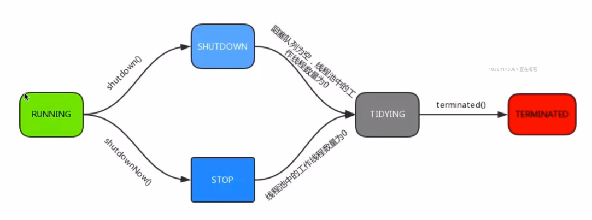

# Java中的线程池 #

线程池的好处：

- 重用存在的线程，减少对象创建、消亡的开销，性能佳。
- 可以有效控制最大并发线程数，提高系统资源利用率，同时可以避免过多的资源竞争，避免阻塞。
- 提供定时执行、定期执行，单线程、并发数控制等功能。

## 一、ThreadPoolExecutor

线程有五种状态：新建，就绪，运行，阻塞，死亡。线程池也同样有这五种状态：Running，SHUTDOWN,STOP,TIDYING，TERMINATED。

  
 

	 private final AtomicInteger ctl = new AtomicInteger(ctlOf(RUNNING, 0));
	    private static final int COUNT_BITS = Integer.SIZE - 3;
	    private static final int CAPACITY   = (1 << COUNT_BITS) - 1;
	
	    // runState is stored in the high-order bits
	    private static final int RUNNING    = -1 << COUNT_BITS;
	    private static final int SHUTDOWN   =  0 << COUNT_BITS;
	    private static final int STOP       =  1 << COUNT_BITS;
	    private static final int TIDYING    =  2 << COUNT_BITS;
	    private static final int TERMINATED =  3 << COUNT_BITS;
	
	    // Packing and unpacking ctl
	    private static int runStateOf(int c)     { return c & ~CAPACITY; }
	    private static int workerCountOf(int c)  { return c & CAPACITY; }
	    private static int ctlOf(int rs, int wc) { return rs | wc; }
变量ctl定义为AtomicInteger，其功能非常强大，记录了"线程池中的任务数量"和“线程池的状态”两个信息。共32位，其中高3位表示“线程池的状态”，低29位表示线程池中的任务数量。

	RUNNING            -- 对应的高3位值是111。
	SHUTDOWN       -- 对应的高3位值是000。
	STOP                   -- 对应的高3位值是001。
	TIDYING              -- 对应的高3位值是010。
	TERMINATED     -- 对应的高3位值是011。
1. RUNNING：处于RUNNING状态的线程池**能够接受新任务**，以及对新添加的任务进行处理。 
2. SHUTDOWN：处于SHUTDOWN状态的线程池**不可以接受新任务**，但是可以**对已添加的任务进行处理**。 
3. STOP：处于STOP状态的线程池**不接收新任务，不处理已添加的任务**，并且会中**断正在处理的任务**。 
4. TIDYING：当所有的任务已终止，ctl记录的”任务数量”为0，线程池会变为TIDYING状态。当线程池变为TIDYING状态时，会执行钩子函数terminated()。terminated()在ThreadPoolExecutor类中是空的，若用户想在线程池变为TIDYING时，进行相应的处理；可以通过重载terminated()函数来实现。 
5. TERMINATED：**线程池彻底终止的状态**。

**状态状态图**：

  
 

### 1.线程池的创建

我们可以通过ThreadPoolExecutor构造函数来创建一个线程池：

	public ThreadPoolExecutor(int corePoolSize,
	                              int maximumPoolSize,
	                              long keepAliveTime,
	                              TimeUnit unit,
	                              BlockingQueue<Runnable> workQueue,
	                              ThreadFactory threadFactory,
	                              RejectedExecutionHandler handler) {
	        if (corePoolSize < 0 ||
	            maximumPoolSize <= 0 ||
	            maximumPoolSize < corePoolSize ||
	            keepAliveTime < 0)
	            throw new IllegalArgumentException();
	        if (workQueue == null || threadFactory == null || handler == null)
	            throw new NullPointerException();
	        this.corePoolSize = corePoolSize;
	        this.maximumPoolSize = maximumPoolSize;
	        this.workQueue = workQueue;
	        this.keepAliveTime = unit.toNanos(keepAliveTime);
	        this.threadFactory = threadFactory;
	        this.handler = handler;
	    }

上述构造方法共有7个参数：

**corePoolSize**

线程池中**核心线程数量**。当提交一个任务时，线程池会新建一个线程来执行任务，直到当前线程数等于corePoolSize。如果调用了线程池的prestartAllCoreThreads()方法，线程池会提前创建并启动所有基本线程。

**maximumPoolSize**

线程池中**允许的最大线程数量**。线程池的阻塞队列满了之后，如果还有任务提交，如果当前线程数小于maximumPoolSize，则会新建线程来执行任务。但是当使用无界队列，该参数也就没有什么效果。

**keepAliveTime**

**线程空闲的时间**。线程的创建和销毁是需要代价的。线程执行完任务后不会立即销毁，而是继续存活一段时间：keepAliveTime。默认情况下，该参数只有在线程数大于corePoolSize时才会生效。

**unit**
keepAliveTime的单位。TimeUnit

**workQueue**
用来保存等待执行的任务的**阻塞队列**，存储等待执行的任务，等待的任务必须实现Runnable接口。我们可以选择如下几种：

- ArrayBlockingQueue：基于数组结构的有界阻塞队列，FIFO。
- LinkedBlockingQueue：基于链表结构的有界阻塞队列，FIFO。
- SynchronousQueue：不存储元素的阻塞队列，每个插入操作都必须等待一个移出操作，反之亦然
- PriorityBlockingQueue：具有优先界别的阻塞队列。

**threadFactory**
用于设置创建线程的工厂。该对象可以通过Executors.defaultThreadFactory()，如下：

	public static ThreadFactory defaultThreadFactory() {
	        return new DefaultThreadFactory();
	    }

返回的是DefaultThreadFactory对象，源码如下：

	static class DefaultThreadFactory implements ThreadFactory {
	        private static final AtomicInteger poolNumber = new AtomicInteger(1);
	        private final ThreadGroup group;
	        private final AtomicInteger threadNumber = new AtomicInteger(1);
	        private final String namePrefix;
	
	        DefaultThreadFactory() {
	            SecurityManager s = System.getSecurityManager();
	            group = (s != null) ? s.getThreadGroup() :
	                                  Thread.currentThread().getThreadGroup();
	            namePrefix = "pool-" +
	                          poolNumber.getAndIncrement() +
	                         "-thread-";
	        }
	
	        public Thread newThread(Runnable r) {
	            Thread t = new Thread(group, r,
	                                  namePrefix + threadNumber.getAndIncrement(),
	                                  0);
	            if (t.isDaemon())
	                t.setDaemon(false);
	            if (t.getPriority() != Thread.NORM_PRIORITY)
	                t.setPriority(Thread.NORM_PRIORITY);
	            return t;
	        }
	    }

ThreadFactory的左右就是提供创建线程的功能的线程工厂。他是通过newThread()方法提供创建线程的功能，newThread()方法创建的线程都是“非守护线程”而且“线程优先级都是Thread.NORM_PRIORITY”。

**handler**

RejectedExecutionHandler，线程池的拒绝策略。所谓拒绝策略，是指将任务添加到线程池中时，线程池拒绝该任务所采取的相应策略。当向线程池中提交任务时，如果此时线程池中的线程已经饱和了，而且阻塞队列也已经满了，则线程池会选择一种拒绝策略来处理该任务。

线程池提供了四种拒绝策略：

- AbortPolicy：直接抛出异常，默认策略；
- CallerRunsPolicy：用调用者所在的线程来执行任务；
- DiscardOldestPolicy：丢弃阻塞队列中靠最前的任务，并执行当前任务；
- DiscardPolicy：直接丢弃任务；

当然我们也可以实现自己的拒绝策略，例如记录日志等等，实现RejectedExecutionHandler接口即可。

### ThreadPoolExecutor的方法

- execute():提交任务，交给线程池执行。
- submit():提交任务，能够返回执行结果 execute+Future。
- shutdown():关闭线程池，等待任务都执行完。
- shutdownNow():关闭线程池，不等待任务执行完。
- getTaskCount():线程池已执行和未执行的任务总数。
- getCompletedTaskCount():线程池当前的线程数量。
- getPoolSize():线程池当前的线程数量。
- getActiveCount():当前线程池中正在执行任务的线程的数量。

## 二、ScheduledThreadPoolExecutor
Timer与TimerTask虽然可以实现线程的周期和延迟调度，但是Timer与TimerTask存在一些缺陷，所以对于这种定期、周期执行任务的调度策略，我们一般都是推荐ScheduledThreadPoolExecutor来实现。

**那么ScheduledThreadPoolExecutor是如何来实现线程的周期、延迟调度的？**

ScheduledThreadPoolExecutor，继承ThreadPoolExecutor且实现了ScheduledExecutorService接口，它就相当于提供了“延迟”和“周期执行”功能的ThreadPoolExecutor。在JDK API中是这样定义它的：ThreadPoolExecutor，它可另行安**排在给定的延迟后运行命令**，或者**定期执行命令**。需要多个辅助线程时，或者要求 ThreadPoolExecutor 具有额外的灵活性或功能时，此类要优于 Timer。 一旦启用已延迟的任务就执行它，但是有关何时启用，启用后何时执行则没有任何实时保证。按照提交的先进先出 (FIFO) 顺序来启用那些被安排在同一执行时间的任务。

