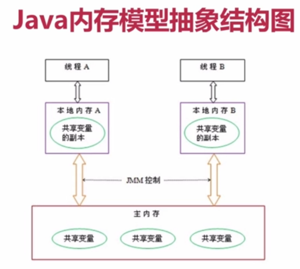

# Java内存模型 #

本博客主要内容来源于《并发编程的艺术》以及http://ifeve.com/java-memory-model-1/，也参考了许多博客和公众号，例如纯洁的微笑、程序员江湖等，如有侵权请联系2530997324@qq.com

## 1.并发编程模型的分类

在并发编程中，需要处理两个问题：线程的**同步**以及线程**通信**。

通信是指线程之间以何种机制来交换信息，在命令式编程中，线程之间通信机制有两种：共享内存和消息传递。

在共享内存的并发模型中，线程之间的共享程序的公共状态，线程之间通过读-写内存中的公共状态来隐式进行通信。在消息传递的并发模型中，线程之间没有公共状态，线程之间必须通过明确的发送消息来显式进行通信。

同步是指程序用于控制不同线程之间操作发生相对顺序的机制。在共享内存并发模型里，同步是显式进行的。程序员需要显式指定某个方法或某段代码需要在线程之间互斥执行。在消息传递的并发模型里，由于消息的发送必须在消息接收之前，因此同步是隐式进行的。

Java的并发采用的是共**享内存模型**，Java线程之间通信总是隐式进行，整个通信过程对程序员完全透明。

## 2.Java内存的抽象模型

在Java中，所有实例域、静态域和数组元素存储在**堆内存**中，堆内存在**线程之间共享**。局部变量，方法定义参数和异常处理参数不会在线程之间共享，他们不存在内存可见性问题。

Java线程之间的通信由Java内存模型(JMM)控制，JMM决定一个线程对共享变量的写入何时对另一个**线程可见**。从抽象的角度看，JMM定义了线程和主内存之间的抽象关系：线程之间的共享变量存储在主内存中，每个线程都有一个私有的本地内存，本地内存中存储了该线程读/写共享变量的副本。本地内存是JMM的一个抽象概念，并不真实存在。它涵盖了缓存，写缓存区，寄存器以及其他的硬件优化。Java内存模型的抽象图如下图所示：

  
 

根据上图线程A和线程B之间进行通信，需要经历两个步骤：

- 1.首先线程A把本地内存A中更新过的共享变量刷新到主内存中。
- 2.然后线程B到主内存中读取之前线程A更新过的共享变量。

利用图示表示如下

  
 
根据上图，本地内存A和B中所有共享内存中变量x的副本，初始化时，这三个内存中的x的值都是0。线程A执行时，把更新后的x值(假设为1)临时存放在自己的本地内存A中。当线程A和线程B需要通信时，线程A会把首先会把本地内存中的x值刷新到主内存，此时主内存中的x值为1，随后，线程B到主内存中读取线程A更新后的值，此时线程B的本地内存中的x值也变为1。

从整体来看，这两个步骤完成了线程A向线程B发送消息的过程，这个过程必须经过主内存。因此可以说JMM通过控制主内存与每个线程的本地内存之间的交互，来为Java程序员提供内存可见性。

## 3.重排序分类

在执行程序时，为了提高性能，编译器和处理器常常会对指令做重排序。重排序主要分三种：

1. **编译器优化的重排序**：在不改变单线程程序语义的情况下，编译器可以重新安排语句的执行顺序。
2. **指令级并行的重排序**：现代处理器采用指令级并行技术来将多条指令重叠执行。如果不存在数据依赖性，处理器可以改变语句对应机器指令的执行顺序。
3. **内存系统的重排序**：由于处理器使用缓存和读/写缓存区，这使得加载和存储操作看上去可能是乱序执行。

Java源代码到最终实际执行的指令序列，会分别经历下面3种重排序。

  
 
上述排序可能会导致程序出现内存可见性问题。

对于编译器，JMM的编译器重排序规则会禁止特定类型的编译器重排序(即不是禁止所有的编译器重排序)。

对于处理器重排序，JMM的处理器重排序规则会要求Java编译器在生成指令序列时，插入特定类型的内存屏障指令，通过内存屏障来禁止特定类型的处理器重排序。

## 4.happen-before

在JMM中，如果一个操作的结果需要对另一个操作可见，那么这两个操作之间必须要存在happens-before关系。这里提到的两个操作既可以是一个线程之内，也可以在不同线程之间。

happens-before规则：

1. 程序顺序规则：一个线程中的每个操作，happens-before于该线程中的任意后续操作。
2. 监视器锁规则：对一个监视器锁的解锁，happens-before与随后对这个监视器的加锁。
3. volatile变量：对一个volatile域的写，happens-before于后续对这个volatile域的读。
4. 传递性：如果A happens-before B，且happens-before C，那么A happens-before C。

## 重排序

1. 数据依赖性：数据依赖性主要针对单个处理器中执行的指令序列和单个线程中执行的操作，编译器和处理器在进行重排序时，会遵守数据依赖性，编译器和处理器不会改变存在数据依赖关系的两个操作的执行顺序。
2. as-if-serial语义：不管怎么重排序，单线程程序执行的结果都不会改变。
3. 程序顺序规则：遵循happens-before规则。

注意：重排序不会改变单线程环境的执行结果，但是会破坏多线程的执行语义。
