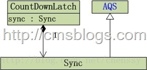
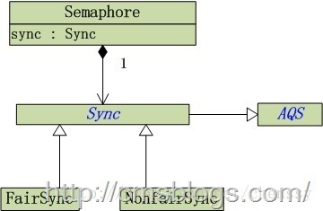

# Java中的并发工具类 #

转自[http://cmsblogs.com/](http://cmsblogs.com/)

Java中的并发工具类主要有四类：CountDownLatch，Semaphore,Exchanger

## 一、CyclicBarrier

CyclicBarrier，一个同步辅助类，它允许一组线程互相等待，直到到达某个**公共屏障点** (common barrier point)。在涉及一组固定大小的线程的程序中，这些线程必须不时地互相等待，此时 CyclicBarrier 很有用。因为该 barrier 在释放等待线程后可以重用，所以称它为循环的barrier。

通俗说来就是当一组线程到达一个屏障时被阻塞，直到最后一个线程到达屏障时，屏障才开门，所有被屏障拦截的线程才会继续操作。

  
 

### CyclicBarrier实现原理

CyclicBarrier的内部使用重入锁ReentrantLock和Condition。它有两个构造函数：

1. **CyclicBarrier(int parties)**：创建一个新的 CyclicBarrier，它将在给定数量的参与者（线程）处于等待状态时启动，但它不会在启动 barrier 时执行预定义的操作。
2. **CyclicBarrier(int parties, Runnable barrierAction)**：创建一个新的 CyclicBarrier，它将在给定数量的参与者（线程）处于等待状态时启动，并在启动 barrier 时执行给定的屏障操作，该操作由最后一个进入 barrier 的线程执行。

上述构造方法中，parties表示拦截线程的数量。barrierAction 为CyclicBarrier接收的Runnable命令，用于在线程到达屏障时，优先执行barrierAction ，用于处理更加复杂的业务场景。

在CyclicBarrier中最重要的方法时await()方法，在所有的线程操作都已经在此barrier上调用await方法之前，将一直等待。其实await()的处理逻辑还是比较简单的：如果该线程不是到达的最后一个线程，则他一直处于等待状态，除非发生其他异常情况。

## 二、CountDownLatch
CyclicBarrier所描述的是“允许一组线程**互相等待**，直到到达某个公共屏障点，才会进行后续任务”，而CountDownLatch所描述的是”在完成一组正在其他线程中执行的操作之前，它允许一个或多个线程一直等待“。

用给定的计数初始化CountDownLatch。由于调用了countDown()方法，所以在当前计数到达0之前，await方法会一直受阻塞。之后，会释放所有等待的线程，await的所有后续调用都将立即返回。这种现象只出现一次——计数无法被重置。如果需要重置计数，请考虑使用 CyclicBarrier。

CountDownLatch是通过一个计数器来实现的，当我们在new 一个CountDownLatch对象的时候需要带入该**计数器值**，该值就表示了**线程的数量**。每当一个线程完成自己的任务后，计数器的值就会减1。当计数器的值变为0时，就表示所有的线程均已经完成了任务，然后就可以恢复等待的线程继续执行了。

从上面的描述可以发现CountDownlatch与CyclicBarrier的主要区别是：

1. CountDownLatch的作用是允许1或N个线程**等待其他线程完成执行**；而CyclicBarrier则是**允许N个线程相互等待**。
2. CountDownLatch的**计数器无法被重置**；CyclicBarrier的计数器可以被重置后使用，因此它被称为是**循环的barrier**。

### CountDownLatch实现原理

  
 

通过上面的结构图我们可以看到，CountDownLatch内部依赖Sync实现，而Sync继承AQS。CountDownLatch仅提供了一个构造方法：

CountDownLatch(int count) ： 构造一个用给定计数初始化的 CountDownLatch

await()：CountDownLatch提供await()方法来使当前线程在锁存器倒计数至零之前一直等待，除非线程被中断。

countDown():CountDownLatch提供countDown() 方法递**减锁存器的计数**，如果计数到达零，则释放所有等待的线程。

CountDownLatch内部通过**共享锁**实现。在创建CountDownLatch实例时，需要传递一个int型的参数：count，该参数为计数器的初始值，也可以理解为该共享锁可以获取的总次数。当某个线程调用await()方法，程序首先判断count的值是否为0，如果不会0的话则会一直等待直到为0为止。当其他线程调用countDown()方法时，则执行释放共享锁状态，使count值 – 1。当在创建CountDownLatch时初始化的count参数，必须要有count线程调用countDown方法才会使计数器count等于0，锁才会释放，前面等待的线程才会继续运行。注意CountDownLatch不能回滚重置。

## 三、Semaphore

信号量Semaphore是一个控制访问多个共享资源的计数器，和CountDownLatch一样，其本质上是一个“**共享锁**”。

一个**计数信号量**。从概念上讲，信号量维护了一个许可集。如有必要，在许可可用前会阻塞每一个 acquire()，然后再获取该许可。每个release() 添加一个许可，从而可能释放一个正在阻塞的获取者。但是，不使用实际的许可对象，Semaphore 只对可用许可的号码进行计数，并采取相应的行动。

**Semaphore 通常用于限制可以访问某些资源（物理或逻辑的）的线程数目**。

号量Semaphore是一个非负整数（>=1）。当一个线程想要访问某个共享资源时，它必须要先获取Semaphore，当Semaphore >0时，获取该资源并使Semaphore – 1。如果Semaphore值 = 0，则表示全部的共享资源已经被其他线程全部占用，线程必须要等待其他线程释放资源。当线程释放资源时，Semaphore则+1

### Semaphore实现原理

  
 

从上图可以看出Semaphore内部包含公平锁（FairSync）和非公平锁（NonfairSync），继承内部类Sync，其中Sync继承**AQS**。

Semaphore提供了两个构造函数：

1. Semaphore(int permits) ：创建具有给定的许可数和非公平的公平设置的 Semaphore。
2. Semaphore(int permits, boolean fair) ：创建具有给定的许可数和给定的公平设置的 Semaphore。

	    public Semaphore(int permits) {
	        sync = new NonfairSync(permits);
	    }
	
	    public Semaphore(int permits, boolean fair) {
	        sync = fair ? new FairSync(permits) : new NonfairSync(permits);
	    }

#### 1.信号量的获取
Semaphore提供了acquire()方法来获取一个许可：

	 public void acquire() throws InterruptedException {
	        sync.acquireSharedInterruptibly(1);
	    }

内部调用AQS的acquireSharedInterruptibly(int arg)，该方法以共享模式获取同步状态：

	public final void acquireSharedInterruptibly(int arg)
	            throws InterruptedException {
	        if (Thread.interrupted())
	            throw new InterruptedException();
	        if (tryAcquireShared(arg) < 0)
	            doAcquireSharedInterruptibly(arg);
	    }
在acquireSharedInterruptibly(int arg)中，tryAcquireShared(int arg)由子类来实现，对于Semaphore而言，如**果我们选择非公平模式，则调用NonfairSync的tryAcquireShared(int arg)方法，否则调用FairSync的tryAcquireShared(int arg)方法。**

#### 2.信号量的释放

获取了许可，当用完之后就需要释放，Semaphore提供release()来释放许可：

	 public void release() {
	        sync.releaseShared(1);
	    }

内部调用AQS的releaseShared(int arg)：

    public final boolean releaseShared(int arg) {
        if (tryReleaseShared(arg)) {
            doReleaseShared();
            return true;
        }
        return false;
    }
releaseShared(int arg)调用Semaphore内部类Sync的tryReleaseShared(int arg)：

    protected final boolean tryReleaseShared(int releases) {
        for (;;) {
            int current = getState();
            //信号量的许可数 = 当前信号许可数 + 待释放的信号许可数
            int next = current + releases;
            if (next < current) // overflow
                throw new Error("Maximum permit count exceeded");
            //设置可获取的信号许可数为next
            if (compareAndSetState(current, next))
                return true;
        }
    }

与AQS中锁的释放相同。

## 四、Exchanger

待续。。。。