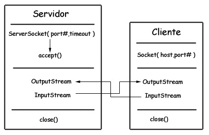

# Java网络基础 #

图片来源：
[https://github.com/Snailclimb/JavaGuide/blob/master/Java%E7%9B%B8%E5%85%B3/Java%20IO%E4%B8%8ENIO.md](https://github.com/Snailclimb/JavaGuide/blob/master/Java%E7%9B%B8%E5%85%B3/Java%20IO%E4%B8%8ENIO.md "Java中的IO体系")
[https://github.com/CyC2018/CS-Notes/blob/master/docs/notes/Java%20IO.md](https://github.com/CyC2018/CS-Notes/blob/master/docs/notes/Java%20IO.md)
## 一、Java中的IO

  
 

从Java IO的结构方式来看，Java IO流主要分以下几类：

- 磁盘操作 ：File
- 字节流：InputStream/OutputStream
- 字符流Reader/Writer。
- 对象操作：Serializable。
- 网络操作：Socket。
- 新的I/O：NIO。

## 二、磁盘操作

	  public static void listAllFIle(File dir){
	        if(dir == null || !dir.exists()){
	            return;
	        }
	        if(dir.isFile()){
	            System.out.println(dir.getName());
	            return;
	        }
	        for(File file:dir.listFiles()){
	            listAllFIle(file);
	        }
	    }
	
	    public static void main(String[] args) {
	        File file = new File("D:\\");
	        listAllFIle(file);
	    }
## 三、字节操作 InputStream/OutputStream

Java I/O使用了装饰者模式来实现，以InputStream为例，InputStream是抽象组件，FileInputStream是InputStream的子类，提供了字节流的输入操作；FilterInputStream属于抽象装饰者，装饰者用于装饰组件，为组件提供额外的功能。例如BufferdInputStream为FileInputStream提供缓存功能。

  
 

实例化一个具有缓存功能的字节流对象，只需要在FileInputStream对象上再套一层BufferedInputStream对象即可。

	FileInputStream fileInputStream = new FileInputStream(filePath);
	BufferedInputStream bufferedInputStream = new BufferedInputStream(fileInputStream);

## 四、字符操作 Reader/Writer

**Java中的编码：**

1. GBK编码：中文字符占2个字节，英文字符占1个字节。
2. UTF-8编码中，中文字符占3个字节，英文字符占1个字节。
3. UTF-16编码中，中文字符和英文字符都占2个字节。

由于Java中的的char类型占16位，也就是两个字节，因此Java的中文和英文都能使用一个char来存储。

## 五、对象操作

**序列化**

所谓序列化是就是将一个对象转换成字节序列，方便存储和传输。

- 序列化：ObjectOutputStream.writeObject()
- 反序列化：ObjectInputStream.readObject()

静态变量不会进行序列化，因为序列化只是保存对象的状态，而静态变量是属于类的状态。

**Serializable接口**

一般的类都是通过实现Serializable接口来实现序列化，它只是一个标准，没有任何一个方法需要实现，但是不通过Serializable接口实现序列化，会抛出异常。

**transient**

transient关键字可以使一些属性不被序列化。

## 六、网络操作

Java中的网络支持：

- InetAddress:用于表示网络上的硬件资源，即IP地址。
- URL：同一资源定位符。
- Sockets：使用TCP协议实现网络通信。
- Datagram：使用UDP协议实现网络通信。

### InetAddress

直接通过静态方法创建实例，没有公有的构造函数

    InetAddress.getByName(String host);
    InetAddress.getByAddress(byte[] address);

### URL

通过URL直接读取字节流数据

	 public static void main(String[] args) throws IOException{
	        URL url = new URL("http://www.baidu.com");
	
	        //字节流
	        InputStream inputStream = url.openStream();
	
	        //字符流
	        InputStreamReader inputStreamReader = new InputStreamReader(inputStream,"utf-8");
	
	        //提供缓存功能
	        BufferedReader bufferedReader = new BufferedReader(inputStreamReader);
	
	        String line;
	        while((line = bufferedReader.readLine())!=null){
	            System.out.println(line);
	        }
	        bufferedReader.close();
	    }
### Sockets

- ServerSockets:服务端类
- Socket：客户端类
- 服务端和客户端通过IputStream和OutputStream进行输入输出。

  
 

### Datagram

- DatagramSocket：通信类
- DatagramPacket：数据包类

## 七、AIO,BIO.NIO以及Netty相关。

### BIO模型:同步阻塞IO处理

阻塞IO处理是指一个线程进行I/O处理时，不能进行其他操作。例如现在烧水，需要一直盯着水壶，一直到烧开为止，这期间什么也不能干。

### NIO模型：同步非阻塞IO处理

JDK1.4以后引入，当一个线程在进行IO处理器时，也可以去进行其他操作。例如烧水时，不需要一直盯着水壶去看，可以采用轮训的方式查看水是否烧开。

### AIO模型：异步非阻塞IO处理

JDK1.7以后引入，利用本地操作系统的IO操作处理模式，当有IO操作产生之后，会启动一个单独的线程，它将所有的IO操作全部交由系统完成，只需要知道返回结果即可。重要的模式是基于操作回调的方式来完成处理。例如在进行烧水时，不需要关注烧水的状态，在烧水完成之后系统会进行通知。

### NIO详解

#### 流和块

I/O和NIO最主要的区别是数据打包方式，IO以流的方式处理数据，而NIO以块的方式处理数据。

面向流的IO一次处理一个字节数据：一个输入流产生一个字节数据，一个输出流产生一个字节数据。为流式数据创建过滤器非常容易，连接几个过滤器，以便每个过滤器只负责处理机制的一部分，不利的一面是，面向流的IO比较慢。

面向块的IO一次处理一个数据块，按块处理数据比按流处理数据要快的多，但是面向块的IO缺少一些面向流的IO所具有的的优雅性和简单性。

#### 通道与缓冲区

**通道：**

通道Channel是对原IO包中流的模拟，可以通过它读取和写入数据。

通道与的区别是，流只能只能在一个方向上移动(输入流InputStream或者输出流OutputStream的子类)，而通道是双向的，可以用于读、写或同时用于读写。

通过包括以下类型：

- FileChannel：从文件中读写数据。
- DatagramChannel：通过UDP读写网络中的数据。
- SocketChannel：通过TCP读取网络中的数据。
- ServerSocketChannel：可以监听新进来的TCP连接，每一个新进来的连接都会创建一个SocketChannel。

**缓存区**

发送给一个通道的所有数据都必须首先放到缓存区中，同样的，从通道中读取的任何数据都要先读到缓存区中。也就是说，不会直接对通道进行读写数据，而是要先经过缓冲区。

#### 选择器
NIO实现了IO多路复用中的Reactor模型，一个线程Thread使用一个选择器Selector通过轮询的方式去监听多个通道Channel上的事件，从而让一个线程可以处理多个事件。

通过配置监听的通道Channel为非阻塞，那么当Channel上的IO事件还未到达时，就不会进入阻塞状态一直等待，而是继续轮询其他的Channel，找到IO事件已经到达的Channel执行。

  
 

**1.创建选择器**

	 //创建选择器
	        Selector selector = Selector.open();

**2.将通道注册到选择器上**

	//将通道注册到选择器上
	        ServerSocketChannel ssChannel = ServerSocketChannel.open();
	        ssChannel.configureBlocking(false);//定义通道为非阻塞
	        ssChannel.register(selector, SelectionKey.OP_ACCEPT);

通道必须配置为非阻塞模式，否则使用选择器就没有任何意义，因为如果通道在某个事件上被阻塞，那么服务器就不能响应其他事件，必须等待这个事件处理完毕才能去处理其他事件。

将通道注册到选择器上，还需要指定要注册的具体事件，主要有以下几类：

- SelectionKey.OP_CONNECT
- SeelctionKey.OP_ACCEPT
- SelectionKey.OP_READ
- SelectionKey.OP_WRITE

SelectionKey的定义：

  	 public static final int OP_READ = 1 << 0;
  	 public static final int OP_WRITE = 1 << 2;
     public static final int OP_CONNECT = 1 << 3;
     public static final int OP_ACCEPT = 1 << 4;

**3.监听事件**

 	selector.select();

使用select()来监听到达的事件，它会一直阻塞到至少有一个事件到达。

**4.获取到达的事件**

     Set<SelectionKey> keys = selector.selectedKeys();
            Iterator<SelectionKey> keyIterator = keys.iterator();

            while(keyIterator.hasNext()){
                SelectionKey key = keyIterator.next();
                if(key.isAcceptable()){
                    ServerSocketChannel serverSocketChannel = (ServerSocketChannel) key.channel();
                    SocketChannel socketChannel = serverSocketChannel.accept();
                    socketChannel.configureBlocking(false);

                    socketChannel.register(selector,SelectionKey.OP_READ);
                }else if(key.isReadable()){
                    SocketChannel socketChannel = (SocketChannel) key.channel();
                    System.out.println(readDataFromSocketChannel(socketChannel));
                    socketChannel.close();
                }

                keyIterator.remove();
            }

**5. 事件循环**

因为一次select()调用不能处理完所有的事件，并且服务端有可能需要一直监听事件，因此服务端的代码一般会在一个死循环中。

 		 while (true){
            selector.select();
            Set<SelectionKey> keys = selector.selectedKeys();
            Iterator<SelectionKey> keyIterator = keys.iterator();

            while(keyIterator.hasNext()){
                SelectionKey key = keyIterator.next();
                if(key.isAcceptable()){
                    ServerSocketChannel serverSocketChannel = (ServerSocketChannel) key.channel();
                    SocketChannel socketChannel = serverSocketChannel.accept();
                    socketChannel.configureBlocking(false);

                    socketChannel.register(selector,SelectionKey.OP_READ);
                }else if(key.isReadable()){
                    SocketChannel socketChannel = (SocketChannel) key.channel();
                    System.out.println(readDataFromSocketChannel(socketChannel));
                    socketChannel.close();
                }

                keyIterator.remove();
            }
        }

