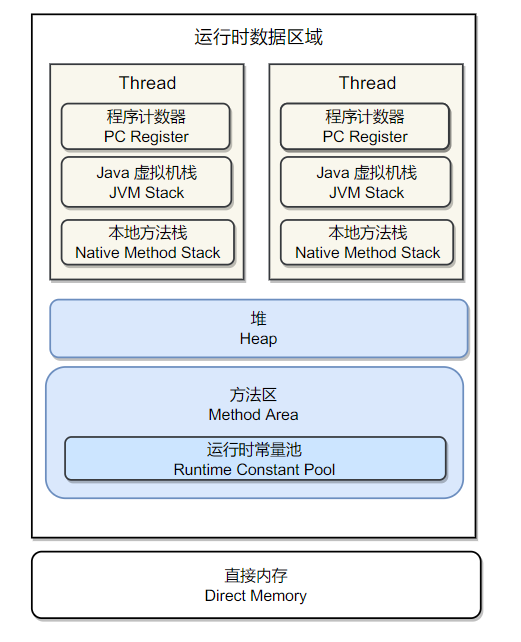

# JVM运行时数据区 #

本博客主要内容来源于《深入理解Java虚拟机》，也参考了许多博客和公众号，例如纯洁的微笑等，如有侵权请联系2530997324@qq.com

  
 

Java虚拟机运行时数据区主要分为七块：程序计数器、虚拟机栈、本地方法栈(线程私有)、堆、方法区包含运行时常量池(线程共享)、直接内存。

JVM内存区域可以主要分为三个部分：堆，方法区(非堆)，以及栈。堆内存又可以分为年轻代和老年代，年轻代内存又可以按照8：1:1的比例划分为Eden区、From Survivor空间以及To Survivor空间。方法区主要存放类信息、常量、静态变量等数据。栈又可以分为虚拟机栈和本地方法栈用于方法的执行。

我们在写代码时，相信遇到过OutOfMemoryError这种错误，起始值就是堆溢出，表明堆内存耗尽，实际开发当中可以通过参数控制堆内存的大小。

控制参数如下：

- Xms：设置堆的最小空间大小。
- Xmx：设置堆的最大空间大小。
- XX:NewSize设置新生代最小空间大小。
- XX：MaxNewSize设置新生代最大空间大小。
- Xss：设置每个线程的堆栈大小。

Java虚拟机是物理机器的软件实现，Java代码之所以可以一处编译，到处运行，是因为编译器将Java代码编译为字节码文件.class,并将该文件加载至JVM当中执行。因此整个JVM的内存体系结构可以用下图表示

  
 

各个区域的具体内容如下。

## 1.程序计数器 ##

记录当前线程所执行的**字节码行号**，用于获取下一条执行的字节码，Java虚拟机的多线程是通过轮流切换和分配处理器时间来实现的，为了线程切换后能够恢复到正确的位置，每个线程都需要有一个独立的程序计数器，所以程序计数器是**线程私有**的。

线程执行Java方法，这个计数器记录的是正在执行的虚拟机字节码，如果执行Native方法，这计数器**为空**。程序计数器是唯一一个在Java虚拟机规范中**没有规定任何OutOfMemoryError**内存溢出错误的区域。

## 2.Java虚拟机栈 ##

Java虚拟机栈也是**线程私有**，生命周期与线程相同，虚拟机栈描述的是Java方法执行的内存模型：每个方法在执行的时候都会同时创建一个栈帧用于**存储局部变量表、操作栈、动态链接、方法出口**等信息。每个**方法被调用**直至执行完成的过程，就对应于栈帧在虚拟机栈中从入栈到出栈的过程。

  
 

局部变量表存放在编译时可知的八种基本数据类(boolean,byte,short,int,char,long,float,double),对象引用和returnAddress类型。

long,double为64长度的数据占用2个局部变量空间，其余数据类型只占1个局部变量空间，局部变量内存空间在编译期间完成分配。

两种异常：当线程请求的栈深度大于虚拟机锁允许的深度，将抛出**StackoverflowError异常**，当虚拟机动态扩展无法申请足够的内存时(大部分虚拟机可动态扩展，也允许固定长度的虚拟机栈)，将会抛出**OutOfMemoryError异常**。

## 3.本地方法栈 ##

本地方法栈与虚拟机栈所发挥的作用非常相似去区别主要是虚拟机栈执行**Java方法(字节码)**，而本地方法则为虚拟机使用到的**Native方法服务**，本地方法栈中的方法语言没有限制，本地方法会抛出**StackOverflowError和OutOfMemoryError**。

  
 

## 4.Java堆 ##
Java堆是Java虚拟机所管理的内存中最大的一块。Java堆是被所有**线程共享**的一块区域，在虚拟机启动时创建。此内存区域的唯一目的就是存放**对象实例**，几乎所有的对象实例都在这里分配内存。

Java对是垃圾收集器管理的主要区域，因此很多时候也被称为"GC堆"。由于现在收集器都采用分代收集算法，所以Java堆中还可以细分为：新生代和老年代；在细致一点的有Eden空间、FromSurvivor空间、ToSurvivor空间。

  
 

Java虚拟机规定，Java堆可以处于物理上不连续的内存空间，只要逻辑上是连续的即可，就像我们的磁盘空间一样。在现实中，既可以实现固定大小的，也可以是可扩展的，当前虚拟机是可扩展来实现的(通过**-Xmx和-Xms**控制)。如果在堆中没有内存完成实例分配，并且堆也无法再扩展时，将会抛出**OutOfMemoryError异常**。

## 5.方法区 ##

方法区与Java堆一样，是各个**线程共享**的内存区域，它被用于已经被虚拟机加载的**类信息、常量、静态变量、即时编译器编译后的代码等数据**。虽然Java虚拟机规范把方法区描述为堆的一个逻辑部分，但是它却有一个别名叫做Non-Heap(非堆)，主要是为了与Java堆区分开。

对于习惯在HotSpot虚拟机上开发和部署程序的开发者来说，很多人愿意将方法区成为**永久代**是实际上两者并不等价，仅因为HotSpot虚拟机的设计团队选择将GC分代收集到方法区，或者使用永久代来实现方法区。

除和Java堆一样不需要连续的内存和可以选择固定大小或者可扩展外，还可以选择不实现垃圾回收。相对而言，垃圾回收行为在这个区域是比较少出现的，但并不是数据进入方法区就永久存在啦，这个区域的内存回收目标主要是针对**常量池的回收和对类型的卸载**。Java虚拟机规范规定，当方法区无法满足内存分配需求时，将抛出**OutOfMemoryError异常**。

HotSpot虚拟机将方法区当做永久代进行垃圾回收，但很难确定永久代的大小，每次Full GC之后，永久代的大小都会发生改变，所以经常抛出OutOfMemoryError异常。为了便于方法区的管理，从JDK1.8开始，移除永久代，取而代之的是元空间，元空间并不在虚拟机中，而是使用一个与堆不相连的本地内存，实现了对元空间的无缝管理，还可以简化Full GC以及对以后并发隔离类元数据等方面的优化。

**备注**：在 JDK7 之前的 HotSpot 虚拟机中，纳入字符串常量池的字符串被存储在永久代中，因此导致了一系列的性能问题和内存溢出错误，所以在JDK1.7时，已经将字符串常量移到堆中。

## 6. 运行时常量池 ##

运行时常量池是方法区的一部分。Class文件中除了有类的版本、字段、方法、接口等描述信息，还有一项信息是常量池，用于存放编译器生成的各种**字面量和符号引用**。

运行时常量池相对于Class文件常量池的另一个重要特征是具备动态性，Java语言并不要求常量一定只有编译器才能产生，也就是并非预置入Class文件中常量池内容才能进入方法区的常量池。这种特性被开发人员利用的比较多的是String类的intern()方法。由于受到方法区内存的限制，所以会抛出OutOfMemoryError。

## 7. 直接内存 ##

在JDK1.4中加入了NIO类，引入一种基于通道(Channel)与缓冲区的(Buffer)的I/O方式，它可以使用Native函数库直接分配堆外内存，然后通过存储在Java堆中的DirectByteBuffer对象作为这块内存的引用进行操作，这样能在一些场景中显著提高性能，因为避免了在Java堆和Native堆来回复制数据。直接内存不是虚拟机运行时数据区的一部分，但其受到本机总内存的限制，也会出现OutofMemoryError。