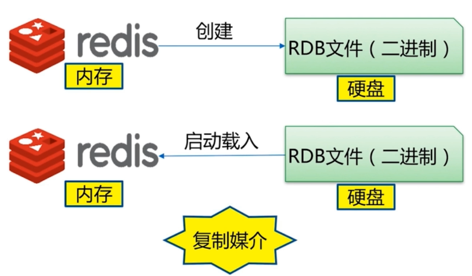
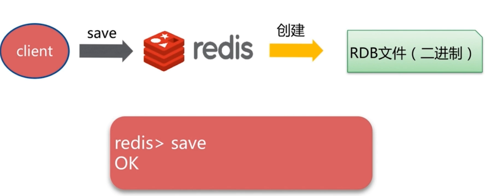
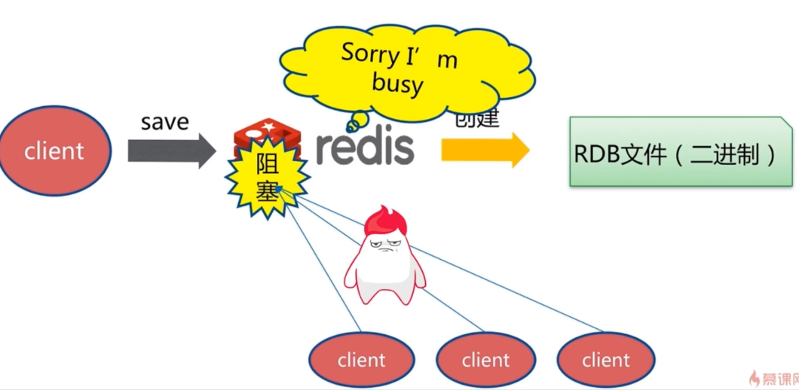
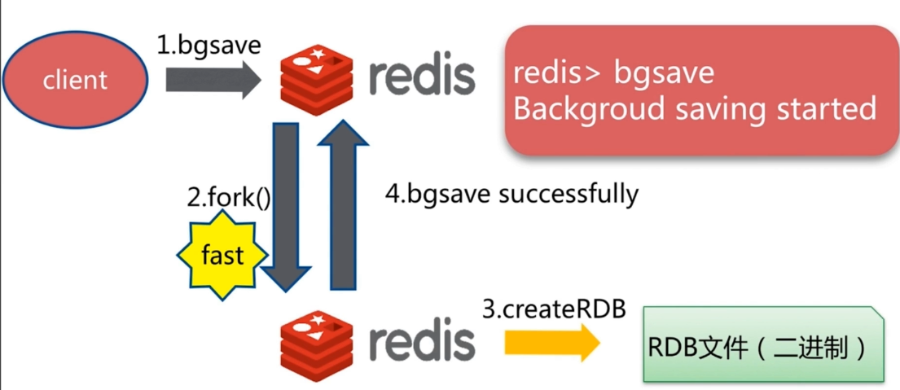
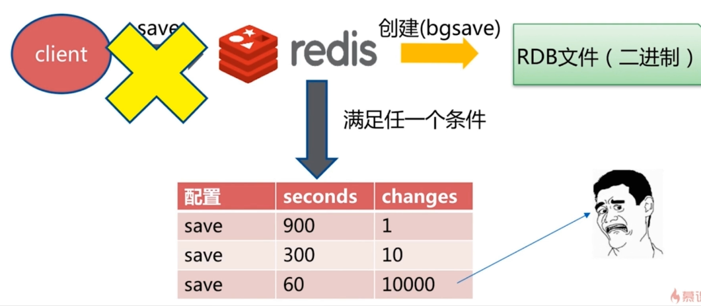
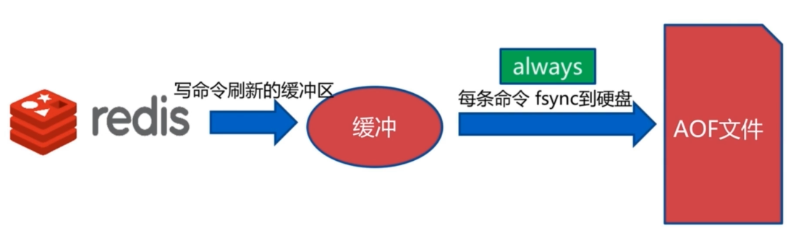
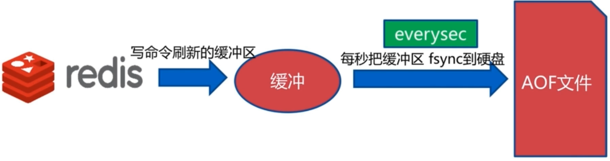
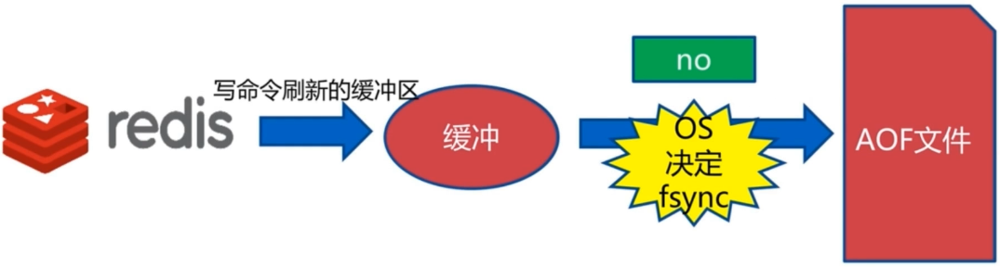
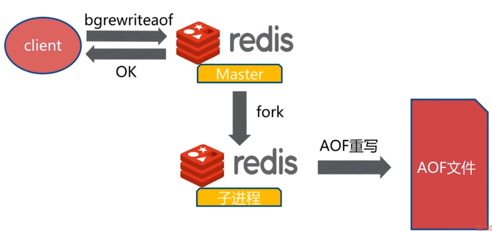

# Redis的持久化 #

Redis 支持两种持久化策略：**RDB快照和AOF日志**，而 Memcached 不支持持久化，默认采用RDB持久化方式。

## 在介绍Redis持久化之前，先介绍一下两种非关系型数据库Redis和Memcached的区别。

- **数据类型**：Memcached仅支持**字符串类型**，而Redis支持五种不同的数据类型，可以更灵活地解决问题。
- **数据持久化**：Redis支持两种持久化策略：RDB快照和AOF日志，而**Memcached不支持持久化。**
- **分布式**：Memcached 不支持分布式，只能通过在客户端使用一致性哈希来实现分布式存储，这种方式在存储和查询时都需要先在客户端计算一次数据所在的节点。**Redis Cluster**实现了分布式的支持。
- **内存管理机制**：在Redis中，并不是所有数据都一直存储在内存中，可以将一些很久没用的value交换到磁盘，而 Memcached 的数据则会一直在内存中。Memcached 将内存分割成特定长度的块来存储数据，以完全解决内存碎片的问题。但是这种方式会使得内存的利用率不高，例如块的大小为 128 bytes，只存储 100 bytes 的数据，那么剩下的28 bytes就浪费掉了。

## 持久化

Redis 是内存型数据库，为了保证数据在断电后不会丢失，需要将内存中的数据持久化到硬盘上。

### RDB 持久化

  
 

RDB是将某个时间点的所有数据都存放到硬盘上。可以将快照复制到其它服务器从而创建具有相同数据的服务器副本。
**缺点：**如果系统发生故障，将会丢失最后一次创建快照之后的数据。。如果数据量很大，保存快照的时间会很长。

### RDB的触发机制(如何生成RDB文件)

- save命令：

  
 

直接在客户端执行save命令即可生成RDB文件。但是save是一个同步命令，当数据量比较大时，会造成阻塞。

  
 

**文件策略：**在生成一个新的RDB文件之后会将老的文件替换。(将redis中所有数据全部写在硬盘之中)

- bgsave命令

  
 

在客户端执行bgsave命令，redis服务端会调用linux的fork()函数，产生一个子进程，这个子进程去生成RDB文件。生成成功后返回一个Backgroud saving started(表名createRDB已经开始)。在fork时可能会发生阻塞。

**文件策略：**在生成一个新的RDB文件之后会将老的文件替换。(将redis中所有数据全部写在硬盘之中)。

- 自动生成RDB

  
 

不使用client去执行命令，当满足三个条件(1.60s改变10000条数据 2.300s改变10条数据 3.900s改变1条数据)中任何一个，自动创建(bgsave) RDB文件(二进制)。

**最佳跑配置(关闭自动配置)**：

- save 900 1;save 300 10; save 60 1000;
- RDB文件名(dbfilename) dump-${port}.rdb;
- dir /bigdiskpath(大的硬盘的目录);
- stop-wirtes-on-bgsave-error **yes** bgsave发生错误停止写入;
- rdbcompression **yes 采用压缩格式；**
- rdbchecksum **yes 采用校验和的方式。**

触发机制--不容忽略方式：1.全量复制 2.debug reload 3.shutdown。

###RDB总结
1.rdb是redis内存到硬盘的快照，用于持久化。
2.save会**阻塞**redis 。
3.bgsave不会阻塞redis，但是会fork新进程(fork()操作时会存现阻塞)。
4.save自动配置满足任一就会被执行 。
5.有些触发机制不容忽视。

**rdb的问题**：1.**耗时**、耗性能 2.不可控，**容易丢失数据**。

### AOF持久化

AOF运行原理-创建：当redis客户端写入一条命令时，会通过**日志的形式以AOF文件格式**相应的写入文件当中。

#### 三种策略

AOF将写命令添加到AOF文件（Append Only File）的末尾。使用AOF持久化需要设置同步选项，从而确保写命令什么时候会同步到磁盘文件上。这是因为对文件进行写入并不会马上将内容同步到磁盘上，而是先存储到**缓冲区**，然后由操作系统决定什么时候同步到磁盘。有以下同步选项：

- always：每个写命令都同步。

  
 

- everysec：每秒同步一次。

  
 

- no：让操作系统来决定何时同步。

  
 

always 选项会严重**减低服务器的性能**；everysec 选项比较合适，可以保证系统崩溃时只**会丢失一秒左右的数据**，并且 Redis 每秒执行一次同步对服务器性能几乎没有任何影响；no 选项并不能给服务器性能带来多大的提升，而且也会增加系统崩溃时数据丢失的数量。
随着服务器写请求的增多，AOF文件会越来越大。Redis 提供了一种将AOF重写的特性，能够去除 AOF文件中的冗余写命令。

#### AOF重写

AOF的优化，可通过重写原生AOF命令，减少硬盘占用量，加速恢复速度。

**重写实现方式**：

- bgrewriteaof(类似bgsave)。

  
 

- AOF重写配置：1.auto-aof-rewrite-min-size：AOF文件**重写需要的最小尺寸** 2.auto-aof-rewrite-percentage：AOF文件**增长率**。

当满足向下面两个条件时，触发重写

- aof_current_size(AOF当前尺寸) > auto-aof-rewrite-min-size
- (aof_current_size aof_base_size(AOF上次启动和重写的尺寸))/aof_base_size > auto-aof-rewrite-percentage

#### AOF配置

- appendonly yes:启动AOF
- AOF文件名(appendfilename) appendonly-${port}.aof;
- appendfsync everysec(每秒刷盘)
- dir /bigdiskpath(大的硬盘的目录);
- no-appendfsync-on-rewrite **yes** ：如果该参数设置为**no**，是最安全的方式，**不会丢失数据**，但是要忍受**阻塞的问题**。如果设置为yes呢？这就相当于将appendfsync设置为no，这说明**并没有执行磁盘操作，只是写入了缓冲区**，因此这样并不会造成阻塞（因为没有竞争磁盘），但是如果这个时候redis挂掉，就会丢失数据。丢失多少数据呢？在linux的操作系统的默认设置下，最多会丢失**30s的数据**。
- auto-aof-rewrite-percentage 100
- auto-aof-rewrite-min-size 64mb

### rdb和aof的抉择

**RDB和AOF比较**：

- 1.启动优先级 RDB低 AOF高 。
- 2.RDB体积小 AOF体积大 。
- 3.rdb恢复速度快，AOF恢复速度慢。 
- 4.rdb丢数据 Aof由策略决定 。
- 5.RDB操作较重，AOF操作较轻。

RDB最佳策略----“**关**”，集中管理：**数据备份开**；主从节点，**从节点开**。

AOF最佳策略----**“开”** ：缓存和存储 ，AOF重写集中管理 选择**everysec**

**最佳策略**：1.小分片 2.缓存或者存储 3.监控硬盘、内存、负载、网络 4.足够的内存(不能用满)。
