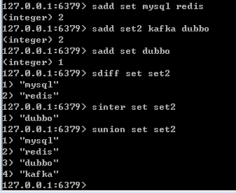

# Redis的数据类型及应用场景 #

Redis 是速度非常快的**非关系型（NoSQL）内存键值**数据库，可以存储键和五种不同类型的值之间的映射。

**键的类型只能为字符串**，值支持五种数据类型：字符串、列表、集合、散列表、有序集合。

## 1.Redis的优点与缺点

### 优点：
1. **读写性能好**，速度快。(使用复制来扩展读性能，使用分片来扩展写性能)。
2. 支持数据**持久化**，支持AOF和RDB两种持久化的方式(相比memcached)
3. 支持**主从复制**，主机会自动将数据同步到从机，可以进行读写分离。
4. **数据结构丰富**：除了支持string类型的value外，还支持hash，set，list，sortedset,list等数据结构。
### 缺点：
1. 较难支持在线扩容，当集群容量达到上限时在线扩容会变得很复杂，所以上限时需要预估**内存资源空间**。
2. redis不具备自动容灾和恢复功能，主机从机的**宕机**都会导致前端部分读写数据读写请求失败，需要等待重启或者手段切换前端的IP才能恢复。

## 2.数据类型

### String

String的值对象可以存储字符串，整数或者浮点数，可以对整个字符串或者字符串的其中一部分执行操作对整数和浮点数执行自增或者自减操作。

#### 底层实现及编码方式

编码方式：int(针对整数值)，raw(针对长字符串，其底层是基于简单动态字符串(SDS))或者embstr(小于等于39字节的短字符串)

#### 常用命令：

1. set key value : 设置指定key的值。
2. get key:获取key指定的值。
3. INCR key:将key所对应的值加1。
4. DECR key:将key所对应的值减1。
5. strlen key:获取key所对应的值的长度。
6. MGET key1 [key2…]：获取所有(一个或多个)给定 key 的值
7. 	SETEX key seconds value：将值 value 关联到 key ，并将 key 的过期时间设为 seconds (以秒为单位)。
8. 	SETNX key value	：只有在 key 不存在时设置 key 的值
8	STRLEN key：返回 key 所储存的字符串值的长度
9	MSET key value [key value …]：同时设置一个或多个 key-value 对。
10	GETRANGE key start end：返回 key 中字符串值的子字符
11	GETSET key value：将给定 key 的值设为 value ，并返回 key 的旧值(old value)

  
 

#### 使用场景

1. 计数器：可以对 String 进行自增自减运算，从而实现计数器功能。
2. 可完全替换memcached,存储简单k-v。
3. 存储少量热点数据,分布式锁(秒杀系统有应用)。
4. 会话缓存(session cache)。

### List(列表)

list列表也是常见的存储结构,它是一个双向链表,即可以作为栈结构也可以作为队列结构。

#### 编码方式及数据结构

列表对象的编码可以是ziplist(压缩列表)或者linkedlist(双端列表)。

#### 常用命令(常以l开头)

1. LPUSH key value1 [value2]:将一个或多个值插入到列表头部
2. LPOP key:移出并获取列表的第一个元素
3. LLEN key:获取列表长度
4. LRANGE key start stop:获取列表指定范围内的元素
5. LREM key count value	:移除列表元素
6. LTRIM key start stop:对一个列表进行修剪(trim)，就是说，让列表只保留指定区间内的元素，不在指定区间之内的元素都将被删除。
7. RPUSH key value1 [value2]:在列表中添加一个或多个值
8. RPOP key:移除并获取列表最后一个元素
9. RPUSHX key value:为已存在的列表添加值

  
 

#### 使用场景

1. 取出最新的几个消息。
2. 作为队列。
3. 发布/订阅消息，还可以可作为基于发布/订阅的脚本触发器。

### SET

Redis的Set是string类型的无序集合。集合成员是唯一的，这就意味着集合中不能出现重复的数据。Redis中集合是通过哈希表实现的，所以没有hash碰撞时添加，删除，查找的复杂度都是O(1),有碰撞时为O(n)

#### 编码方式与数据结构

集合对象的编码可以是intset(底层为整数集合)或者hashtable(底层为字典)。

1. 集合对象保存的所有元素都是整数。
2. 集合对象保存元素数量不超过512个。

满足上述两点时，采用intset编码否则使用hashtable编码。

#### 常用命令(以s开头)

1. SADD key member1 [member2]:向集合添加一个或多个成员。
2. SCARD key:获取集合的成员数。
3. SDIFF key1 [key2]:返回给定所有集合的差集。
4. SINTER key1 [key2]:回给定所有集合的交集。
5. SISMEMBER key member:判断 member 元素是否是集合 key 的成员。
6. SMEMBERS key	:返回集合中的所有成员。
7. SREM key member1 [member2]:移除集合中一个或多个成员。
8. SUNION key1 [key2]:返回所有给定集合的并集。
 

  
 

#### 使用场景

一些会不重复的数据,进行交集,并集,差集等灵活操作，比如关注人,粉丝,可分别放在一个set中。

### Hash

包含键值对的无序散列表，添加、获取、移除单个键值对；获取所有键值对；检查某个键是否存在。

#### 编码方式与数据结构

哈希对象的编码可以是ziplist(底层Wie压缩列表)或者hashtable(底层为字典)。

#### 常用命令(以h开头)

1. HSET key field value：将哈希表key中的字段field的值设为value。
2. HGET key field：获取存储在哈希表中指定字段的值。
3. HDEL key field2 [field2]：删除一个或多个哈希表字段。
4. HGETALL key：获取在哈希表中指定key的所有字段和值。
5. HEXISTS key field：查看哈希表key中，指定的字段是否存在。
6. HMGET key field1 [field2]：获取所有给定字段的值。
7. HMSET key field1 value1 [field2 value2 ]：同时将多个 field-value (域-值)对设置到哈希表key中。
8. HSETNX key field value：只有在字段 field 不存在时，设置哈希表字段的值。

  
 

#### 使用场景

- 查找表，主要用来存储对象。

### sorted set

redis 有序集合和集合一样也是string类型元素的集合,且不允许重复的成员。
不同的是**每个元素都会关联一个double类型的分数**。redis正是通过分数来为集合中的成员进行从小到大的排序。有序集合的成员是唯一的,但分数(score)却可以重复,当分数重复时,按照自然顺序排序。

#### 编码方式与数据结构

有序集合的编码可以是ziplist(底层为压缩列表)和skiplist(底层为跳表)。

#### 常用命令

1. ZADD key score1 member1 [score2 member2]	:向有序集合添加一个或多个成员，或者更新已存在成员的分数。
2. ZCARD key:获取有序集合的成员数。
3. ZCOUNT key min max:计算在有序集合中指定区间分数的成员数。
4. ZINCRBY key increment member：有序集合中对指定成员的分数加上增量 increment。
5. ZINTERSTORE destination numkeys key [key …]：计算给定的一个或多个有序集的交集并将结果集存储在新的有序集合key中。
6. ZRANGEBYSCORE key min max [WITHSCORES] [LIMIT]：通过分数返回有序集合指定区间内的成员。
7. ZRANK key member：返回有序集合中指定成员的索引。
8. ZREM key member [member …]：移除有序集合中的一个或多个成员。
9. ZREMRANGEBYSCORE key min max：移除有序集合中给定的分数区间的所有成员。
10. ZSCORE key member：返回有序集中，成员的分数值。
11. ZREVRANGEBYSCORE key max min [WITHSCORES]：返回有序集中指定分数区间内的成员，分数从高到低排序。
12. ZUNIONSTORE destination numkeys key [key …]：计算给定的一个或多个有序集的并集，并存储在新的key中。

  
 

#### 使用场景

- 排序(排行榜)：sorted set 比set多了一个score的(分数),可以通过这个scored来排序,相同scored的数据按自然顺序,比如微信朋友圈就可以用sorted set 来排序,分数用时间来表示。

Redis sorted set的内部使用HashMap和跳跃表(SkipList)来保证数据的存储和有序，HashMap里放的是成员到score的映射，而跳跃表里存放的是所有的成员，排序依据是HashMap里存的score,使用跳跃表的结构可以获得比较高的查找效率，并且在实现上比较简单。

## Redis中的主要数据结构

### 字典

Redis的字典使用哈希表作为底层实现，使用**拉链法解决哈希冲突**。

哈希表：

	typedef struct dictht {
        //哈希表数组
	    dictEntry **table;
        //哈希表大小
	    unsigned long size;
        //哈希表大小掩码，用于计算索引值
        //总是等于size-1
	    unsigned long sizemask;
        //哈希表已有节点的数量
	    unsigned long used;
	} dictht;

哈希表节点：

	typedef struct dictEntry {
        //键
	    void *key;
        //值
	    union {
	        void *val;
	        uint64_t u64;
	        int64_t s64;
	        double d;
	    } v;
	    struct dictEntry *next;
	} dictEntry;

Redis的字典dict中包含两个哈希表dictht，这是为了方便进行rehash 操作。在扩容时，将其中一个dictht上的键值对rehash到另一个dictht上面，完成之后释放空间并交换两个dictht的角色。

	typedef struct dict {
	    dictType *type;
	    void *privdata;
	    dictht ht[2];
	    long rehashidx; /* rehashing not in progress if rehashidx == -1 */
	    unsigned long iterators; /* number of iterators currently running */
	} dict;

rehash 操作不是一次性完成，而是采用渐进方式，这是为了避免一次性执行过多的rehash操作给服务器带来过大的负担。**渐进式rehash通过记录dict的 rehashidx 完成，它从0开始，然后每执行一次rehash都会递增**。例如在一次rehash中，要把dict[0]rehash到dict[1]，这一次会把dict[0]上table[rehashidx]的键值对rehash到 dict[1]上，dict[0]的table[rehashidx]指向null，并令rehashidx++。在rehash 期间，每次对字典执行添加、删除、查找或者更新操作时，都会执行一次渐进式 rehash。采用渐进式 rehash 会导致字典中的数据分散在两个dictht上，因此对字典的查找操作也需要到对应的dictht去执行。

### 跳跃表

转自极客时间《数据结构与算法之美专栏》

跳表(SkipList)：增加了向前指针的链表叫做跳表。跳表全称叫做跳跃表，简称跳表。跳表是一个随机化的数据结构，实质是一种可以进行**二分查找**的有序链表。跳表在原有的有序链表上增加了多级索引，通过索引来实现快速查询。跳表不仅能提高搜索性能，同时也可以提高插入和删除操作的性能。

  
 

对于一个单链表来说，即使链表中的数据是有序的，如果我们想要查找某个数据，也必须从头到尾的遍历链表，很显然这种查找效率是十分低效的，时间复杂度为O(n)。那么我们如何提高查找效率呢？我们可以对链表建立一级“索引”，**每两个结点提取一个结点到上一级**，我们把抽取出来的那一级叫做索引或者索引层，如下图所示，down表示down指针。

  
 

假设我们现在要查找值为16的这个结点。我们可以先在索引层遍历，当遍历索引层中值为13的时候，通过值为13的结点的指针域发现下一个结点值为17，因为链表本身有序，所以值为16的结点肯定在13和17这两个结点之间。然后我们通过索引层结点的down指针，下降到原始链表这一层，继续往后遍历查找。这个时候我们只需要遍历2个结点（值为13和16的结点），就可以找到值等于16的这个结点了。如果使用原来的链表方式进行查找值为16的结点，则需要遍历10个结点才能找到，而现在只需要遍历7个结点即可，从而提高了查找效率。

那么我们可以由此得到启发，和上面建立第一级索引的方式相似，在第一级索引的基础上，每两个一级索引结点就抽到一个结点到第二级索引中。再来查找值为16的结点，只需要遍历6个结点即可，从而进一步提高了查找效率。

  
 

根据上面的分析，我们可以发现跳表查找任意数据的时间复杂度是O(logn)，与二分查找是一样的。但是这实际上是一种空间换时间的方式，所以跳表的空间复杂度为O(n)。

### 跳表的插入

跳表插入的时间复杂度为：O(logn)，支持高效的动态插入。在单链表中，一旦定位好要插入的位置，插入结点的时间复杂度是很低的，就是O(1)。但是为了保证原始链表中数据的有序性，我们需要先找到要插入的位置，这个查找的操作就会比较耗时。对于纯粹的单链表，需要遍历每个结点，来找到插入的位置。但是对于跳表来说，查找的时间复杂度为O(logn)，所以这里查找某个数据应该插入的位置的时间复杂度也是O(logn)，如下图所示：

  
 

### 跳表的删除

跳表的删除操作时间复杂度为：O(logn)，支持动态的删除。

在跳表中删除某个结点时，如果这个结点在索引中也出现了，我们除了要删除原始链表中的结点，还要删除索引。因为单链表中的删除操作需要拿到删除结点的前驱结点，然后再通过指针操作完成删除。所以在查找要删除的结点的时候，一定要获取前驱结点（双向链表除外）。同样删除跳表时还需查找到要删除的前驱节点，操作时间复杂度即为O(logn)。

### 跳表索引的动态更新

我们不断地往跳表中插入数据时，我们如果不更新索引，就有可能出现某2个索引节点之间的数据非常多的情况，在极端情况下，跳表还会退化成单链表，如下图所示：

  
 

作为一种动态数据结构，我们需要某种手段来维护索引与原始链表大小之间的平衡，也就是说，如果链表中的结点多了，索引结点就相应地增加一些，避免复杂度退化，以及查找、插入和删除操作性能的下降。如果你了解红黑树、AVL树这样的平衡二叉树，你就会知道它们是通过左右旋的方式保持左右子树的大小平衡，而跳表是通过**随机函数**来维护“平衡性”。

当我们往跳表中插入数据的时候，我们可以通过一个随机函数，来决定这个结点插入到哪几级索引层中，比如随机函数生成了值K，那我们就将这个结点添加到第一级到第K级这个K级索引中。如下图中要插入数据为6，K=2的例子：

  
 

**注意：为什么Redis要用跳表来实现有序集合，而不是红黑树？**

插入、删除、查找以及迭代输出有序序列的操作，红黑树也可以完成，时间复杂度和跳表相同，但是**按照区间查找**，红黑树没有跳表高。但是像红黑树在大部分编程语言中都有相应的Map相关类，而跳表需要自己去实现。

