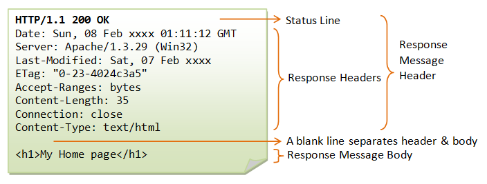

# Http #

Http协议是指超文本传输协议。

## 一.URL、URI、URN的区别 ##

- URI(统一资源标识符，web服务器资源的名字，例如：index.html)
- URL(统一资源定位符)
- URN(统一资源名称)

实际上URI包括URL、URN，目前只有URL比较流行，所以见到的基本都是URL。

## 二、Http报文

### 1.请求报文

  
 

HTTP请求由请求行、请求头、空行、请求数据4个部分组成，而请求行又包括请求方法字段、请求的URL地址、协议名称及版本组成。

**GET请求**

  
 

GET方式是最常见的一种请求方式。我们日常点击链接或者通过浏览器浏览网页，就是使用GET方式。GET方法要求服务器将URL定位的资源放在响应报文数据部分，回送到客户端。

**POST请求**

  
 

### 2.响应报文

  
 

HTTP响应报文也由四个部分组成，分别是：状态行、消息报头、空行、响应正文。

**200响应**

  
 

**404响应**

  
 

### 3.HTTP状态码 ##
- 1xx:指示信息--请求已经接受，正在处理。
- 2xx:成功--请求正常接收完毕。
- 3xx:重定向--需要进行附加操作以完成请求。
- 4xx:客户端错误--请求语法错误或者请求无法实现。
- 5xx:服务端错误--服务器处理请求出错。

  
 

**HTTP的常见状态码 **

- 200 OK，服务器已经成功处理了请求。
- 301 永久移除，请求网页已经永久跳转到新的位置，服务器返回此响应时，会自动将请求跳转到新位置。
- 302 临时移动：服务器暂时从不同位置的网页响应请求，但请求者继续使用原有位置来进行以后的请求，会出现网址加持问题，搜索引擎抓取新的内容而保留旧的地址。
- 400 Bad Request：服务器不理解请求的语法。
- 404 Not Found：服务器找不到请求的资源。
- 502 服务器作为网关和代理，从上游服务器收到无效响应。
- 503 服务器目前暂时无法使用。
- 500 (服务器内部错误)。
- 505 HTTP Version Not Surpported，服务器不支持请求中所用的HTTP协议版本。

### 4.Http与Https

HTTPS协议是由**SSL+HTTP协议**构建的可进行加密传输、身份认证的网络协议，要比http协议安全。  

#### 区别

-  http协议是运行在TCP之上(工作在应用层)，所有传输内容都是明文，而https运行在SSL/TLS之上(工作在传输层)，而SSL/TLS运行在TCP之上，所有传输内容都要经过加密，加密一般采用对称加密。但对称密钥的进行了非对称加密，可以进行客户端服务端的身份验证。
-  http和https使用的是完全不同的连接方式，用的端口也不一样，前者是80，后者是443。
-  HTTP 的 URL 以 http:// 开头，而 HTTPS 的 URL 以 https:// 开头。
-  HTTP 无需证书，而 HTTPS 需要认证证书，证书需要交费。

### 5.http的方法

客户端发送的 请求报文 第一行为请求行，包含了方法字段。

**GET**：获取资源

> 当前网络请求中，绝大部分使用的是 GET 方法。

**HEAD：**获取报文首部

> 和 GET 方法类似，但是不返回报文实体主体部分。主要用于确认URL的有效性以及资源更新的日期时间等。

**POST：**传输实体主体

> POST 主要用来向指定资源提交数据进行处理请求(例如提交表单和上传文件)，POST请求会导致新的资源建立和修改已有资源，而GET主要用来获取资源。

**PUT：**上传文件

> 由于自身不带验证机制，任何人都可以上传文件，因此存在安全性问题，一般不使用该方法。

PUT /new.html HTTP/1.1
Host: example.com
Content-type: text/html
Content-length: 16

New File

**PATCH**：对资源进行部分修改

PUT 也可以用于修改资源，但是只能完全替代原始资源，PATCH 允许部分修改。

PATCH /file.txt HTTP/1.1
Host: www.example.com
Content-Type: application/example
If-Match: "e0023aa4e"
Content-Length: 100

[description of changes]

**DELETE：**删除文件

请求服务器删除Request-URL所标识的资源。

DELETE /file.html HTTP/1.1

**OPTIONS：**查询支持的方法

查询指定的URL能够支持的方法。会返回 Allow: GET, POST, HEAD, OPTIONS 这样的内容。

**CONNECT：**
要求在与代理服务器通信时建立隧道

使用 SSL（Secure Sockets Layer，安全套接层）和 TLS（Transport Layer Security，传输层安全）协议把通信内容加密后经网络隧道传输。

#### get与post的区别
- get请求不安全而post请求时安全的。
- 浏览器对get请求的URL长度有限制(1024字节)。get请求不能代替post请求发送大量的数据。
- get请求时幂等的，所有幂等是指一次或多次请求某一个资源应该具有相同的作用。
- get请求访问时数据会在地址栏后可见，而post数据在地址栏不可见。
- get请求可以保存在cookie中，post请求不能被缓存。

### 6.HTTP长连接、短链接 ##

在HTTP/1.0中默认使用短链接，即客户端与服务器每进行一次HTTP操作，就建立一次连接，任务结束就中断连接。

从HTTP/1.1开始，默认使用长连接，用来保持连接性，使用长连接的HTTP协议，会在响应头加入下面的代码：
    
    Connection:keep-alive

在使用长连接的情况下，当一个网页打开完成之后，客户端与服务端之间用于传输HTTP数据的TCP连接不会关闭，客户端再次访问这个服务器时，会继续使用这一条已经建立的连接。Keep alive不会永久保持，可以在不同服务器中设定时间。

#### 什么时候用长连接，短连接？  　　
长连接多用于操作频繁，点对点的通讯，而且连接数不能太多情况，。每个TCP连接都需要三步握手，这需要时间，如果每个操作都是先连接，再操作的话那么处理速度会降低很多，所以每个操作完后都不断开，次处理时直接发送数据包就OK了，不用建立TCP连接。例如：数据库的连接用长连接， 如果用短连接频繁的通信会造成socket错误，而且频繁的socket 创建也是对资源的浪费。 
  
而像WEB网站的http服务一般都用短链接，因为长连接对于服务端来说会耗费一定的资源，而像WEB网站这么频繁的成千上万甚至上亿客户端的连接用短连接会更省一些资源，如果用长连接，而且同时有成千上万的用户，如果每个用户都占用一个连接的话，那可想而知吧。所以并发量大，但每个用户无需频繁操作情况下需用短连好

### 7.Cookie和Session ###
**Cookie**
Cookie是服务端发送到用户浏览器并保存到**本地的一小块数据**，它会在浏览器再次向同一服务器发起请求时被携带并发送到服务器上。它用于告诉服务端两个请求是否来自同一浏览器，并保持用户登录状态。

**Seesion**
用户信息也可以存储到服务器中，这样更加安全。比如存储在服务器上的数据库或者Redis或者其他文件中。

Session维护用户登录的过程：

- 用户登录时，用户提交包含用户名和密码的表单，放入HTTP请求报文中；
- 服务器验证用户名和密码；
- 如果正确则把用户信息存储到Redis中，此时Redis中的ID叫做 **Session ID**；
- 服务器返回的响应报文的Set-Cookie首部字段包含了这个Session ID，客户端收到响应报文之后将该Cookie值存入浏览器；
- 客户端之后对同一个服务器进行请求时会包含该Cookie值，服务器收到之后提取Session ID，从Redis中取出用户信息，继续之后的业务操作。

  
 

### 8.转发和重定向

一句话，**转发是服务器行为，重定向是客户端行为**。为什么这样说呢，这就要看两个动作的工作流程：

- 转发过程：客户浏览器发送http请求---->web服务器接受此请求--->调用内部的一个方法在容器内部完成请求处理和转发动作---->将目标资源发送给客户；在这里，转发的路径必须是同一个web容器下的url，其**不能转向到其他的web路径上去**，中间传递的是自己的容器内的request。在客户浏览器路径栏显示的仍然是其第一次访问的路径，也就是说**客户是感觉不到服务器做了转发的。转发行为是浏览器只做了一次访问请求。**

- 重定向过程：客户浏览器发送http请求---->web服务器接受后发送302状态码响应及对应新的location给客户浏览器-->客户浏览器发现是302响应，则自动再发送一个新的http请求，请求url是新的location地址---->服务器根据此请求寻找资源并发送给客户。在这里location可以重定向到任意URL，既然是浏览器重新发出了请求，则就没有什么request传递的概念了。**在客户浏览器路径栏显示的是其重定向的路径**，**客户可以观察到地址的变化的**。重定向行为是浏览器做了至少两次的访问请求的。
