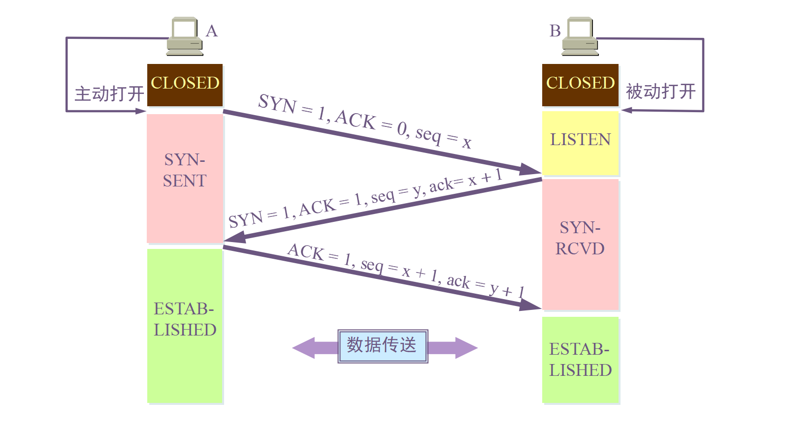
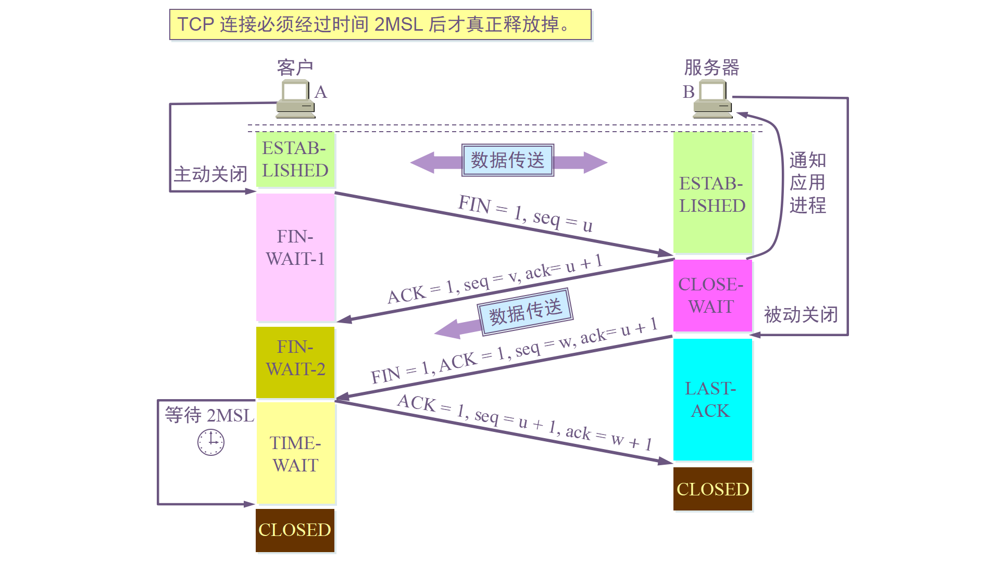

# TCP与UDP #

传输层提供进程间的逻辑通信，其向高层用户屏蔽下面网络层的核心细节，是应用程序看起来像是两个传输层实体进行端到端的通信。传输层最重要的两个协议是TCP和UDP协议，下面针对TCP和UDP协议的特性进行分析。

## 1.TCP

传输控制协议：

- 面向连接：客户机/服务器进程间需要建立**连接**
- **可靠的传输**。
- 只能**一对一**。
- 面向**字节流**(流入到进程或流出进程的字节流)。
- **流量控制**：发送方不会发送速度过快，超过接收方的处理能力。
- **拥塞控制**：当网络负载过重时能够限制发送方的发送速度。
- 全双工通信。

### 1）TCP的首部

  
 

TCP首部前**20字节**是固定的，后面的4N字节是根据需要增加的选项。

- **源端口和目的端口**：各占**2**个字节。
-** 序号**：占**4**个字节，用于对字节流进行编号，若序号为301，表示表示当前报文段的第一个字节序号为301，如果数据长度为100字节，则下一个报文段的序号为401。
- **确认号**：占**4**个字节，期望收到的下一个报文段的序号。若B正确接收A发送来的一个报文段，序号是501，数据长度为200字节，那么B期望下一个报文段的序号为701，那么B发送给A的确认报文段中确认号为701。
- **数据偏移**：占4位，该字段实际只是首部的长度，但由于存在不确定字段，所以数据偏移字段是需要的，其单位是32位字(即4字节)。
- **保留**：占6位。
- URG：紧急数据位，当置为1时，说明有**紧急数据需要传**。
- ACK：当ACK=1时，**确认号字段才有效**，在建立连接后，所有报文段的ACK都必须置为1。
- PSH:当PSH为1时，会立即**创建一个报文段发出去**。
- RST：当RST=1时，表明TCP连接中出现严重差错，必须释放连接，他可以用来**拒绝一个非法报文段或拒绝一个连接。**
- SYN：在建立连接时，当SYN=1,ACK=0时表示这是**一个连接请求报文段**，若对方同意建立连接，则响应报文中SYN=1,ACK=1。
- 终止FIN，用来**释放一个连接**，当FIN=1时，表名此报文段的发送方的数据已经发送完毕，并要求释放运输连接。
- **窗口**：窗口值作为接收方让发送方设置其发送窗口的依据。
- **校验和**：占2个字节，与UDP类似，UDP协议号为17，TCP协议号为6，长度需要修改。
- **紧急指针**：当URG=1时有效。

### 2)TCP的三次握手

  
 

- 客户端A**主动打开连接**，服务端B**被动打开连接**。
- 服务端B的TCP服务器先创建传输控制块(TCB),服务器进程进入**监听(listen)状态**，等到客户端A的连接请求。
- 客户端A也创建TCB，并向服务端发送请求报文，SYN置为1(表明这是一个建立连接请求报文段)，并初始化一个序号seq=x(报文段序号)。
- 服务端接收连接请求，如果确认连接，发送响应报文，SYN=1(表明这是一个建立连接请求报文段),ACK=1(表明确认建立连接),由于客户端的序列号消耗一位序号，服务端B的确认号为ack = x+1(客户端报文段序号+1)，并初始化一个序号y(报文段序号)。
- 客户端A接收服务端B的确认之后，还要向服务端B发出确认报文，SYN=1,ACK=1,由于服务端B也要消耗一个序号，所以A的确认号ack=y+1(服务端报文段序号+1)，序号seq=x+1。

#### 为什么TCP连接需要三次握手？两次不可以吗？

为了防止已经失效的连接请求报文突然又传到服务端。根据上述例子，假定一种情况：当A发出的第一个请求因为网络节点的时间滞留，以致于等到第二个连接释放以后才到达B，那么误以为A再次发出连接请求，重新建立新的连接，将一直等待客户端发送数据，白白浪费服务器资源。采用三次握手时，需要客户端再次发送确认，所以可以避免再次建立连接。

- 客户端-发送带有SYN标志的数据包--一次握手--服务端
- 服务端-发送带有SYN/ACK标志的数据包--二次握手--客户端
- 客户端-发送带有ACK标志的数据包--三次握手--服务端

第一次握手：服务端确认客户端发送正常  
第二次握手：客户端确认自己发送、接收正常，服务端发送、接收正常；服务器确认自己接收正常，客户端发送正常。
第三次握手：客户端确认自己发送接收正常，服务器发送接收正常；服务器确认自己发送接收正常。

### 3）TCP的四次挥手

  
 

- 客户端A先想服务端B发送释放连接请求，FIN=1(释放连接请求标记与SYN对应),序号seq=u(等于A前面已经传送过的报文最后一个字节序号加1),停止发送数据，并主动关闭连接。A进入**FIN-WAIT-1**，等待B的确认。
- B收到连接释放请求后发出确认报文，确认号ack=u+1，自己的序号为v(等于B前面已经传送过的数据的最后一个字节的序号加1)，B进入**CLOSE_WAIT(关闭等待状态)**。TCP服务这是通知高层应用进程，A->B连接已经释放。(半关闭状态)
- A收到B的确认之后就进入**FIN-WAIT-2状态**，等待B发出释放连接请求。
- B发出释放连接报文段FIN=1,假定序号为w，确认号还是之前的u+1,B进入LAST-ACK状态，等待A的确认。
- A在收到B的连接释放报文后，必须对此发出确认，ACK=1,seq=u+1,ack=w+1;随后进入TIME_WAIT状态，等待**2MSL(2*2=4mins)**时间后释放连接。
- B收到A的确认报文段后，释放链接。

##### 为什么需要2MSL(最长报文段寿命)？
1. 确保最后一个确认报文段能够到达服务端B，如果B没有收到A的确认报文段，将重新发送连接释放请求，在A等待的时间段内可以重传。
2. A等待一段时间是为了让本连接中产生的所有报文都从网络中消失，使得下一个连接不会出现旧的报文。
#### 四次挥手的原因
前两次只能保证A->B的连接释放，服务端可能还会发送数据，在服务端进入CLOSE_WAIT状态之后，服务端也需要发送释放请求并得到客户端的确认。

- 客户端-发送一个FIN，用来关闭客户端到服务端的数据。
- 服务器-收到一个FIN，它发回一个ACK，确认序号为收到的序号加1.和SYN一样，一个FIN将占用一个序号。
- 服务器-关闭与客户端的连接，发送一个FIN给客户端。
- 客户端-发回ACK报文确认，并将确认序号设置为收到序号加1。

####保活计数器

当客户端主机出现故障时，服务器不能一直等待下去。服务器每收到一次客户数据，就重新设置保活计数器，时间的设置通常是**两个小时**。若两个小时没有收到客户端的数据，服务器就发送一个探测报文段，以后每个**75分钟**在发送一次，若一连发送**10**个探测报文段后仍无客户端响应，服务器就认为客户端出现故障，接着关闭这个连接。

### 4）可靠传输

TCP 使用**超时重传**来实现可靠传输：如果一个已经发送的报文段在超时时间内没有收到确认，那么就重传这个报文段。

**超时重传**：发送端发送的报文若长时间未收到确认的报文则需要重发该报文。可能有以下几种情况：
- 发送的数据没能到达接收端，对方没有响应；
- 接收端接收数据，但是ACK报文在返回过程中丢失；
- 接收端拒绝或丢弃数据。

一个报文段从发送到接受再到确认所经过的往返时间RTT，加权往返时间RTTS计算公式如下：

    RTTs = (1-a)*(RTTs)+a*RTT

超时时间RTO应该略大于RTTs，TCP使用的超时时间计算如下：
    RTO = RTTs + 4*RTTd
其中RTTd为偏差。

### 5)滑动窗口

窗口是缓存的一部分，用来暂时存放字节流。发送方和接收方各有一个窗口，接收方通过TCP报文段中的窗口字段**告诉发送方自己的窗口大小**，发送方根据这个值和其他信息设置自己窗口的大小。

发送窗口内的字节都允许被发送，接收窗口内的字节都允许被接收。如果发送窗口左边的字节已经发送并且收到了确认，那么就将发送窗口向右滑动一定距离，直到左部第一个字节不是已经发送并且已确认的状态；接收窗口同理当左部字节已经发送确认并交付主机，就向右滑动窗口。

  
 

接收窗口只会对窗口内**最后一个按序到达的字节进行确认**，例如接收窗口已经收到字节为{31,34,35},其中{31}按序到达，而{32，33}没有按序到达，因此只对31进行确认。发送得到一个字节的确认之后，就知道该字节之前的所有字节都已经被接收。

**下面进行滑动窗口模拟**
在TCP中，滑动窗口是为了流量控制。如果对方发送数据过快，接收方就来不及接收，接收方就需要通告对方，减慢数据的发送。

  
 

### 6)流量控制**

流量控制是为了**控制发送方发送速率**，保证接收方来得及接收。

接收方发送的确认报文中的窗口字段可以用来控制发送方窗口大小，从而影响发送的发送速率。

利用滑动窗口可以方便的在TCP连接基础上实现对发送方的流量控制。

### 7)拥塞控制

拥塞是指网络中**对某一资源的需求大于可用资源**。

如果网络出现拥塞，分组将会丢失，此时发送方会继续重传，从而导致网络拥塞程度更高。因此出现拥塞时，应当控制发送方的速率，这一点和流量控制很像，但是出发点不同。流量控制是为了**让接收方能来得及接收**，而拥塞控制是为了**降低整个网络的拥塞程度。**

  
 

TCP主要通过四种算法来进行拥塞控制：**慢开始、拥塞避免、快重传、快恢复**。

**拥塞窗口与发送方窗口的区别**：拥塞窗口只是一个状态变量，**实际决定发送方能发送多少数据的是发送方窗口。**

#### 慢开始与拥塞避免**

  
 

发送方最初执行慢开始，令cowd(**拥塞窗口**)=1,发送方只能发送一个报文段；当收到确认后，将cwnd加倍，按照这个规律，之后发送方能够发送报文段数量为：2，4，8...。

按照慢启动的规律，cwnd呈**指数加倍增长**，由于快速增长，网络拥塞可能也就更高。所以可以设定一个慢启动阈值ssthresh,当cwnd >= ssthresh时，进入拥塞避免，每次轮次只将cwnd加1(线性)。

如果出现超时，则令ssthresh = cwnd/2,然后**重新执行慢开始**。

#### 快重传与快恢复

**快重传**

  
 

在接收方，要求每次接收到报文段都应该对最后一个已收到有序报文段进行确认。如上图所示，接收到M1,M2，此时收到M4，应该发送对M2的确认。

在发送方，**如果收到三个重复确认，不必等到重传计时器到期**，那么就可知道下一个报文段丢失。此次立即执行快重传，重传下一个报文段。例如上图收到三个M2的确认(三个重复确认),则可以判断M3缺失，立即重传M3。

**快恢复**

  
 

在上述情况下，只是丢失个别报文，而不是网络拥塞，因此执行快恢复，令ssthresh = cwnd/2,cwnd = ssthresh,注意到此时直接进入拥塞避免。

注意：慢开始和快恢复的快慢指的是cwnd的设定值，而不是cwnd的增长速率。**慢开始cwnd设定为1，而快恢复设定为ssthresh。**

##2.UDP ##

用户数据报协议

- 无连接
- 不可靠数据传输
- 尽最大努力交付
- 面向**报文**
- 支持一对一，一对多，多对一和多对多的交互通信
- UDP首部开销小，8个字节

  
 

首部只有8个字节，分别**为源端口、目的端口、长度、校验和。**在进行校验时，需要添加12字节的伪首部。	IP数据包校验和只校验IP首部，而UDP校验和会把首部与数据部分一起校验。